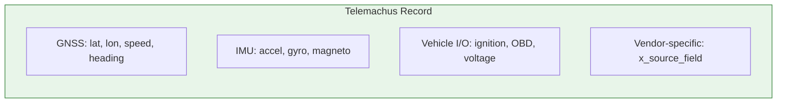
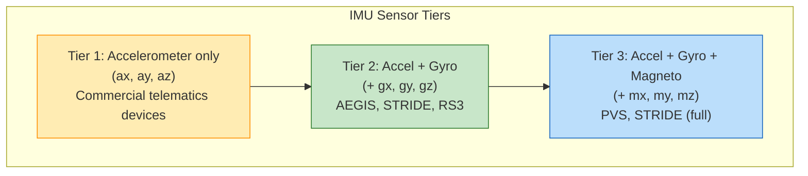
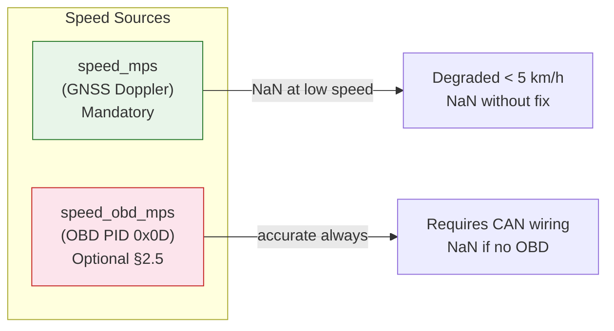
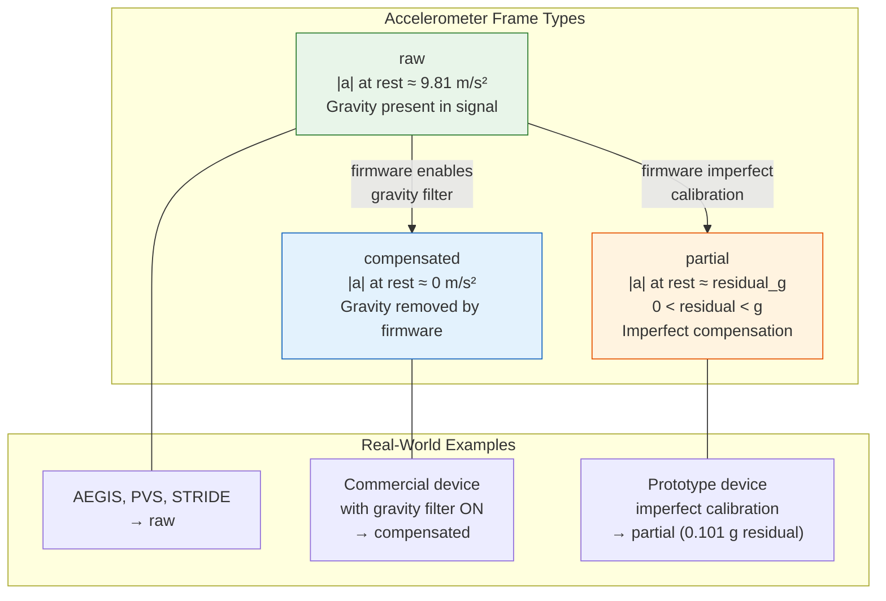
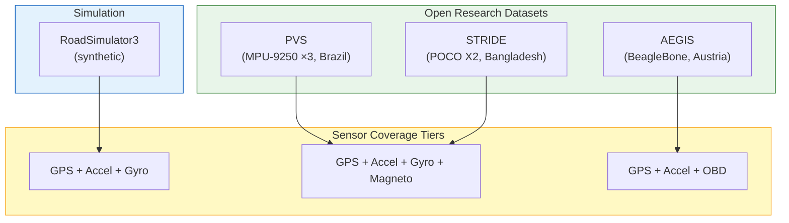

# SPEC-01: Telemachus Record Format

## 1. Introduction

Telemachus defines an **open pivot format** for high-frequency mobility
and telematics data. A Telemachus dataset captures what a telematics
device physically measures and transmits: GNSS position, inertial
measurements, and optionally vehicle bus data.

This specification consolidates and supersedes RFC-0001 (Core v0.2),
RFC-0004 (Extended FieldGroups), and RFC-0013 (Device Layer v0.7).

### 1.1 Design Principles

- **Raw device output only.** No enrichment, no interpretation, no external data.
- **Columns are flat.** No nested JSON objects — every field is a top-level column.
- **Units are SI.** m/s, m/s², rad/s, degrees WGS84, UTC nanoseconds.
- **Multi-rate is native.** GNSS and IMU may sample at different frequencies.
- **Vendor extensions welcome.** Extra columns use `x_<source>_<field>` convention.

### 1.2 Record Overview

A Telemachus record is a timestamped row containing measurements from
up to five functional groups:



---

## 2. Column Specification

### 2.1 Functional Groups

Columns are organized into **five functional groups**. All columns are
flat (no nesting). The grouping is conceptual, for documentation only.

```mermaid
graph LR
    subgraph DT["Datetime"]
        ts["ts (UTC)"]
    end

    subgraph GNSS["GNSS"]
        lat & lon
        speed_mps
        heading_deg
        altitude_gps_m
        hdop & h_accuracy_m
        n_satellites
    end

    subgraph IMU_G["IMU"]
        direction TB
        subgraph ACCEL["Accelerometer"]
            ax["ax_mps2"]
            ay["ay_mps2"]
            az["az_mps2"]
        end
        subgraph GYRO["Gyroscope (opt.)"]
            gx["gx_rad_s"]
            gy["gy_rad_s"]
            gz["gz_rad_s"]
        end
        subgraph MAG["Magnetometer (opt.)"]
            mx["mx_uT"]
            my["my_uT"]
            mz["mz_uT"]
        end
    end

    subgraph VEH["Vehicle I/O (opt.)"]
        ign["ignition"]
        odo["odometer_m"]
        spd_obd["speed_obd_mps"]
        volt["vehicle_voltage_v"]
        rpm_f["rpm"]
    end

    subgraph XTR["Extra (opt.)"]
        x_f["x_&lt;source&gt;_&lt;field&gt;"]
    end

    DT --- GNSS --- IMU_G --- VEH --- XTR

    style DT fill:#fff9c4,stroke:#f9a825
    style GNSS fill:#e8f5e9,stroke:#2e7d32
    style IMU_G fill:#e3f2fd,stroke:#1565c0
    style VEH fill:#fce4ec,stroke:#c62828
    style XTR fill:#f3e5f5,stroke:#6a1b9a
```



### 2.2 Mandatory Fields

Every Telemachus-compliant file MUST contain these columns:

| Column | Type | Unit | Source | Description |
|--------|------|------|--------|-------------|
| `ts` | datetime64[ns, UTC] | UTC | Device clock | Timestamp at highest sensor rate |
| `lat` | float64 | degrees WGS84 | GNSS | Latitude. NaN between GNSS ticks |
| `lon` | float64 | degrees WGS84 | GNSS | Longitude. NaN between GNSS ticks |
| `speed_mps` | float32 | m/s | GNSS Doppler | Ground speed. NaN between GNSS ticks |
| `ax_mps2` | float32 | m/s² | IMU accel | Longitudinal acceleration (+ = forward) |
| `ay_mps2` | float32 | m/s² | IMU accel | Lateral acceleration (+ = left) |
| `az_mps2` | float32 | m/s² | IMU accel | Vertical acceleration (~9.81 at rest if raw) |
| `device_id` | string | — | Config | Unique device identifier |
| `trip_id` | string | — | Config | Unique trip identifier |

### 2.3 Recommended Fields — GNSS Metadata

These fields SHOULD be present when the hardware provides them:

| Column | Type | Unit | Description |
|--------|------|------|-------------|
| `heading_deg` | float32 | degrees [0, 360) | Course over ground (COG). NaN when stationary |
| `altitude_gps_m` | float32 | m | GNSS altitude (NMEA GGA). Typical accuracy: 10–30 m |
| `hdop` | float32 | — (ratio) | Horizontal Dilution of Precision. < 2.0 = good |
| `h_accuracy_m` | float32 | m | Horizontal position accuracy (Android/smartphones). Complementary to hdop |
| `n_satellites` | int8 | — | Number of satellites used in fix. > 6 = reliable |

> **`hdop` vs `h_accuracy_m`**: Commercial GNSS devices (Teltonika, Danlaw)
> report `hdop` (dimensionless ratio). Smartphones (Android) report
> `h_accuracy_m` (68th percentile radius in meters). Both may coexist; a
> dataset typically has one or the other, rarely both.

### 2.4 Optional Fields — Extended IMU

Present only if the device has the corresponding sensor. Columns MUST be
absent or all-NaN when the sensor is not available — they MUST NOT be
filled with zeros.

| Column | Type | Unit | Description |
|--------|------|------|-------------|
| `gx_rad_s` | float32 | rad/s | Gyroscope X (roll rate) |
| `gy_rad_s` | float32 | rad/s | Gyroscope Y (pitch rate) |
| `gz_rad_s` | float32 | rad/s | Gyroscope Z (yaw rate) |
| `mx_uT` | float32 | µT | Magnetometer X |
| `my_uT` | float32 | µT | Magnetometer Y |
| `mz_uT` | float32 | µT | Magnetometer Z |



### 2.5 Optional Fields — Vehicle I/O

Raw vehicle bus data (CAN/OBD) when the device is connected to the
vehicle electrical system.

| Column | Type | Unit | Description |
|--------|------|------|-------------|
| `ignition` | bool | — | Vehicle ignition state (digital input) |
| `odometer_m` | float64 | m | Odometer reading (CAN/OBD) |
| `speed_obd_mps` | float32 | m/s | Vehicle speed from OBD PID 0x0D. Independent of GNSS speed |
| `vehicle_voltage_v` | float32 | V | External power source voltage (12 V / 24 V system) |
| `rpm` | float32 | rev/min | Engine RPM (CAN/OBD PID 0x0C) |

> **Two speed fields**: `speed_mps` (GNSS, mandatory) and `speed_obd_mps`
> (OBD, optional) are intentionally separate. GPS speed degrades below
> ~5 km/h and requires a fix; OBD speed is accurate at all speeds but
> requires CAN wiring.



### 2.6 Vendor-Specific Extra Fields

Telemachus files MAY contain additional columns not defined in this
specification. These columns MUST follow the naming convention:

```
x_<source>_<field>
```

Where `<source>` identifies the data provider or processing origin, and
`<field>` is a descriptive snake_case name.

**Examples:**

| Column | Source | Description |
|--------|--------|-------------|
| `x_pvs_road_surface` | PVS dataset | Road surface label (ground truth) |
| `x_pvs_temp_dashboard_c` | PVS dataset | Sensor temperature at dashboard placement |
| `x_stride_orientation_qw` | STRIDE dataset | Android orientation quaternion W |
| `x_stride_gravity_x_mps2` | STRIDE dataset | Android-derived gravity vector X |
| `x_rs3_road_type` | RoadSimulator3 | Simulation ground truth road classification |
| `x_vendor_firmware_flag` | Any vendor | Device-specific firmware status field |

**Rules:**
- Validators MUST ignore columns matching `x_*` (never reject them)
- Adapters SHOULD document their extra columns in the manifest
- Consumers MUST NOT assume any `x_*` column is present

### 2.7 Multi-Rate Convention

Telemachus files are timestamped at the **highest sensor rate** (typically
IMU rate, e.g. 10–100 Hz). Lower-rate columns (GNSS at 1 Hz) contain
NaN on rows where no measurement is available.


### 2.8 AccPeriod — Accelerometer Frame Reference

Commercial telematics devices may apply **firmware-side gravity
compensation**. The same accelerometer can output data in different
reference frames:

| Frame | At rest | Behaviour |
|-------|---------|-----------|
| `raw` | `az ~ 9.81 m/s²` (gravity present) | Unprocessed sensor output |
| `compensated` | `az ~ 0 m/s²` (gravity removed) | Firmware has subtracted gravity |
| `partial` | `az ~ epsilon`, `0 < abs(epsilon) < g` | Imperfect compensation, residual gravity vector |

The accelerometer frame is declared **at manifest level** (see SPEC-02
§3.7), not per-row. Each AccPeriod is a contiguous time range with a
coherent frame.

**Default**: if no AccPeriod is declared, consumers MUST assume `raw`.



### 2.9 Excluded Columns

The following columns MUST NOT appear in a Telemachus dataset. They
represent **enriched or derived data** that is outside the scope of this
format:

| Column | Reason |
|--------|--------|
| `road_type` | Requires external map data |
| `speed_limit_kmh` | Requires external map data |
| `altitude_dem_m` | Requires external DEM |
| `slope_pct` | Derived from external DEM |
| `event` | Algorithmic output, not raw measurement |
| `lat_matched` | Requires map matching engine |
| `carrier_state` | Per-trip metadata — belongs in manifest (see SPEC-02) |
| `is_vehicle_data` | Derived from carrier_state |

---

## 3. Validation Rules

A Telemachus file is valid if:

1. All mandatory columns (§2.2) are present with correct types
2. `ts` is monotonically increasing (strictly)
3. **Per AccPeriod** (SPEC-02 §3.7), `|a|` mean at rest matches the declared frame:
   - `raw`: ≈ 9.81 ± 1.0 m/s²
   - `compensated`: ≈ 0 ± 1.0 m/s²
   - `partial`: ≈ `residual_g` ± 0.05 g
4. `lat` / `lon` are within [-90, 90] / [-180, 180] when not NaN
5. No excluded columns from §2.9 are present
6. All extra columns follow the `x_<source>_<field>` convention
7. `speed_mps` >= 0 when not NaN
8. Gyro/magneto columns are either all present or all absent (no partial group)

---

## 4. Hardware Mapping

### 4.1 Source Coverage Matrix



> **Commercial devices** (GPS + Accel, with optional Vehicle I/O) are
> supported via private adapters documented outside this specification.

### 4.2 Detailed Column Mapping — Open Datasets

> **Note:** Column mappings for commercial/proprietary devices are
> documented in their respective private adapter modules, not in this
> public specification.

#### AEGIS (Zenodo 820576, Austria)

| Raw CSV Column | Telemachus Column | Conversion |
|----------------|-------------------|------------|
| `timestamp` (accelerations.csv) | `ts` | ISO string → UTC datetime |
| `x_value` (accelerations.csv) | `ax_mps2` | **G-force × 9.80665** |
| `y_value` | `ay_mps2` | G-force × 9.80665 |
| `z_value` | `az_mps2` | G-force × 9.80665 |
| `x_value` (gyroscopes.csv) | `gx_rad_s` | **deg/s × π/180** |
| `y_value` | `gy_rad_s` | deg/s × π/180 |
| `z_value` | `gz_rad_s` | deg/s × π/180 |
| `latitude` (positions.csv) | `lat` | **NMEA DDMM.MMMM → decimal degrees** |
| `longitude` | `lon` | NMEA → decimal degrees |
| `altitude` | `altitude_gps_m` | direct (meters) |
| `data` (obdData.csv, PID 0x0D) | `speed_obd_mps` | km/h ÷ 3.6 |
| `trip_id` | `trip_id` | direct |
| `beaglebone_id` (trips.csv) | `device_id` | lookup |

#### PVS (Kaggle, Curitiba)

| Raw CSV Column | Telemachus Column | Conversion |
|----------------|-------------------|------------|
| `timestamp` | `ts` | Unix seconds → UTC datetime |
| `acc_x_{placement}` | `ax_mps2` | direct (already m/s²) |
| `acc_y_{placement}` | `ay_mps2` | direct |
| `acc_z_{placement}` | `az_mps2` | direct |
| `gyro_x_{placement}` | `gx_rad_s` | **deg/s × π/180** |
| `gyro_y_{placement}` | `gy_rad_s` | deg/s × π/180 |
| `gyro_z_{placement}` | `gz_rad_s` | deg/s × π/180 |
| `mag_x_{placement}` | `mx_uT` | direct (µT) |
| `mag_y_{placement}` | `my_uT` | direct |
| `mag_z_{placement}` | `mz_uT` | direct |
| `latitude` | `lat` | direct (decimal degrees) |
| `longitude` | `lon` | direct |
| `speed` | `speed_mps` | direct (already m/s) |
| `elevation` (GPS CSV) | `altitude_gps_m` | direct |
| `hdop` (GPS CSV) | `hdop` | direct |
| `satellites` (GPS CSV) | `n_satellites` | direct |

#### STRIDE (Figshare, Rajshahi)

| Raw CSV Column | Telemachus Column | Conversion |
|----------------|-------------------|------------|
| `time` (TotalAcceleration.csv) | `ts` | **ns epoch → UTC datetime** |
| `x` (TotalAcceleration.csv) | `ax_mps2` | direct (already m/s²) |
| `y` | `ay_mps2` | direct |
| `z` | `az_mps2` | direct |
| `x` (Gyroscope.csv) | `gx_rad_s` | direct (already rad/s) |
| `y` | `gy_rad_s` | direct |
| `z` | `gz_rad_s` | direct |
| `x` (Magnetometer.csv) | `mx_uT` | direct (µT) |
| `y` | `my_uT` | direct |
| `z` | `mz_uT` | direct |
| `latitude` (Location.csv) | `lat` | direct (decimal degrees) |
| `longitude` | `lon` | direct |
| `speed` (Location.csv) | `speed_mps` | direct (already m/s) |
| `altitude` (Location.csv) | `altitude_gps_m` | direct |
| `bearing` (Location.csv) | `heading_deg` | direct (degrees) |
| `horizontalAccuracy` (Location.csv) | `h_accuracy_m` | direct (meters) |

#### RoadSimulator3 (Synthetic)

| RS3 Field | Telemachus Column | Conversion |
|-----------|-------------------|------------|
| `timestamp` | `ts` | direct (10 Hz uniform UTC) |
| `lat`, `lon` | `lat`, `lon` | direct |
| `speed` | `speed_mps` | direct |
| `heading` | `heading_deg` | direct |
| `acc_x/y/z` | `ax/ay/az_mps2` | direct (includes gravity on az) |
| `gyro_x/y/z` | `gx/gy/gz_rad_s` | direct (NaN if disabled) |

> **Note:** RS3 also exports `road_type`, `event`, `target_speed` — these
> are **ground truth metadata** for validation, NOT part of a Telemachus
> record. They should be stored as `x_rs3_*` extra columns or in a
> sidecar file.

---

## 5. Unit Conversion Reference

Adapters MUST convert raw device units to Telemachus canonical units:

| Quantity | Telemachus Unit | Common Raw Units | Conversion |
|----------|-----------------|-----------------|------------|
| Speed | m/s | km/h | ÷ 3.6 |
| Acceleration | m/s² | G-force | × 9.80665 |
| Gyroscope | rad/s | deg/s | × π / 180 |
| Magnetometer | µT | µT | (usually native) |
| GPS coordinates | decimal degrees | NMEA DDMM.MMMM | `DD + MM.MMMM / 60` |
| GPS coordinates | decimal degrees | decimal degrees | (no conversion) |
| Odometer | m | km | × 1000 |
| Voltage | V | V | (no conversion) |
| Timestamp | datetime64[ns, UTC] | epoch seconds | × 1e9 + to_datetime |
| Timestamp | datetime64[ns, UTC] | epoch nanoseconds | to_datetime |
| Timestamp | datetime64[ns, UTC] | ISO 8601 string | parse + ensure UTC |

---

## 6. Python API — Sensor Introspection

The `telemachus-py` library provides introspection helpers for consumers
to discover what data is available without loading the full dataset:

### 6.1 Manifest-Level (fast, no data loaded)

```python
ds = tele.Dataset.from_manifest("manifest.yaml")
ds.declared_sensors()    # → {'gps': {'rate_hz': 1}, 'accelerometer': {...}, ...}
ds.has_declared_gyro()   # → True / False
ds.acc_frame()           # → "raw" | "compensated" | "partial"
```

### 6.2 Data-Level (loads parquet, checks actual content)

```python
df = tele.read("manifest.yaml")
tele.has_gps(df)         # → True if lat, lon, speed_mps have non-NaN values
tele.has_imu(df)         # → True if ax, ay, az have non-NaN values
tele.has_gyro(df)        # → True if gx, gy, gz present and non-NaN
tele.has_magneto(df)     # → True if mx, my, mz present and non-NaN
tele.has_obd(df)         # → True if speed_obd_mps or rpm present and non-NaN
tele.sensor_profile(df)  # → "gps+imu+gyro+magneto" or "gps+imu" etc.
tele.is_gps_only(df)     # → GPS but no IMU
tele.is_full_imu(df)     # → accel + gyro available
```

---

## 7. References

- **SPEC-02**: Dataset Manifest — canonical file-level metadata
- **SPEC-03**: Adapters & Validation — tooling and conformance testing
- **Superseded RFCs**: RFC-0001 (Core v0.2), RFC-0004 (Extended FieldGroups), RFC-0013 (Device Layer v0.7)

### Dataset References

| Dataset | DOI / URL | License |
|---------|-----------|---------|
| AEGIS | Zenodo 820576 | CC-BY-4.0 |
| PVS | Kaggle (Curitiba) | CC-BY-NC-ND-4.0 |
| STRIDE | Figshare 25460755 | CC-BY-4.0 |
| UAH-DriveSet | Universidad de Alcala | Academic |

---

End of SPEC-01.
