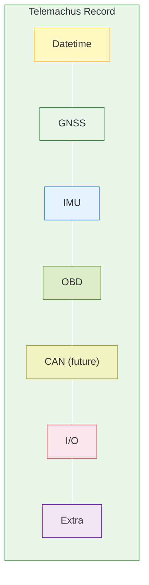
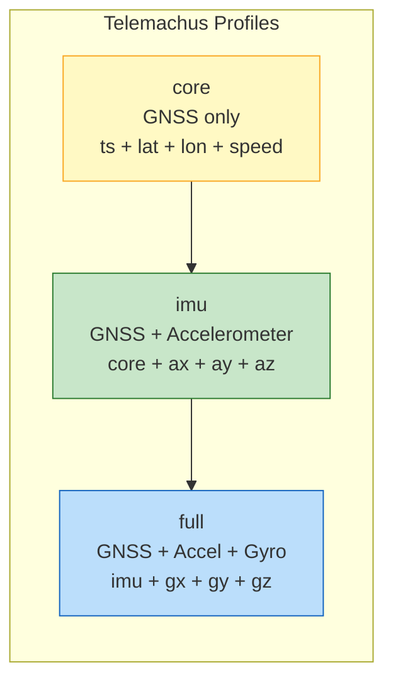
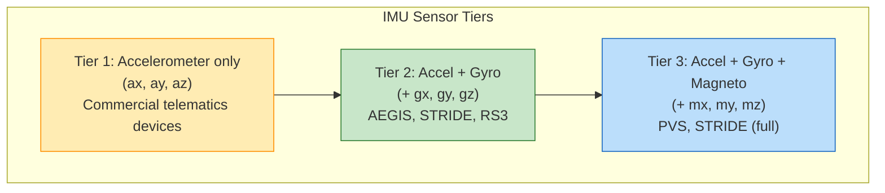
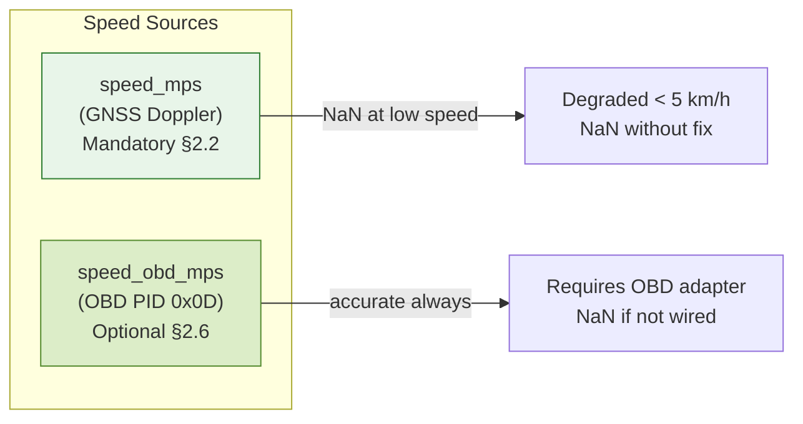
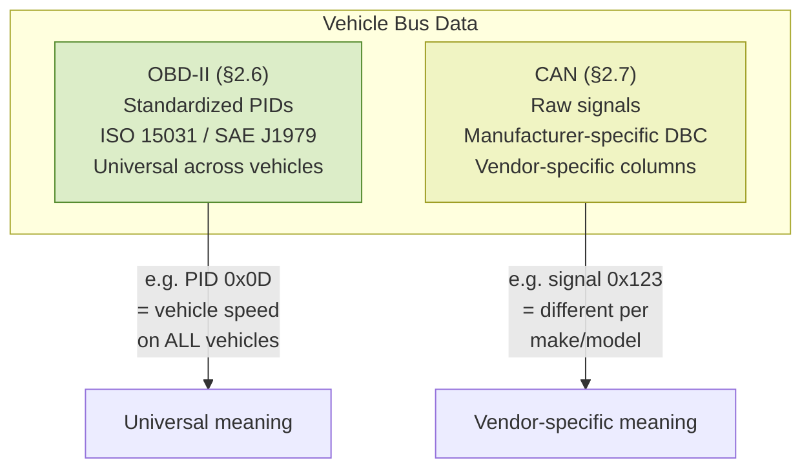
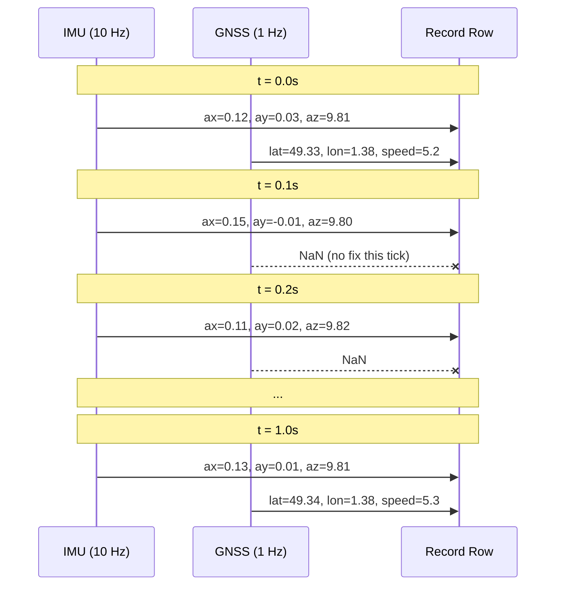
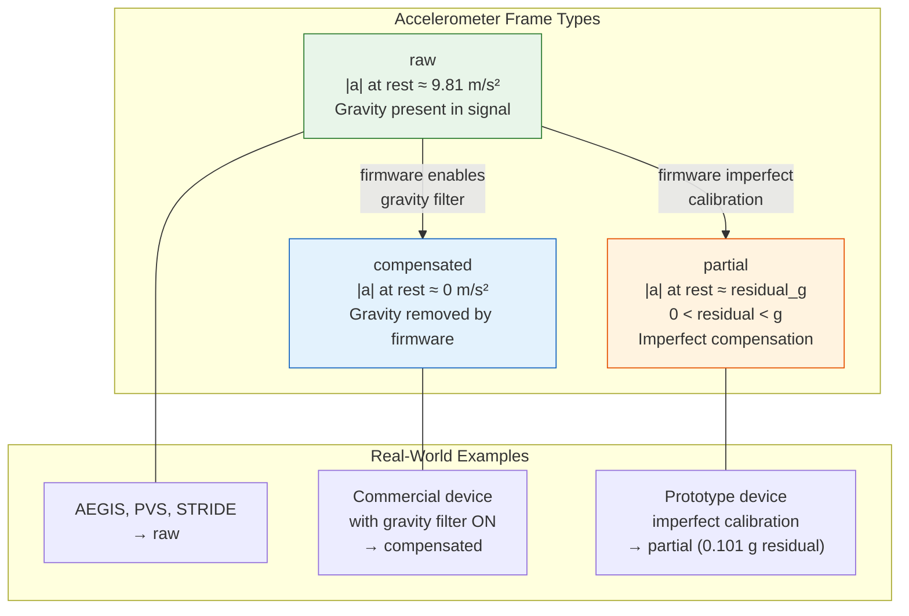
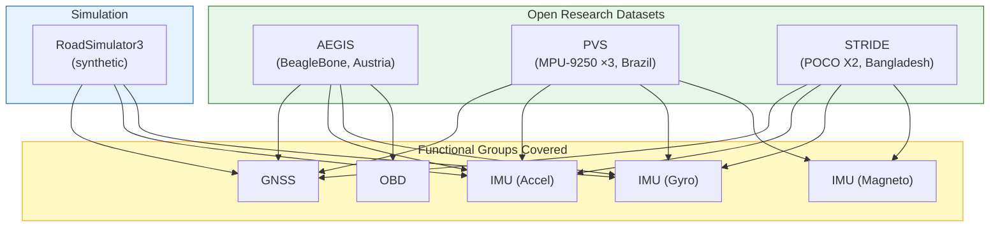

# SPEC-01: Telemachus Record Format

## 1. Introduction

Telemachus defines an **open pivot format** for high-frequency mobility
and telematics data. A Telemachus dataset captures what a telematics
device physically measures and transmits: GNSS position, inertial
measurements, and optionally vehicle bus data.

This specification consolidates and supersedes RFC-0001 (Core v0.2),
RFC-0004 (Extended FieldGroups), and RFC-0013 (Device Layer v0.7).

### 1.1 Design Principles

- **Raw device output only.** No enrichment, no interpretation, no external data.
- **Columns are flat.** No nested JSON objects — every field is a top-level column.
- **Units are SI.** m/s, m/s², rad/s, degrees WGS84, UTC nanoseconds. Unit suffixes in column names (`_mps`, `_rad_s`, `_uT`) make data self-documenting.
- **Multi-rate is native.** GNSS and IMU may sample at different frequencies.
- **One group per sensor.** Each functional group maps to a physical sensor or bus.
- **Profiles, not one-size-fits-all.** Three profiles (`core`, `imu`, `full`) adapt to different device capabilities.
- **Vendor extensions welcome.** Extra columns use `x_<source>_<field>` convention.

### 1.2 Record Overview

A Telemachus record is a timestamped row containing measurements from
up to seven functional groups, each mapping to a distinct sensor or bus:



---

## 2. Column Specification

### 2.1 Functional Groups

Columns are organized into **seven functional groups**, each mapping to
a physical sensor, bus, or signal type. All columns are flat (no
nesting). The grouping is conceptual, for documentation only.

```mermaid
graph LR
    subgraph DT["1 — Datetime"]
        ts["ts (UTC)"]
    end

    subgraph GNSS["2 — GNSS Receiver"]
        lat & lon
        speed_mps
        heading_deg
        altitude_gps_m
        hdop & h_accuracy_m
        n_satellites
    end

    subgraph IMU_G["3 — IMU"]
        direction TB
        subgraph ACCEL["Accelerometer"]
            ax["ax_mps2"]
            ay["ay_mps2"]
            az["az_mps2"]
        end
        subgraph GYRO["Gyroscope (opt.)"]
            gx["gx_rad_s"]
            gy["gy_rad_s"]
            gz["gz_rad_s"]
        end
        subgraph MAG["Magnetometer (opt.)"]
            mx["mx_uT"]
            my["my_uT"]
            mz["mz_uT"]
        end
    end

    subgraph OBD_G["4 — OBD-II"]
        spd_obd["speed_obd_mps"]
        rpm_f["rpm"]
        odo["odometer_m"]
    end

    subgraph CAN_G["5 — CAN (future)"]
        can_f["x_can_&lt;signal&gt;"]
    end

    subgraph IO_G["6 — I/O"]
        ign["ignition"]
        volt["vehicle_voltage_v"]
    end

    subgraph XTR["7 — Extra"]
        x_f["x_&lt;source&gt;_&lt;field&gt;"]
    end

    DT --- GNSS --- IMU_G --- OBD_G --- CAN_G --- IO_G --- XTR

    style DT fill:#fff9c4,stroke:#f9a825
    style GNSS fill:#e8f5e9,stroke:#2e7d32
    style IMU_G fill:#e3f2fd,stroke:#1565c0
    style OBD_G fill:#dcedc8,stroke:#558b2f
    style CAN_G fill:#f0f4c3,stroke:#9e9d24
    style IO_G fill:#fce4ec,stroke:#c62828
    style XTR fill:#f3e5f5,stroke:#6a1b9a
```



### 2.2 Profiles

Not all telematics devices have the same sensors. Telemachus defines
three profiles to accommodate different hardware capabilities:



| Profile | Required columns | Typical sources |
|---------|-----------------|-----------------|
| **`core`** | `ts`, `lat`, `lon`, `speed_mps` | GPS trackers, fleet APIs (Samsara, Geotab, Webfleet) |
| **`imu`** | core + `ax_mps2`, `ay_mps2`, `az_mps2` | Commercial telematics devices with accelerometer |
| **`full`** | imu + `gx_rad_s`, `gy_rad_s`, `gz_rad_s` | Research platforms, smartphones (AEGIS, STRIDE, PVS) |

The profile is declared in the manifest (`profile` field, see SPEC-02).
Validation adapts to the declared profile: a `core` dataset is valid
without IMU columns.

> **Default**: if no profile is declared, validators MUST assume `imu`
> (GNSS + accelerometer) for backward compatibility.

### 2.3 Mandatory Fields

Mandatory columns depend on the declared profile:

**All profiles (core, imu, full):**

| Column | Type | Unit | Group | Description |
|--------|------|------|-------|-------------|
| `ts` | datetime64[ns, UTC] | UTC | Datetime | Timestamp at highest sensor rate |
| `lat` | float64 | degrees WGS84 | GNSS | Latitude. NaN between GNSS ticks |
| `lon` | float64 | degrees WGS84 | GNSS | Longitude. NaN between GNSS ticks |
| `speed_mps` | float32 | m/s | GNSS | Ground speed (Doppler). NaN between GNSS ticks |

**Profile `imu` and `full` add:**

| Column | Type | Unit | Group | Description |
|--------|------|------|-------|-------------|
| `ax_mps2` | float32 | m/s² | IMU | Longitudinal acceleration (+ = forward) |
| `ay_mps2` | float32 | m/s² | IMU | Lateral acceleration (+ = left) |
| `az_mps2` | float32 | m/s² | IMU | Vertical acceleration (~9.81 at rest if raw) |

**Profile `full` adds:**

| Column | Type | Unit | Group | Description |
|--------|------|------|-------|-------------|
| `gx_rad_s` | float32 | rad/s | IMU | Gyroscope X (roll rate) |
| `gy_rad_s` | float32 | rad/s | IMU | Gyroscope Y (pitch rate) |
| `gz_rad_s` | float32 | rad/s | IMU | Gyroscope Z (yaw rate) |

### 2.4 Recommended Fields — Identification

These fields SHOULD be present per-row OR inherited from the manifest
(see SPEC-02 §4.1). They are metadata, not physical measurements:

| Column | Type | Group | Description | Fallback |
|--------|------|-------|-------------|----------|
| `device_id` | string | Metadata | Unique device identifier | Manifest `hardware.devices[0].name` |
| `trip_id` | string | Metadata | Unique trip identifier | Manifest or filename convention |

> If a file omits `device_id` / `trip_id`, consumers MUST resolve them
> from the manifest. If the manifest declares multiple devices and the
> file omits `device_id`, validation MUST fail.

### 2.5 Recommended Fields — GNSS Metadata

These fields SHOULD be present when the hardware provides them:

| Column | Type | Unit | Description |
|--------|------|------|-------------|
| `heading_deg` | float32 | degrees [0, 360) | Course over ground (COG). NaN when stationary |
| `altitude_gps_m` | float32 | m | GNSS altitude (NMEA GGA). Typical accuracy: 10–30 m |
| `hdop` | float32 | — (ratio) | Horizontal Dilution of Precision. < 2.0 = good |
| `h_accuracy_m` | float32 | m | Horizontal position accuracy (Android/smartphones). Complementary to hdop |
| `n_satellites` | Int8 (nullable) | — | Number of satellites used in fix. > 6 = reliable. NaN when no fix |

> **`hdop` vs `h_accuracy_m`**: Commercial GNSS devices (Teltonika, Danlaw)
> report `hdop` (dimensionless ratio). Smartphones (Android) report
> `h_accuracy_m` (68th percentile radius in meters). Both may coexist; a
> dataset typically has one or the other, rarely both.

### 2.6 Optional Fields — Extended IMU

Present only if the device has the corresponding sensor. Columns MUST be
absent or all-NaN when the sensor is not available — they MUST NOT be
filled with zeros.

| Column | Type | Unit | Description |
|--------|------|------|-------------|
| `gx_rad_s` | float32 | rad/s | Gyroscope X (roll rate) |
| `gy_rad_s` | float32 | rad/s | Gyroscope Y (pitch rate) |
| `gz_rad_s` | float32 | rad/s | Gyroscope Z (yaw rate) |
| `mx_uT` | float32 | µT | Magnetometer X |
| `my_uT` | float32 | µT | Magnetometer Y |
| `mz_uT` | float32 | µT | Magnetometer Z |



### 2.7 Optional Fields — OBD-II

Standardized vehicle data from the OBD-II diagnostic port (ISO 15031,
SAE J1979). These PIDs are universal across OBD-II compliant vehicles.

| Column | Type | Unit | OBD PID | Description |
|--------|------|------|---------|-------------|
| `speed_obd_mps` | float32 | m/s | 0x0D | Vehicle speed. Independent of GNSS speed |
| `rpm` | float32 | rev/min | 0x0C | Engine RPM |
| `odometer_m` | float64 | m | 0xA6 | Total odometer reading |

> **Two speed fields**: `speed_mps` (GNSS, mandatory) and `speed_obd_mps`
> (OBD, optional) are intentionally separate. GPS speed degrades below
> ~5 km/h and requires a fix; OBD speed is accurate at all speeds but
> requires a wired OBD adapter.



> **Additional OBD PIDs** (throttle position, engine load, coolant
> temperature, etc.) may be included using the vendor-specific convention
> `x_obd_<pid_name>` (e.g., `x_obd_throttle_pct`, `x_obd_coolant_c`).
> These may be promoted to formal columns in future spec versions when
> supported by Open datasets.

### 2.8 Future Group — CAN Bus

Raw CAN bus data (SAE J1939, manufacturer-specific DBCs) is **not yet
formalized** in this specification. CAN signals are vendor-specific —
each vehicle manufacturer defines its own signal dictionary (DBC file).

Until formal CAN columns are defined, raw CAN data SHOULD use the
vendor-specific convention:

```
x_can_<signal_name>
```

**Examples:** `x_can_wheel_speed_fl_mps`, `x_can_steering_angle_deg`,
`x_can_brake_pressure_bar`.

> CAN column formalization will be considered when Open datasets with
> raw CAN data become available. The key difference with OBD: OBD PIDs
> are standardized (same PID = same meaning across all vehicles), CAN
> signals are manufacturer-specific (same signal ID = different meaning
> per vehicle make/model).



### 2.9 Optional Fields — I/O (Digital & Analog Inputs)

Raw electrical signals from the device's input pins. These are
hardware-level signals, not protocol data:

| Column | Type | Unit | Description |
|--------|------|------|-------------|
| `ignition` | bool | — | Vehicle ignition state (digital input pin) |
| `vehicle_voltage_v` | float32 | V | External power source voltage (analog input, 12 V / 24 V system) |

> `vehicle_voltage_v` reads the vehicle electrical system voltage via
> the device's power input. It is a key signal for determining whether
> the device is wired to a vehicle (> 9 V) or running on battery.

### 2.10 Vendor-Specific Extra Fields

Telemachus files MAY contain additional columns not defined in this
specification. These columns MUST follow the naming convention:

```
x_<source>_<field>
```

Where `<source>` identifies the data provider or processing origin, and
`<field>` is a descriptive snake_case name.

**Examples:**

| Column | Source | Description |
|--------|--------|-------------|
| `x_pvs_road_surface` | PVS dataset | Road surface label (ground truth) |
| `x_pvs_temp_dashboard_c` | PVS dataset | Sensor temperature at dashboard placement |
| `x_stride_orientation_qw` | STRIDE dataset | Android orientation quaternion W |
| `x_stride_gravity_x_mps2` | STRIDE dataset | Android-derived gravity vector X |
| `x_rs3_road_type` | RoadSimulator3 | Simulation ground truth road classification |
| `x_obd_throttle_pct` | OBD-II | Throttle position (PID 0x11, not yet formalized) |
| `x_can_steering_angle_deg` | CAN bus | Raw CAN signal (manufacturer-specific) |
| `x_vendor_firmware_flag` | Any vendor | Device-specific firmware status field |

**Rules:**
- Validators MUST ignore columns matching `x_*` (never reject them)
- Adapters SHOULD document their extra columns in the manifest
- Consumers MUST NOT assume any `x_*` column is present

### 2.11 Multi-Rate Convention

Telemachus files are timestamped at the **highest sensor rate** (typically
IMU rate, e.g. 10–100 Hz). Lower-rate columns (GNSS at 1 Hz) contain
NaN on rows where no measurement is available.



### 2.12 AccPeriod — Accelerometer Frame Reference

Commercial telematics devices may apply **firmware-side gravity
compensation**. The same accelerometer can output data in different
reference frames:

| Frame | At rest | Behaviour |
|-------|---------|-----------|
| `raw` | `az ~ 9.81 m/s²` (gravity present) | Unprocessed sensor output |
| `compensated` | `az ~ 0 m/s²` (gravity removed) | Firmware has subtracted gravity |
| `partial` | `az ~ epsilon`, `0 < abs(epsilon) < g` | Imperfect compensation, residual gravity vector |

The accelerometer frame is declared **at manifest level** (see SPEC-02
§3.7), not per-row. Each AccPeriod is a contiguous time range with a
coherent frame.

**Default**: if no AccPeriod is declared, consumers MUST assume `raw`.



### 2.13 Excluded Columns

The following columns MUST NOT appear as **top-level columns** in a
Telemachus dataset. They represent enriched or derived data:

| Column | Reason |
|--------|--------|
| `road_type` | Requires external map data |
| `speed_limit_kmh` | Requires external map data |
| `altitude_dem_m` | Requires external DEM |
| `slope_pct` | Derived from external DEM |
| `event` | Algorithmic output, not raw measurement |
| `lat_matched` | Requires map matching engine |
| `carrier_state` | Per-trip metadata — belongs in manifest (see SPEC-02) |
| `is_vehicle_data` | Derived from carrier_state |

> **Clarification — ground truth vs. enrichment**: Simulation ground
> truth (e.g. `x_rs3_road_type`, `x_rs3_event`) is allowed as
> vendor-specific extra columns (`x_*`). These are **annotations
> attached to synthetic data for validation purposes**, not enrichment
> derived from external sources. The exclusion rule applies only to
> top-level columns without the `x_` prefix.

---

## 3. Validation Rules

A Telemachus file is valid if:

1. All mandatory columns for the declared profile (§2.2–2.3) are present with correct types. Default profile is `imu` if not declared
2. `ts` is monotonically increasing (strictly)
3. **For profiles `imu` and `full`**, per AccPeriod (SPEC-02 §3.7), `|a|` mean at rest matches the declared frame:
   - `raw`: ≈ 9.81 ± 1.0 m/s²
   - `compensated`: ≈ 0 ± 1.0 m/s²
   - `partial`: ≈ `residual_g` ± 0.05 g
4. `lat` / `lon` are within [-90, 90] / [-180, 180] when not NaN
5. No excluded columns from §2.13 are present (columns with `x_` prefix are always allowed)
6. All extra columns follow the `x_<source>_<field>` convention
7. `speed_mps` >= 0 when not NaN
8. Gyro columns are either all present or all absent (no partial group)
9. Magneto columns are either all present or all absent (no partial group)
10. If `device_id` / `trip_id` are absent from columns, they MUST be resolvable from the manifest (SPEC-02 §4.1)

---

## 4. Hardware Mapping

### 4.1 Source Coverage Matrix



> **Commercial devices** (GNSS + IMU + optional I/O and OBD) are
> supported via private adapters documented outside this specification.

### 4.2 Detailed Column Mapping — Open Datasets

> **Note:** Column mappings for commercial/proprietary devices are
> documented in their respective private adapter modules, not in this
> public specification.

#### AEGIS (Zenodo 820576, Austria)

| Raw CSV Column | Telemachus Column | Group | Conversion |
|----------------|-------------------|-------|------------|
| `timestamp` (accelerations.csv) | `ts` | Datetime | ISO string → UTC datetime |
| `x_value` (accelerations.csv) | `ax_mps2` | IMU | **G-force × 9.80665** |
| `y_value` | `ay_mps2` | IMU | G-force × 9.80665 |
| `z_value` | `az_mps2` | IMU | G-force × 9.80665 |
| `x_value` (gyroscopes.csv) | `gx_rad_s` | IMU | **deg/s × π/180** |
| `y_value` | `gy_rad_s` | IMU | deg/s × π/180 |
| `z_value` | `gz_rad_s` | IMU | deg/s × π/180 |
| `latitude` (positions.csv) | `lat` | GNSS | **NMEA DDMM.MMMM → decimal degrees** |
| `longitude` | `lon` | GNSS | NMEA → decimal degrees |
| `altitude` | `altitude_gps_m` | GNSS | direct (meters) |
| `data` (obdData.csv, PID 0x0D) | `speed_obd_mps` | OBD | km/h ÷ 3.6 |
| `trip_id` | `trip_id` | Metadata | direct |
| `beaglebone_id` (trips.csv) | `device_id` | Metadata | lookup |

#### PVS (Kaggle, Curitiba)

| Raw CSV Column | Telemachus Column | Group | Conversion |
|----------------|-------------------|-------|------------|
| `timestamp` | `ts` | Datetime | Unix seconds → UTC datetime |
| `acc_x_{placement}` | `ax_mps2` | IMU | direct (already m/s²) |
| `acc_y_{placement}` | `ay_mps2` | IMU | direct |
| `acc_z_{placement}` | `az_mps2` | IMU | direct |
| `gyro_x_{placement}` | `gx_rad_s` | IMU | **deg/s × π/180** |
| `gyro_y_{placement}` | `gy_rad_s` | IMU | deg/s × π/180 |
| `gyro_z_{placement}` | `gz_rad_s` | IMU | deg/s × π/180 |
| `mag_x_{placement}` | `mx_uT` | IMU | direct (µT) |
| `mag_y_{placement}` | `my_uT` | IMU | direct |
| `mag_z_{placement}` | `mz_uT` | IMU | direct |
| `latitude` | `lat` | GNSS | direct (decimal degrees) |
| `longitude` | `lon` | GNSS | direct |
| `speed` | `speed_mps` | GNSS | direct (already m/s) |
| `elevation` (GPS CSV) | `altitude_gps_m` | GNSS | direct |
| `hdop` (GPS CSV) | `hdop` | GNSS | direct |
| `satellites` (GPS CSV) | `n_satellites` | GNSS | direct |

#### STRIDE (Figshare, Rajshahi)

| Raw CSV Column | Telemachus Column | Group | Conversion |
|----------------|-------------------|-------|------------|
| `time` (TotalAcceleration.csv) | `ts` | Datetime | **ns epoch → UTC datetime** |
| `x` (TotalAcceleration.csv) | `ax_mps2` | IMU | direct (already m/s²) |
| `y` | `ay_mps2` | IMU | direct |
| `z` | `az_mps2` | IMU | direct |
| `x` (Gyroscope.csv) | `gx_rad_s` | IMU | direct (already rad/s) |
| `y` | `gy_rad_s` | IMU | direct |
| `z` | `gz_rad_s` | IMU | direct |
| `x` (Magnetometer.csv) | `mx_uT` | IMU | direct (µT) |
| `y` | `my_uT` | IMU | direct |
| `z` | `mz_uT` | IMU | direct |
| `latitude` (Location.csv) | `lat` | GNSS | direct (decimal degrees) |
| `longitude` | `lon` | GNSS | direct |
| `speed` (Location.csv) | `speed_mps` | GNSS | direct (already m/s) |
| `altitude` (Location.csv) | `altitude_gps_m` | GNSS | direct |
| `bearing` (Location.csv) | `heading_deg` | GNSS | direct (degrees) |
| `horizontalAccuracy` (Location.csv) | `h_accuracy_m` | GNSS | direct (meters) |

#### RoadSimulator3 (Synthetic)

| RS3 Field | Telemachus Column | Group | Conversion |
|-----------|-------------------|-------|------------|
| `timestamp` | `ts` | Datetime | direct (10 Hz uniform UTC) |
| `lat`, `lon` | `lat`, `lon` | GNSS | direct |
| `speed` | `speed_mps` | GNSS | direct |
| `heading` | `heading_deg` | GNSS | direct |
| `acc_x/y/z` | `ax/ay/az_mps2` | IMU | direct (includes gravity on az) |
| `gyro_x/y/z` | `gx/gy/gz_rad_s` | IMU | direct (NaN if disabled) |

> **Note:** RS3 also exports `road_type`, `event`, `target_speed` — these
> are **ground truth metadata** for validation, NOT part of a Telemachus
> record. They should be stored as `x_rs3_*` extra columns or in a
> sidecar file.

---

## 5. Unit Conversion Reference

Adapters MUST convert raw device units to Telemachus canonical units:

| Quantity | Telemachus Unit | Common Raw Units | Conversion |
|----------|-----------------|-----------------|------------|
| Speed | m/s | km/h | ÷ 3.6 |
| Acceleration | m/s² | G-force | × 9.80665 |
| Gyroscope | rad/s | deg/s | × π / 180 |
| Magnetometer | µT | µT | (usually native) |
| GPS coordinates | decimal degrees | NMEA DDMM.MMMM | `DD + MM.MMMM / 60` |
| GPS coordinates | decimal degrees | decimal degrees | (no conversion) |
| Odometer | m | km | × 1000 |
| Voltage | V | V | (no conversion) |
| Timestamp | datetime64[ns, UTC] | epoch seconds | × 1e9 + to_datetime |
| Timestamp | datetime64[ns, UTC] | epoch nanoseconds | to_datetime |
| Timestamp | datetime64[ns, UTC] | ISO 8601 string | parse + ensure UTC |

---

## 6. Python API — Sensor Introspection

The `telemachus-py` library provides introspection helpers for consumers
to discover what data is available without loading the full dataset:

### 6.1 Manifest-Level (fast, no data loaded)

```python
ds = tele.Dataset.from_manifest("manifest.yaml")
ds.profile()             # → "core" | "imu" | "full"
ds.declared_sensors()    # → {'gps': {'rate_hz': 1}, 'accelerometer': {...}, ...}
ds.has_declared_gyro()   # → True / False
ds.acc_frame()           # → "raw" | "compensated" | "partial"
```

### 6.2 Data-Level (loads parquet, checks actual content)

```python
df = tele.read("manifest.yaml")
tele.has_gps(df)         # → True if lat, lon, speed_mps have non-NaN values
tele.has_imu(df)         # → True if ax, ay, az have non-NaN values
tele.has_gyro(df)        # → True if gx, gy, gz present and non-NaN
tele.has_magneto(df)     # → True if mx, my, mz present and non-NaN
tele.has_obd(df)         # → True if speed_obd_mps or rpm present and non-NaN
tele.has_io(df)          # → True if ignition or vehicle_voltage_v present
tele.sensor_profile(df)  # → "gps+imu+gyro+magneto" or "gps+imu+obd" etc.
tele.is_gps_only(df)     # → GPS but no IMU
tele.is_full_imu(df)     # → accel + gyro available
```

---

## 7. References

- **SPEC-02**: Dataset Manifest — canonical file-level metadata
- **SPEC-03**: Adapters & Validation — tooling and conformance testing
- **Superseded RFCs**: RFC-0001 (Core v0.2), RFC-0004 (Extended FieldGroups), RFC-0013 (Device Layer v0.7)

### Dataset References

| Dataset | DOI / URL | License |
|---------|-----------|---------|
| AEGIS | Zenodo 820576 | CC-BY-4.0 |
| PVS | Kaggle (Curitiba) | CC-BY-NC-ND-4.0 |
| STRIDE | Figshare 25460755 | CC-BY-4.0 |
| UAH-DriveSet | Universidad de Alcala | Academic |

---

End of SPEC-01.
