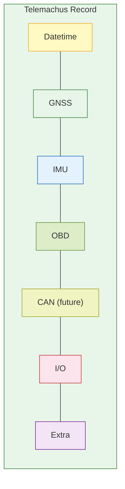
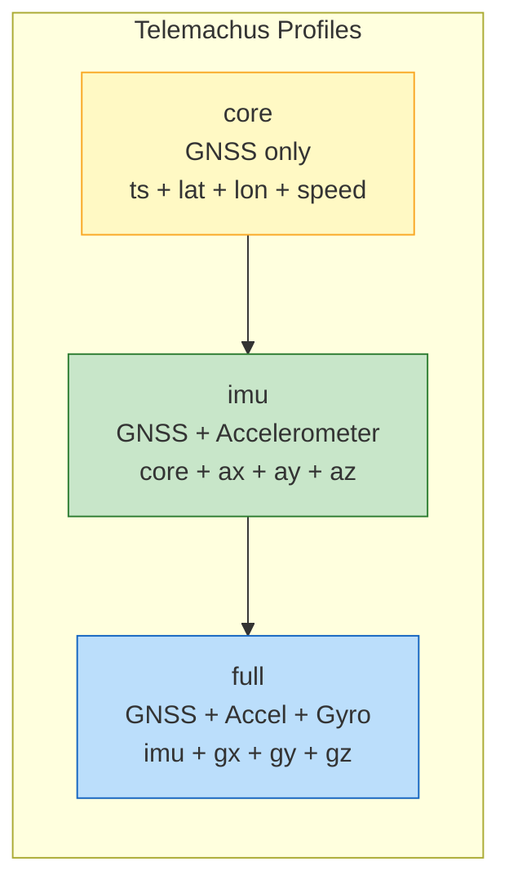
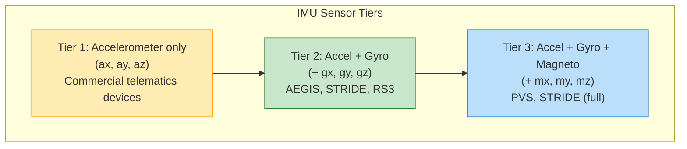
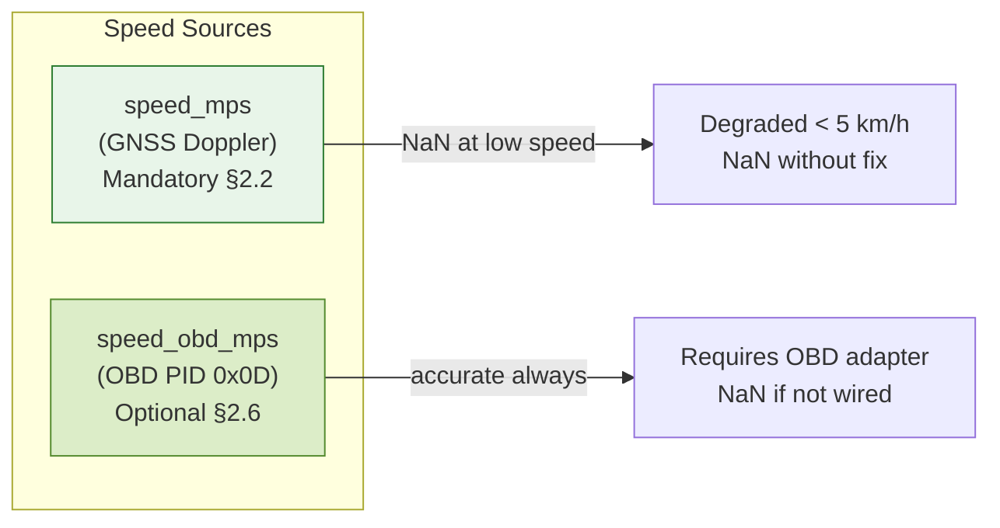
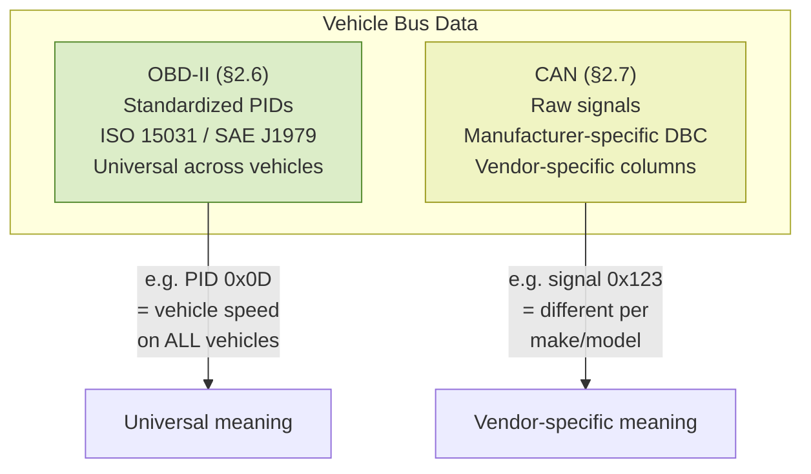
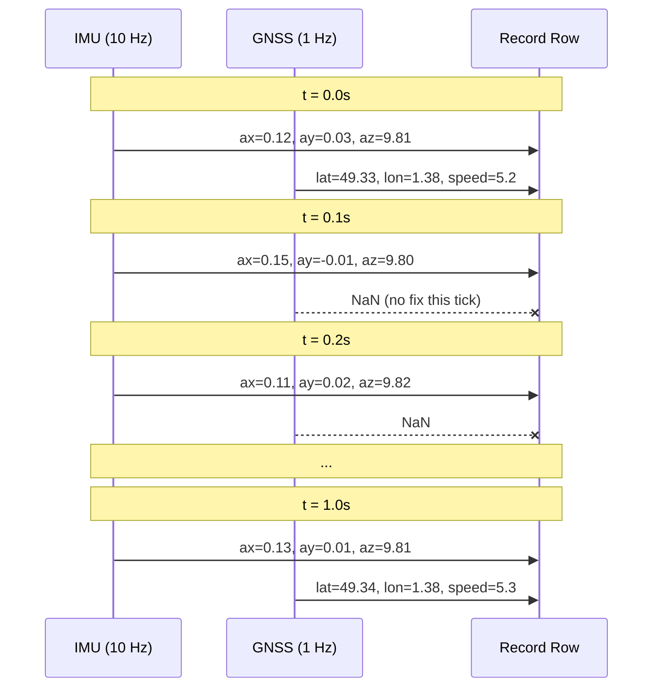
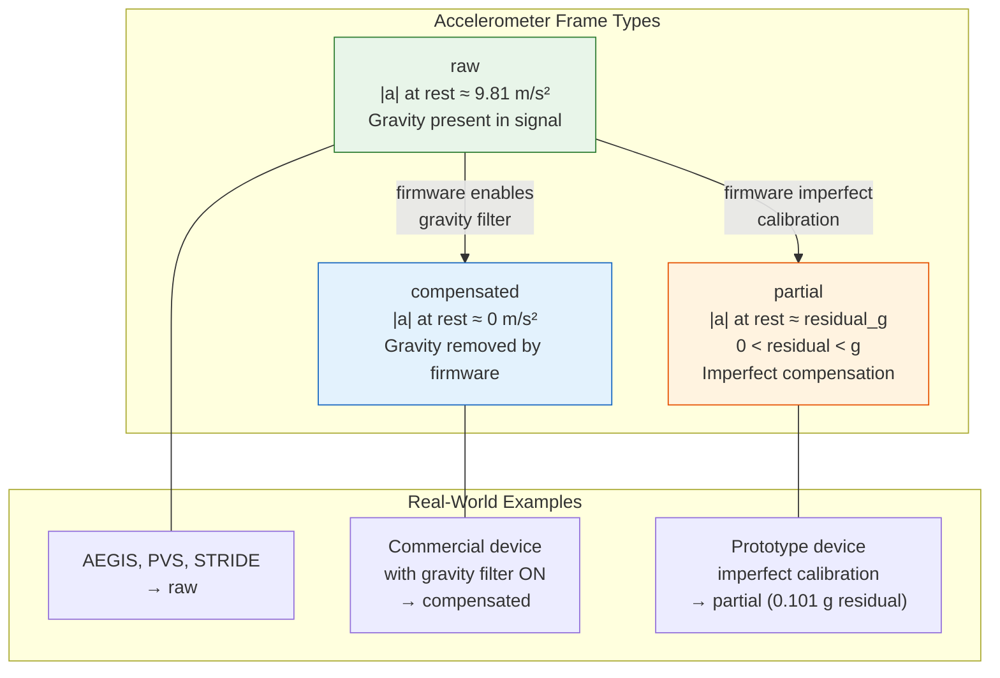
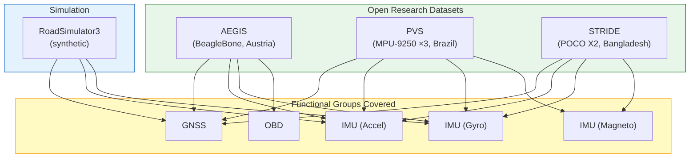

# SPEC-01: Telemachus Record Format

> **v0.9 (2026-06-03)** — Device-frame coverage completion: GNSS-quality flags,
> device telemetry & motion state, sensitive-identifier (PII) policy, full
> source-field coverage rule, and acceleration unified across sampling rates and
> transport encodings. Details in `CHANGELOG.md`.

## 1. Introduction

Telemachus defines an **open pivot format** for high-frequency mobility
and telematics data. A Telemachus dataset captures what a telematics
device physically measures and transmits: GNSS position, inertial
measurements, and optionally vehicle bus data.

**This layer is the master.** The industry it serves has spent twenty years
answering one question — *what should the dashboard show?* — and that question
pushes every architecture to simplify early: one position a second, a few
threshold events, a few indicators, a screen. Events replace measurements,
aggregates replace trajectories, and the reduction is irreversible. Music went
the same way in the 2000s, with one difference: it kept the master. Nobody
presses a record from an MP3.

A record conforming to this specification is what the studio keeps. Every layer
above it — reconstruction, events, scores, dashboards — can be recomputed from
it, and each is a projection made for one purpose. This layer cannot be
recomputed from anything, which is the entire reason it is specified first and
in the most detail.

This specification consolidates and supersedes RFC-0001 (Core v0.2),
RFC-0004 (Extended FieldGroups), and RFC-0013 (Device Layer v0.7).

### 1.1 Design Principles

- **Raw device output only.** No enrichment, no interpretation, no external data.
- **Columns are flat.** No nested JSON objects — every field is a top-level column.
- **Units are SI.** m/s, m/s², rad/s, degrees WGS84, UTC nanoseconds. Unit suffixes in column names (`_mps`, `_rad_s`, `_uT`) make data self-documenting.
- **Multi-rate is native.** GNSS and IMU may sample at different frequencies.
- **One group per sensor.** Each functional group maps to a physical sensor or bus.
- **Profiles, not one-size-fits-all.** Three profiles (`core`, `imu`, `full`) adapt to different device capabilities.
- **Vendor extensions welcome.** Extra columns use `x_<source>_<field>` convention.

### 1.2 Record Overview

A Telemachus record is a timestamped row containing measurements from
up to seven functional groups, each mapping to a distinct sensor or bus:


```mermaid
graph LR
    subgraph RECORD["Telemachus Record"]
        DT["Datetime"]
        GPS["GNSS"]
        IMU["IMU"]
        OBD["OBD"]
        CAN["CAN (future)"]
        IO["I/O"]
        EXTRA["Extra"]
    end

    DT --- GPS --- IMU --- OBD --- CAN --- IO --- EXTRA

    style RECORD fill:#e8f5e9,stroke:#2e7d32
    style DT fill:#fff9c4,stroke:#f9a825
    style GPS fill:#e8f5e9,stroke:#2e7d32
    style IMU fill:#e3f2fd,stroke:#1565c0
    style OBD fill:#dcedc8,stroke:#558b2f
    style CAN fill:#f0f4c3,stroke:#9e9d24
    style IO fill:#fce4ec,stroke:#c62828
    style EXTRA fill:#f3e5f5,stroke:#6a1b9a
```

---

## 2. Column Specification

### 2.1 Functional Groups

Columns are organized into **seven functional groups**, each mapping to
a physical sensor, bus, or signal type. All columns are flat (no
nesting). The grouping is conceptual, for documentation only.


```mermaid
graph LR
    subgraph DT["1 — Datetime"]
        ts["ts (UTC)"]
    end

    subgraph GNSS["2 — GNSS Receiver"]
        lat & lon
        speed_mps
        heading_deg
        altitude_gps_m
        hdop & h_accuracy_m
        n_satellites
    end

    subgraph IMU_G["3 — IMU"]
        direction TB
        subgraph ACCEL["Accelerometer"]
            ax["ax_mps2"]
            ay["ay_mps2"]
            az["az_mps2"]
        end
        subgraph GYRO["Gyroscope (opt.)"]
            gx["gx_rad_s"]
            gy["gy_rad_s"]
            gz["gz_rad_s"]
        end
        subgraph MAG["Magnetometer (opt.)"]
            mx["mx_uT"]
            my["my_uT"]
            mz["mz_uT"]
        end
    end

    subgraph OBD_G["4 — OBD-II"]
        spd_obd["speed_obd_mps"]
        rpm_f["rpm"]
        odo["odometer_m"]
    end

    subgraph CAN_G["5 — CAN (future)"]
        can_f["x_can_&lt;signal&gt;"]
    end

    subgraph IO_G["6 — I/O"]
        ign["ignition"]
        volt["vehicle_voltage_v"]
    end

    subgraph XTR["7 — Extra"]
        x_f["x_&lt;source&gt;_&lt;field&gt;"]
    end

    DT --- GNSS --- IMU_G --- OBD_G --- CAN_G --- IO_G --- XTR

    style DT fill:#fff9c4,stroke:#f9a825
    style GNSS fill:#e8f5e9,stroke:#2e7d32
    style IMU_G fill:#e3f2fd,stroke:#1565c0
    style OBD_G fill:#dcedc8,stroke:#558b2f
    style CAN_G fill:#f0f4c3,stroke:#9e9d24
    style IO_G fill:#fce4ec,stroke:#c62828
    style XTR fill:#f3e5f5,stroke:#6a1b9a
```

### 2.2 Profiles

Not all telematics devices have the same sensors. Telemachus defines
three profiles to accommodate different hardware capabilities:


```mermaid
graph LR
    subgraph PROFILES["Telemachus Profiles"]
        CORE["core\nGNSS only\nts + lat + lon + speed"]
        KIMU["imu\nGNSS + Accelerometer\ncore + ax + ay + az"]
        FULL["full\nGNSS + Accel + Gyro\nimu + gx + gy + gz"]
    end

    CORE --> KIMU --> FULL

    style CORE fill:#fff9c4,stroke:#f9a825
    style KIMU fill:#c8e6c9,stroke:#2e7d32
    style FULL fill:#bbdefb,stroke:#1565c0
```

| Profile | Required columns | Typical sources |
|---------|-----------------|-----------------|
| **`core`** | `ts`, `lat`, `lon` (+ `speed_mps` if the receiver measures it, see §2.3.1) | GPS trackers, fleet APIs (Samsara, Geotab, Webfleet), low-power trackers |
| **`imu`** | core + `ax_mps2`, `ay_mps2`, `az_mps2` | Commercial telematics devices with accelerometer |
| **`full`** | imu + `gx_rad_s`, `gy_rad_s`, `gz_rad_s` | Research platforms, smartphones (AEGIS, STRIDE, PVS) |

The profile is declared in the manifest (`profile` field, see SPEC-02).
Validation adapts to the declared profile: a `core` dataset is valid
without IMU columns.

> **Default**: if no profile is declared, validators MUST assume `imu`
> (GNSS + accelerometer) for backward compatibility.

### 2.3 Mandatory Fields

Mandatory columns depend on the declared profile:

**All profiles (core, imu, full):**

| Column | Type | Unit | Group | Description |
|--------|------|------|-------|-------------|
| `ts` | datetime64[ns, UTC] | UTC | Datetime | Timestamp at highest sensor rate |
| `lat` | float64 | degrees WGS84 | GNSS | Latitude. NaN between GNSS ticks |
| `lon` | float64 | degrees WGS84 | GNSS | Longitude. NaN between GNSS ticks |
| `speed_mps` | float32 | m/s | GNSS | Ground speed. **Conditional — see §2.3.1.** NaN between GNSS ticks |

### 2.3.1 `speed_mps` is conditional, and never back-filled

A Doppler solution costs energy. Many low-power receivers — wildlife collars,
asset tags, long-life trackers — emit position without ever emitting speed.
Under the previous wording such a device had two ways out, and both were bad:
declare itself non-conformant, or fill `speed_mps` by differentiating two
positions.

The second is the dangerous one. A Doppler speed is **independent** of the
position error; a speed obtained from two positions is **made of it**. The two
carry the same column name and are not the same quantity.

Therefore:

- `speed_mps` MUST be present when the receiver measures it;
- it MAY be absent (column omitted, or present and all-NaN) when it does not;
- if it is present, the dataset MUST declare its provenance (§2.14). A
  position-differentiated speed MUST be declared `derived`, never `measured`;
- a consumer MUST NOT assume `measured` in the absence of a declaration.

**Profile `imu` and `full` add:**

| Column | Type | Unit | Group | Description |
|--------|------|------|-------|-------------|
| `ax_mps2` | float32 | m/s² | IMU | Longitudinal acceleration (+ = forward) |
| `ay_mps2` | float32 | m/s² | IMU | Lateral acceleration (+ = left) |
| `az_mps2` | float32 | m/s² | IMU | Vertical acceleration (~9.81 at rest if raw) |

**Profile `full` adds:**

| Column | Type | Unit | Group | Description |
|--------|------|------|-------|-------------|
| `gx_rad_s` | float32 | rad/s | IMU | Gyroscope X (roll rate) |
| `gy_rad_s` | float32 | rad/s | IMU | Gyroscope Y (pitch rate) |
| `gz_rad_s` | float32 | rad/s | IMU | Gyroscope Z (yaw rate) |

### 2.4 Recommended Fields — Identification

These fields SHOULD be present per-row OR inherited from the manifest
(see SPEC-02 §4.1). They are metadata, not physical measurements:

| Column | Type | Group | Description | Fallback |
|--------|------|-------|-------------|----------|
| `device_id` | string | Metadata | Unique device identifier (opaque, non-sensitive) | Manifest `hardware.devices[0].name` |
| `trip_id` | string | Metadata | Unique trip identifier | Manifest or filename convention |
| `device_imei` | string | Metadata | Hardware IMEI — **sensitive (PII)** | optional |
| `sim_iccid` | string | Metadata | SIM serial / ICCID — **sensitive (PII)** | optional |

> If a file omits `device_id` / `trip_id`, consumers MUST resolve them
> from the manifest. If the manifest declares multiple devices and the
> file omits `device_id`, validation MUST fail.

> **Sensitive identifiers — defined, but publication-restricted**: `device_imei`
> and `sim_iccid` are **part of the format** (a telematics record legitimately
> carries them for operational/private use). They are **PII**: in a **published
> open dataset** they MUST be omitted or anonymized (the opaque `device_id` is
> used instead) and MUST NOT carry real values in public data. The schema
> *defines* them; the publication policy (SPEC-04) *restricts* them. Sensitivity
> is a publication concern, not a reason to exclude them from the format.
>
> The cellular-network identifiers `gsm_mcc` / `gsm_mnc` / `gsm_operator` (§2.9.1)
> are **quasi-identifiers**: they reveal the fleet's operator and country and can
> enable indirect de-anonymization. In a published open dataset they MUST be
> coarsened or omitted (keep `gsm_network_type`, drop operator / MCC / MNC).

### 2.5 Recommended Fields — GNSS Metadata

These fields SHOULD be present when the hardware provides them:

| Column | Type | Unit | Description |
|--------|------|------|-------------|
| `heading_deg` | float32 | degrees [0, 360) | Course over ground (COG). NaN when stationary |
| `altitude_gps_m` | float32 | m | GNSS altitude (NMEA GGA). Typical accuracy: 10–30 m |
| `hdop` | float32 | — (ratio) | Horizontal Dilution of Precision. < 2.0 = good |
| `h_accuracy_m` | float32 | m | Horizontal position accuracy (Android/smartphones). Complementary to hdop |
| `n_satellites` | Int8 (nullable) | — | Number of satellites used in fix. > 6 = reliable. NaN when no fix |
| `pdop` | float32 | — (ratio) | Position Dilution of Precision |
| `gnss_valid` | bool | — | Per-fix valid flag. **Advisory only** — some firmwares assert it on only a minority of valid fixes; MUST NOT be used to drop positioned rows |
| `gnss_state` | Int8 (nullable) | — | Receiver mode (off / no-fix / 2D / 3D), device enum |
| `gnss_fix_status` | bool | — | Fix acquired (device flag), distinct from `gnss_valid` |

> **Three GNSS flags, distinct roles**: `gnss_valid` = per-fix valid bit
> (advisory, often sparse); `gnss_state` = receiver mode; `gnss_fix_status` =
> boolean fix-acquired. Complementary, not interchangeable.

> **`hdop` vs `h_accuracy_m`**: Commercial GNSS devices (Teltonika, Danlaw)
> report `hdop` (dimensionless ratio). Smartphones (Android) report
> `h_accuracy_m` (68th percentile radius in meters). Both may coexist; a
> dataset typically has one or the other, rarely both.

### 2.6 Extended IMU Fields

These columns are **mandatory for the `full` profile**, optional for
`imu`, and absent for `core`. When a sensor is not available, columns
MUST be absent or all-NaN — they MUST NOT be filled with zeros.

| Column | Type | Unit | Description |
|--------|------|------|-------------|
| `gx_rad_s` | float32 | rad/s | Gyroscope X (roll rate) |
| `gy_rad_s` | float32 | rad/s | Gyroscope Y (pitch rate) |
| `gz_rad_s` | float32 | rad/s | Gyroscope Z (yaw rate) |
| `mx_uT` | float32 | µT | Magnetometer X |
| `my_uT` | float32 | µT | Magnetometer Y |
| `mz_uT` | float32 | µT | Magnetometer Z |


```mermaid
graph TD
    subgraph IMU["IMU Sensor Tiers"]
        T1["Tier 1: Accelerometer only\n(ax, ay, az)\nCommercial telematics devices"]
        T2["Tier 2: Accel + Gyro\n(+ gx, gy, gz)\nAEGIS, STRIDE, RS3"]
        T3["Tier 3: Accel + Gyro + Magneto\n(+ mx, my, mz)\nPVS, STRIDE (full)"]
    end

    T1 --> T2 --> T3

    style T1 fill:#ffecb3,stroke:#ff8f00
    style T2 fill:#c8e6c9,stroke:#2e7d32
    style T3 fill:#bbdefb,stroke:#1565c0
```

### 2.7 Optional Fields — OBD-II

Standardized vehicle data from the OBD-II diagnostic port (ISO 15031,
SAE J1979). These PIDs are universal across OBD-II compliant vehicles.

| Column | Type | Unit | OBD PID | Description |
|--------|------|------|---------|-------------|
| `speed_obd_mps` | float32 | m/s | 0x0D | Vehicle speed. Independent of GNSS speed |
| `rpm` | float32 | rev/min | 0x0C | Engine RPM |
| `odometer_m` | float64 | m | 0xA6 | Total odometer reading |

> **Two speed fields**: `speed_mps` (GNSS, mandatory) and `speed_obd_mps`
> (OBD, optional) are intentionally separate. GPS speed degrades below
> ~5 km/h and requires a fix; OBD speed is accurate at all speeds but
> requires a wired OBD adapter.


```mermaid
graph LR
    subgraph SPEED["Speed Sources"]
        GPS_S["speed_mps\n(GNSS Doppler)\nMandatory §2.2"]
        OBD_S["speed_obd_mps\n(OBD PID 0x0D)\nOptional §2.6"]
    end

    GPS_S -- "NaN at low speed" --> NOTE1["Degraded < 5 km/h\nNaN without fix"]
    OBD_S -- "accurate always" --> NOTE2["Requires OBD adapter\nNaN if not wired"]

    style GPS_S fill:#e8f5e9,stroke:#2e7d32
    style OBD_S fill:#dcedc8,stroke:#558b2f
```

> **Additional OBD PIDs** (throttle position, engine load, coolant
> temperature, etc.) may be included using the vendor-specific convention
> `x_obd_<pid_name>` (e.g., `x_obd_throttle_pct`, `x_obd_coolant_c`).
> These may be promoted to formal columns in future spec versions when
> supported by Open datasets.

### 2.8 Future Group — CAN Bus

Raw CAN bus data (SAE J1939, manufacturer-specific DBCs) is **not yet
formalized** in this specification. CAN signals are vendor-specific —
each vehicle manufacturer defines its own signal dictionary (DBC file).

Until formal CAN columns are defined, raw CAN data SHOULD use the
vendor-specific convention:

```
x_can_<signal_name>
```

**Examples:** `x_can_wheel_speed_fl_mps`, `x_can_steering_angle_deg`,
`x_can_brake_pressure_bar`.

> CAN column formalization will be considered when Open datasets with
> raw CAN data become available. The key difference with OBD: OBD PIDs
> are standardized (same PID = same meaning across all vehicles), CAN
> signals are manufacturer-specific (same signal ID = different meaning
> per vehicle make/model).


```mermaid
graph TD
    subgraph BUS["Vehicle Bus Data"]
        OBD_B["OBD-II (§2.6)\nStandardized PIDs\nISO 15031 / SAE J1979\nUniversal across vehicles"]
        CAN_B["CAN (§2.7)\nRaw signals\nManufacturer-specific DBC\nVendor-specific columns"]
    end

    OBD_B -- "e.g. PID 0x0D\n= vehicle speed\non ALL vehicles" --> UNIVERSAL["Universal meaning"]
    CAN_B -- "e.g. signal 0x123\n= different per\nmake/model" --> SPECIFIC["Vendor-specific meaning"]

    style OBD_B fill:#dcedc8,stroke:#558b2f
    style CAN_B fill:#f0f4c3,stroke:#9e9d24
```

### 2.9 Optional Fields — I/O (Digital & Analog Inputs)

Raw electrical signals from the device's input pins. These are
hardware-level signals, not protocol data:

| Column | Type | Unit | Description |
|--------|------|------|-------------|
| `ignition` | bool | — | Vehicle ignition state (digital input pin) |
| `vehicle_voltage_v` | float32 | V | External power source voltage (analog input, 12 V / 24 V system) |

> `vehicle_voltage_v` reads the vehicle electrical system voltage via
> the device's power input. It is a key signal for determining whether
> the device is wired to a vehicle (> 9 V) or running on battery.

### 2.9.1 Optional Fields — Device Telemetry & Motion State

Slowly-varying device status, typically reported on heartbeat/status frames.
On the multi-rate timeline these are **sparse** (status-frame cadence); a
consumer needing a per-row value SHOULD forward-fill them, since they are
**persistent states**, not instantaneous measurements (unlike GNSS/IMU, which
must not be filled).

| Column | Type | Unit | Description |
|--------|------|------|-------------|
| `moving` | bool | — | Device movement flag (firmware motion detector) |
| `instant_moving` | bool | — | Instantaneous movement flag |
| `sleep_mode` | Int8 (nullable) | — | Device power/sleep state (0 = active) |
| `battery_voltage_v` | float32 | V | Internal/backup battery voltage |
| `battery_current_a` | float32 | A | Battery current |
| `battery_level_pct` | Int8 (nullable) | % | Internal battery charge |
| `gsm_signal_level` | Int8 (nullable) | — | Cellular signal level (device-specific scale) |
| `gsm_network_type` | string | — | Cellular network type (2G / 3G / 4G) |
| `gsm_mcc` / `gsm_mnc` | Int16 (nullable) | — | Mobile country / network code |
| `gsm_operator` | Int32 (nullable) | — | Operator code |

> Optional **context**: a consumer MUST tolerate absence and MUST NOT let these
> replace mandatory measurement columns.
>
> **Forward-fill TTL**: when a consumer forward-fills a persistent state, it SHOULD
> NOT propagate it across a data gap longer than a bounded TTL (recommended: a few
> minutes, or until a `sleep_mode` / ignition transition). A stale battery or GSM
> value carried over hours of silence is misleading; beyond the TTL the state
> reverts to NaN.

### 2.10 Vendor-Specific Extra Fields

Telemachus files MAY contain additional columns not defined in this
specification. These columns MUST follow the naming convention:

```
x_<source>_<field>
```

Where `<source>` identifies the data provider or processing origin, and
`<field>` is a descriptive snake_case name.

**Examples:**

| Column | Source | Description |
|--------|--------|-------------|
| `x_pvs_road_surface` | PVS dataset | Road surface label (ground truth) |
| `x_pvs_temp_dashboard_c` | PVS dataset | Sensor temperature at dashboard placement |
| `x_stride_orientation_qw` | STRIDE dataset | Android orientation quaternion W |
| `x_stride_gravity_x_mps2` | STRIDE dataset | Android-derived gravity vector X |
| `x_rs3_road_type` | RoadSimulator3 | Simulation ground truth road classification |
| `x_obd_throttle_pct` | OBD-II | Throttle position (PID 0x11, not yet formalized) |
| `x_can_steering_angle_deg` | CAN bus | Raw CAN signal (manufacturer-specific) |
| `x_vendor_firmware_flag` | Any vendor | Device-specific firmware status field |

**Rules:**
- Validators MUST ignore columns matching `x_*` (never reject them)
- Adapters SHOULD document their extra columns in the manifest
- Consumers MUST NOT assume any `x_*` column is present
- The `<field>` part MUST be sanitized to `snake_case`: any non-alphanumeric
  character (e.g. the dots in a source key like `accelerometer.calibration.state`)
  MUST become `_` → `x_teltonika_accelerometer_calibration_state`
- A source field that is **always empty** on a device (e.g. CAN/OBD fillers on a
  non-CAN unit) SHOULD be **omitted**, not emitted as an all-NaN column

### 2.11 Multi-Rate Convention

Telemachus files are timestamped at the **highest sensor rate** (typically
IMU rate, e.g. 10–100 Hz). Lower-rate columns (GNSS at 1 Hz) contain
NaN on rows where no measurement is available.

**Completeness rule.** The row set is the **union** of the sensor time axes,
not the high-rate axis alone. Every native measurement present in the source
MUST have a row in the file. In particular, a GNSS fix that falls in a hole in
the accelerometer stream — an inter-burst gap, a sleeping IMU — is carried on a
row of its own, with the accelerometer columns NaN. A file built by joining the
low-rate stream onto the high-rate grid loses those fixes silently and still
passes every other rule in §3; the rule is stated here because that is the
failure it exists to name.

The converse is equally required: a row created for a low-rate fix MUST NOT
carry an interpolated high-rate value. Deciding which rows exist is the
format's business; deciding what values fill them is not (SPEC-04 §5.2).


```mermaid
sequenceDiagram
    participant IMU as IMU (10 Hz)
    participant GPS as GNSS (1 Hz)
    participant REC as Record Row

    Note over IMU,REC: t = 0.0s
    IMU->>REC: ax=0.12, ay=0.03, az=9.81
    GPS->>REC: lat=49.33, lon=1.38, speed=5.2

    Note over IMU,REC: t = 0.1s
    IMU->>REC: ax=0.15, ay=-0.01, az=9.80
    GPS--xREC: NaN (no fix this tick)

    Note over IMU,REC: t = 0.2s
    IMU->>REC: ax=0.11, ay=0.02, az=9.82
    GPS--xREC: NaN

    Note over IMU,REC: ...

    Note over IMU,REC: t = 1.0s
    IMU->>REC: ax=0.13, ay=0.01, az=9.81
    GPS->>REC: lat=49.34, lon=1.38, speed=5.3
```

### 2.12 AccPeriod — Accelerometer Frame Reference

Commercial telematics devices may apply **firmware-side gravity
compensation**. The same accelerometer can output data in different
reference frames:

| Frame | At rest | Behaviour |
|-------|---------|-----------|
| `raw` | `az ~ 9.81 m/s²` (gravity present) | Unprocessed sensor output |
| `compensated` | `az ~ 0 m/s²` (gravity removed) | Firmware has subtracted gravity |
| `partial` | `az ~ epsilon`, `0 < abs(epsilon) < g` | Imperfect compensation, residual gravity vector |

The accelerometer frame is declared **at manifest level** (see SPEC-02
§3.7), not per-row. Each AccPeriod is a contiguous time range with a
coherent frame.

**Default**: if no AccPeriod is declared, consumers MUST assume `raw`.


```mermaid
graph TD
    subgraph FRAMES["Accelerometer Frame Types"]
        RAW["raw\n|a| at rest ≈ 9.81 m/s²\nGravity present in signal"]
        COMP["compensated\n|a| at rest ≈ 0 m/s²\nGravity removed by firmware"]
        PART["partial\n|a| at rest ≈ residual_g\n0 < residual < g\nImperfect compensation"]
    end

    RAW -- "firmware enables\ngravity filter" --> COMP
    RAW -- "firmware imperfect\ncalibration" --> PART

    subgraph EXAMPLES["Real-World Examples"]
        E1["AEGIS, PVS, STRIDE\n→ raw"]
        E2["Commercial device\nwith gravity filter ON\n→ compensated"]
        E3["Prototype device\nimperfect calibration\n→ partial (0.101 g residual)"]
    end

    RAW --- E1
    COMP --- E2
    PART --- E3

    style RAW fill:#e8f5e9,stroke:#2e7d32
    style COMP fill:#e3f2fd,stroke:#1565c0
    style PART fill:#fff3e0,stroke:#e65100
```

> The frame only states whether the device's own firmware left gravity in the
> signal (`raw`) or removed/re-framed it on-board (`compensated` / `partial`). The
> **orientation/mounting estimate and any rectification** of the raw signal are
> **off-board processing** (D1+), not device output — they live in the pipeline,
> never in a Telemachus record (per §2.2).

### 2.13 Excluded Columns

The following columns MUST NOT appear as **top-level columns** in a
Telemachus dataset. They represent enriched or derived data:

| Column | Reason |
|--------|--------|
| `road_type` | Requires external map data |
| `speed_limit_kmh` | Requires external map data |
| `altitude_dem_m` | Requires external DEM |
| `slope_pct` | Derived from external DEM |
| `event` | Algorithmic output, not raw measurement |
| `lat_matched` | Requires map matching engine |
| `carrier_state` | Per-trip metadata — belongs in manifest (see SPEC-02) |
| `is_vehicle_data` | Derived from carrier_state |

#### 2.4.1 Enforcement

The restriction above is checked, not merely stated. A validator MUST:

1. **Report** any personal-data column carrying values, at every level. A
   producer should never be surprised by what is in their own file.
2. **Reject** the dataset when the manifest declares an intent to publish and a
   personal-data column carries values. The declaration is an open `license`, a
   `source.type` of `open_external`, or a `source.doi`/`source.url` — the moment
   the intent is on record is the moment the check has standing to refuse.

A column that is present but entirely null is neither: an adapter that creates
the column and never fills it has done nothing wrong, and failing it would teach
producers to avoid the standard name, which is the opposite of what §2.4 wants.

**The remedy is removal, not hashing.** A hashed IMEI is still a per-device
identifier and still joins against any other table holding the same hash. Drop
the column and give `device_id` an opaque value.

**What this does not claim to catch.** Identifiers are the easy half. A
trajectory identifies a person on its own — four published positions are enough
to re-identify most individuals in a mobility dataset — and no validator can
decide whether a given trace is publishable. Removing `device_imei` makes a
dataset compliant with this rule, not anonymous.

> **Sensitive identifiers are NOT excluded from the format**: `device_imei` and
> `sim_iccid` are defined optional PII fields (§2.4), governed by the *publication*
> policy (omitted/anonymized in open datasets, SPEC-04) — not by this list.
>
> **Raw transport blobs** (e.g. a raw payload hex/text buffer) are likewise NOT in
> this list: they are not a standard measurement column, but MAY be carried as a
> single `x_<vendor>_payload` extension if an adapter must preserve the wire bytes.
> This list is only for **derived/enriched** columns (external maps / DEM / algorithms).
>
> **Coverage rule** (§2.4 + §2.10 + this list): every source field maps to a
> standard column, a defined-but-sensitive identifier (§2.4), an
> `x_<vendor>_<field>` extra (§2.10), or this exclusion list — nothing is silently
> lost.

> **Clarification — ground truth vs. enrichment**: Simulation ground
> truth (e.g. `x_rs3_road_type`, `x_rs3_event`) is allowed as
> vendor-specific extra columns (`x_*`). These are **annotations
> attached to synthetic data for validation purposes**, not enrichment
> derived from external sources. The exclusion rule applies only to
> top-level columns without the `x_` prefix.

---

### 2.13.1 Corrections — a corrected value never replaces its source

§2.13 keeps derived and enriched values out of the record. It does not say what
a producer should do when it legitimately has a *better* value for a column that
already exists: a position refined by post-processing, an accelerometer
rectified into the carrier's frame, a speed reconciled with an odometer.

Today, nothing stops them overwriting `lat`. Once they have, the measurement is
gone, and no later algorithm can recover it. That is the one loss this format
exists to prevent, and it is currently unaddressed.

**Lossless does not mean untransformed.** It means *no irreversible destruction
of the source*. A lossless audio codec is not one that declines to touch the
waveform; it is one from which the waveform comes back bit for bit. The same
standard applies here, and it is the standard this section sets.

**The rule.** Correcting is legitimate. Destroying is not. A correction is
admissible when the raw value, the corrected value and the identity of what
produced it coexist in the file:

- the source column keeps its name and its measured values, **unmodified**;
- the corrected value goes in `<column>_adj`;
- its uncertainty, when the producer has one, goes in `<column>_sigma`, in the
  same unit as the column;
- the producer is declared once in the manifest (SPEC-02 §3.12), not repeated
  on every row.

```
ts          lat         lat_adj     lat_sigma
...         49.330121   49.330118   0.4
```

**The invariant, and it is mechanically checkable:** *removing every `_adj` and
`_sigma` column declared in the manifest MUST leave exactly the source file.*
A format that claims to be lossless and cannot demonstrate it is making a
promise, not a guarantee.

**What this specification does not say.** It says nothing about how a corrected
value is obtained — which estimator, which calibration, which fusion. That is
implementation, it is out of scope by SPEC-04 §5.2, and the convention is
deliberately built so a producer can ship corrected data in an open format while
its method stays its own. The contract is open; the method is not.

Two consequences worth stating:

- A file may carry `lat_adj` without `lat` only if no raw position was ever
  measured. A correction with nothing to correct is not a correction.
- `_adj` and `_sigma` are reserved suffixes on standard column names. They are
  not vendor extras and do not take the `x_` prefix, because their relationship
  to the source column is exactly what a consumer needs to be able to rely on.

### 2.14 Column Provenance — measured, derived, or absent

A column name says what a value *is*. It does not say where it *came from*,
and for several columns that difference decides whether an analysis is valid.

`speed_mps` is the clearest case. Measured by Doppler, it is independent of the
position solution. Computed from two positions, it is entirely made of position
error. Same name, same unit, opposite error properties. The same applies to
`heading_deg`, which a receiver may measure as course over ground or which an
adapter may derive from successive positions.

Consequence, observed on a real dataset: selecting stationary samples by a
Doppler speed and then measuring position scatter yields the receiver noise.
Doing the same with a position-derived speed is circular, and returns a number
that looks reasonable while meaning nothing. Nothing in the file distinguishes
the two cases.

A dataset therefore SHOULD declare, per column, one of:

| Value | Meaning |
|-------|---------|
| `measured` | the sensor emitted this quantity directly |
| `derived` | computed by the adapter from other columns of this dataset |
| `absent` | the sensor does not provide it (column omitted or all-NaN) |

Declaration lives in the manifest (SPEC-02 §3.11), not in the rows: it is a
property of the dataset, not of the sample.

Rules:

- an adapter that fills a column by computation MUST declare it `derived`;
- an adapter MUST NOT declare `measured` a column it computed, even when the
  computation is exact;
- a consumer MUST NOT assume `measured` in the absence of a declaration;
- a validator SHOULD warn when a mandatory or recommended column carries no
  declaration.

> **Why not a per-row flag.** Provenance is fixed by the acquisition chain, not
> by the sample. A per-row flag would cost one column per field and describe a
> variation that does not exist. Where provenance genuinely changes inside one
> dataset — two device generations in one file, for instance — the dataset
> SHOULD be split, exactly as §2.12 requires for a frame change.

> **Relation to §2.13.** §2.13 excludes columns *enriched from external
> sources* (DEM, maps, map-matching). §2.14 covers columns computed **from the
> dataset's own columns**, which stay in the record. The two rules are
> complementary: the first says what must not enter, the second says how to
> label what legitimately does.

## 3. Validation Rules

A Telemachus file is valid if:

1. All mandatory columns for the declared profile (§2.2–2.3) are present with correct types. Default profile is `imu` if not declared
2. `ts` is monotonically increasing (strictly)
3. **For profiles `imu` and `full`**, per AccPeriod (SPEC-02 §3.7), `|a|` mean at rest matches the declared frame:
   - `raw`: ≈ 9.81 ± 1.0 m/s²
   - `compensated`: ≈ 0 ± 1.0 m/s²
   - `partial`: `0 < |a| < g` at rest (qualitative band; no exact value required — `residual_g`, if present, is an off-board descriptive hint, not a conformance target)
   - **"At rest" heuristic**: rows where `speed_mps < 0.5 m/s` (when GPS available) OR where `accel_norm_std < 0.3 m/s²` over a 2-second sliding window. Implementations MAY use different thresholds but MUST document them
4. `lat` / `lon` are within [-90, 90] / [-180, 180] when not NaN
5. `heading_deg` is within [0, 360) when not NaN
6. `speed_mps` >= 0 when not NaN; `speed_obd_mps` >= 0 when not NaN
7. No excluded columns from §2.13 are present (columns with `x_` prefix are always allowed)
8. All extra columns follow the `x_<source>_<field>` convention
9. **All present columns** (mandatory, recommended, and optional) MUST have correct data types as specified in §2. Type checking is not limited to mandatory columns
10. If gyro columns are present, all three (`gx`, `gy`, `gz`) MUST be present (no partial group). For profile `full`, they are mandatory
11. If magneto columns are present, all three (`mx`, `my`, `mz`) MUST be present (no partial group)
12. If `device_id` / `trip_id` are absent from columns, they MUST be resolvable from the manifest (SPEC-02 §4.1)
13. Every `<column>_adj` / `<column>_sigma` present is declared in the manifest `corrections` block (SPEC-02 §3.14), and its source `<column>` is present (§2.13.1). Removing all declared `_adj` and `_sigma` columns leaves exactly the source columns
14. No personal-data column (§2.4) carries values in a dataset whose manifest declares an intent to publish (§2.4.1)

---

## 4. Hardware Mapping

### 4.1 Source Coverage Matrix


```mermaid
graph TD
    subgraph RESEARCH["Open Research Datasets"]
        AEGIS["AEGIS\n(BeagleBone, Austria)"]
        PVS["PVS\n(MPU-9250 ×3, Brazil)"]
        STRIDE["STRIDE\n(POCO X2, Bangladesh)"]
    end

    subgraph SIM["Simulation"]
        RS3["RoadSimulator3\n(synthetic)"]
    end

    subgraph GROUPS["Functional Groups Covered"]
        G_GPS["GNSS"]
        G_IMU["IMU (Accel)"]
        G_GYRO["IMU (Gyro)"]
        G_MAG["IMU (Magneto)"]
        G_OBD["OBD"]
    end

    AEGIS --> G_GPS & G_IMU & G_GYRO & G_OBD
    PVS --> G_GPS & G_IMU & G_GYRO & G_MAG
    STRIDE --> G_GPS & G_IMU & G_GYRO & G_MAG
    RS3 --> G_GPS & G_IMU & G_GYRO

    style RESEARCH fill:#e8f5e9,stroke:#2e7d32
    style SIM fill:#e3f2fd,stroke:#1565c0
    style GROUPS fill:#fff9c4,stroke:#f9a825
```

> **Commercial devices** (GNSS + IMU + optional I/O and OBD) are
> supported via private adapters documented outside this specification.

### 4.2 Detailed Column Mapping — Open Datasets

> **Note:** Column mappings for commercial/proprietary devices are
> documented in their respective private adapter modules, not in this
> public specification.

#### AEGIS (Zenodo 820576, Austria)

| Raw CSV Column | Telemachus Column | Group | Conversion |
|----------------|-------------------|-------|------------|
| `timestamp` (accelerations.csv) | `ts` | Datetime | ISO string → UTC datetime |
| `x_value` (accelerations.csv) | `ax_mps2` | IMU | **G-force × 9.80665** |
| `y_value` | `ay_mps2` | IMU | G-force × 9.80665 |
| `z_value` | `az_mps2` | IMU | G-force × 9.80665 |
| `x_value` (gyroscopes.csv) | `gx_rad_s` | IMU | **deg/s × π/180** |
| `y_value` | `gy_rad_s` | IMU | deg/s × π/180 |
| `z_value` | `gz_rad_s` | IMU | deg/s × π/180 |
| `latitude` (positions.csv) | `lat` | GNSS | **NMEA DDMM.MMMM → decimal degrees** |
| `longitude` | `lon` | GNSS | NMEA → decimal degrees |
| `altitude` | `altitude_gps_m` | GNSS | direct (meters) |
| `data` (obdData.csv, PID 0x0D) | `speed_obd_mps` | OBD | km/h ÷ 3.6 |
| `trip_id` | `trip_id` | Metadata | direct |
| `beaglebone_id` (trips.csv) | `device_id` | Metadata | lookup |

#### PVS (Kaggle, Curitiba)

| Raw CSV Column | Telemachus Column | Group | Conversion |
|----------------|-------------------|-------|------------|
| `timestamp` | `ts` | Datetime | Unix seconds → UTC datetime |
| `acc_x_{placement}` | `ax_mps2` | IMU | direct (already m/s²) |
| `acc_y_{placement}` | `ay_mps2` | IMU | direct |
| `acc_z_{placement}` | `az_mps2` | IMU | direct |
| `gyro_x_{placement}` | `gx_rad_s` | IMU | **deg/s × π/180** |
| `gyro_y_{placement}` | `gy_rad_s` | IMU | deg/s × π/180 |
| `gyro_z_{placement}` | `gz_rad_s` | IMU | deg/s × π/180 |
| `mag_x_{placement}` | `mx_uT` | IMU | direct (µT) |
| `mag_y_{placement}` | `my_uT` | IMU | direct |
| `mag_z_{placement}` | `mz_uT` | IMU | direct |
| `latitude` | `lat` | GNSS | direct (decimal degrees) |
| `longitude` | `lon` | GNSS | direct |
| `speed` | `speed_mps` | GNSS | direct (already m/s) |
| `elevation` (GPS CSV) | `altitude_gps_m` | GNSS | direct |
| `hdop` (GPS CSV) | `hdop` | GNSS | direct |
| `satellites` (GPS CSV) | `n_satellites` | GNSS | direct |

#### STRIDE (Figshare, Rajshahi)

| Raw CSV Column | Telemachus Column | Group | Conversion |
|----------------|-------------------|-------|------------|
| `time` (TotalAcceleration.csv) | `ts` | Datetime | **ns epoch → UTC datetime** |
| `x` (TotalAcceleration.csv) | `ax_mps2` | IMU | direct (already m/s²) |
| `y` | `ay_mps2` | IMU | direct |
| `z` | `az_mps2` | IMU | direct |
| `x` (Gyroscope.csv) | `gx_rad_s` | IMU | direct (already rad/s) |
| `y` | `gy_rad_s` | IMU | direct |
| `z` | `gz_rad_s` | IMU | direct |
| `x` (Magnetometer.csv) | `mx_uT` | IMU | direct (µT) |
| `y` | `my_uT` | IMU | direct |
| `z` | `mz_uT` | IMU | direct |
| `latitude` (Location.csv) | `lat` | GNSS | direct (decimal degrees) |
| `longitude` | `lon` | GNSS | direct |
| `speed` (Location.csv) | `speed_mps` | GNSS | direct (already m/s) |
| `altitude` (Location.csv) | `altitude_gps_m` | GNSS | direct |
| `bearing` (Location.csv) | `heading_deg` | GNSS | direct (degrees) |
| `horizontalAccuracy` (Location.csv) | `h_accuracy_m` | GNSS | direct (meters) |

#### RoadSimulator3 (Synthetic)

| RS3 Field | Telemachus Column | Group | Conversion |
|-----------|-------------------|-------|------------|
| `timestamp` | `ts` | Datetime | direct (10 Hz uniform UTC) |
| `lat`, `lon` | `lat`, `lon` | GNSS | direct |
| `speed` | `speed_mps` | GNSS | direct |
| `heading` | `heading_deg` | GNSS | direct |
| `acc_x/y/z` | `ax/ay/az_mps2` | IMU | direct (includes gravity on az) |
| `gyro_x/y/z` | `gx/gy/gz_rad_s` | IMU | direct (NaN if disabled) |

> **Note:** RS3 also exports `road_type`, `event`, `target_speed` — these
> are **ground truth metadata** for validation, NOT part of a Telemachus
> record. They should be stored as `x_rs3_*` extra columns or in a
> sidecar file.

---

## 5. Unit Conversion Reference

Adapters MUST convert raw device units to Telemachus canonical units:

| Quantity | Telemachus Unit | Common Raw Units | Conversion |
|----------|-----------------|-----------------|------------|
| Speed | m/s | km/h | ÷ 3.6 |
| Acceleration | m/s² | G-force | × 9.80665 |
| Gyroscope | rad/s | deg/s | × π / 180 |
| Magnetometer | µT | µT | (usually native) |
| GPS coordinates | decimal degrees | NMEA DDMM.MMMM | `DD + MM.MMMM / 60` |
| GPS coordinates | decimal degrees | decimal degrees | (no conversion) |
| Odometer | m | km | × 1000 |
| Voltage | V | V | (no conversion) |
| Timestamp | datetime64[ns, UTC] | epoch seconds | × 1e9 + to_datetime |
| Timestamp | datetime64[ns, UTC] | epoch nanoseconds | to_datetime |
| Timestamp | datetime64[ns, UTC] | ISO 8601 string | parse + ensure UTC |

Two conventions apply to the whole table:

- Constants are **exact**, not rounded. Standard gravity is `9.80665`, not
  `9.81`: the 0.07 % difference is small enough to survive review and large
  enough to matter when it is applied to every sample of every dataset.
- A naive timestamp — no offset, no `Z` — is read as **UTC**. Inferring a local
  offset from a filename, a hostname or a country field is how a dataset
  acquires a whole-hour bias that no validator can see.

**Units are declared, not inferred.** An adapter states the unit its source
carries at the point where it names the column; it does not decide from
magnitudes. A correct column name over values in the wrong unit passes every
schema check there is — right name, right type, positive, finite — and the
magnitude check of SPEC-03 §4.6 is a backstop for data that arrives already
converted, not a substitute for the declaration.

---

## 6. Python API — Sensor Introspection

The `telemachus-py` library provides introspection helpers for consumers
to discover what data is available without loading the full dataset:

### 6.1 Manifest-Level (fast, no data loaded)

```python
ds = tele.Dataset.from_manifest("manifest.yaml")
ds.profile()             # → "core" | "imu" | "full"
ds.declared_sensors()    # → {'gps': {'rate_hz': 1}, 'accelerometer': {...}, ...}
ds.has_declared_gyro()   # → True / False
ds.acc_frame()           # → "raw" | "compensated" | "partial"
```

### 6.2 Data-Level (loads parquet, checks actual content)

```python
df = tele.read("manifest.yaml")
tele.has_gps(df)         # → True if lat, lon, speed_mps have non-NaN values
tele.has_imu(df)         # → True if ax, ay, az have non-NaN values
tele.has_gyro(df)        # → True if gx, gy, gz present and non-NaN
tele.has_magneto(df)     # → True if mx, my, mz present and non-NaN
tele.has_obd(df)         # → True if speed_obd_mps or rpm present and non-NaN
tele.has_io(df)          # → True if ignition or vehicle_voltage_v present
tele.sensor_profile(df)  # → "gps+imu+gyro+magneto" or "gps+imu+obd" etc.
tele.is_gps_only(df)     # → GPS but no IMU
tele.is_full_imu(df)     # → accel + gyro available
```

---

## 7. References

- **SPEC-02**: Dataset Manifest — canonical file-level metadata
- **SPEC-03**: Adapters & Validation — tooling and conformance testing
- **Superseded RFCs**: RFC-0001 (Core v0.2), RFC-0004 (Extended FieldGroups), RFC-0013 (Device Layer v0.7)

### Dataset References

| Dataset | DOI / URL | License |
|---------|-----------|---------|
| AEGIS | Zenodo 820576 | CC-BY-4.0 |
| PVS | Kaggle (Curitiba) | CC-BY-NC-ND-4.0 |
| STRIDE | Figshare 25460755 | CC-BY-4.0 |
| UAH-DriveSet | Universidad de Alcala | Academic |

---

End of SPEC-01.
