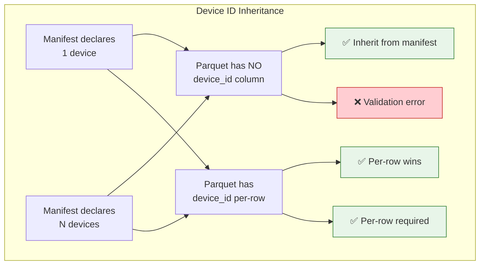
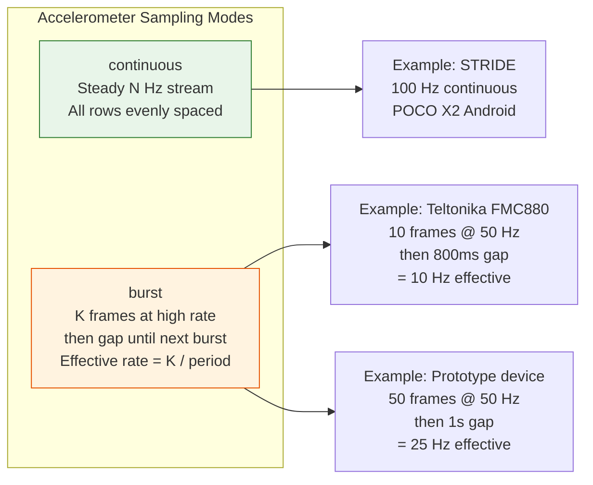
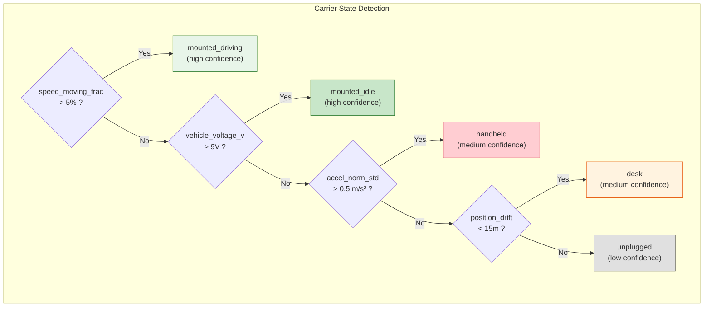

# SPEC-02: Dataset Manifest — Canonical File-Level Metadata

## 1. Introduction

Every Telemachus dataset is accompanied by a **manifest** that describes
its provenance, hardware configuration, sensor characteristics, and
accelerometer frame history. The manifest is a YAML sidecar file named
`manifest.yaml` placed alongside the Telemachus parquet files.

This specification consolidates and supersedes RFC-0003 (Dataset
Specification v0.2) and RFC-0014 (Dataset Manifest v0.8).

### 1.1 Design Principles

- **One manifest per dataset.** The manifest is authoritative for file-level metadata.
- **YAML preferred.** JSON with identical schema is also accepted.
- **No duplication with record columns.** Metadata that doesn't change per-row (device, frame, carrier state) lives in the manifest, not in columns.
- **Inheritance.** Row-level columns MAY omit fields declared at manifest level; consumers resolve by falling back to the manifest.

### 1.2 Manifest Structure Overview

```mermaid
graph TD
    subgraph MANIFEST["manifest.yaml"]
        ID["Identification\ndataset_id, schema_version\ntitle, slug, country, license"]
        SRC["Source (provenance)\ntype, url, doi, citation"]
        HW["Hardware\nvendor, model, class\ndevices list"]
        SENS["Sensors\ngps, accelerometer\ngyroscope, magnetometer, obd2"]
        ACC["AccPeriods\nframe: raw/compensated/partial\nresidual_g, detection_method"]
        CS["Carrier States\ntrip_carrier_states\ncarrier_state_summary"]
        LOC["Location & Period\ncity, region, lat/lon center\nstart, end"]
        VOL["Volume\nn_devices, n_trips\nn_messages, distance_km"]
        DATA["Data Files\npath, format, size_mb"]
    end

    ID --> SRC --> HW --> SENS --> ACC --> CS --> LOC --> VOL --> DATA

    style MANIFEST fill:#e3f2fd,stroke:#1565c0
    style ID fill:#fff9c4,stroke:#f9a825
    style SRC fill:#e8f5e9,stroke:#2e7d32
    style HW fill:#fce4ec,stroke:#c62828
    style SENS fill:#bbdefb,stroke:#1565c0
    style ACC fill:#fff3e0,stroke:#e65100
    style CS fill:#f3e5f5,stroke:#6a1b9a
    style LOC fill:#c8e6c9,stroke:#2e7d32
    style VOL fill:#e0e0e0,stroke:#424242
    style DATA fill:#ffecb3,stroke:#ff8f00
```



---

## 2. Directory Structure

```
<dataset_slug>/
├── manifest.yaml          # This specification
├── device1.parquet        # Telemachus data file(s)
├── device2.parquet     # (one per device or one combined)
└── README.md              # Optional human-readable description
```

For datasets with restricted licenses (e.g. CC-BY-NC-ND), raw data
MUST NOT be committed to git. Instead, the manifest points to the
download source:

```
<dataset_slug>/
├── manifest.yaml          # Points to external source
├── README.md              # Download instructions
├── download.sh            # Script to fetch from official source
└── adapter.py             # Conversion code (MIT licensed)
```

---

## 3. Manifest Schema

### 3.1 Required Fields

| Field | Type | Description |
|-------|------|-------------|
| `dataset_id` | string | Globally unique identifier. Pattern: `<country>_<slug>_<year>` |
| `schema_version` | string | Telemachus spec version, e.g. `"telemachus-0.8"` |
| `profile` | string | Device capability profile: `"core"`, `"imu"`, or `"full"` (see SPEC-01 §2.2). Default: `"imu"` |
| `source` | object | Provenance block (see §3.5) |

### 3.2 Identification Block (recommended)

```yaml
title: "AEGIS Automotive Sensor Data (Graz)"
slug: aegis_graz
country: AT                          # ISO 3166-1 alpha-2
license: CC-BY-4.0                   # SPDX identifier
license_warning: ""                  # Free-text caveat if restrictive
```

### 3.3 Location & Period

```yaml
location:
  city: "Graz"
  region: "Styria"
  lat_center: 47.0707
  lon_center: 15.4395

period:
  start: 2017-01-01T00:00:00Z
  end: 2017-12-31T23:59:59Z
  notes: "Academic data collection campaign"
```

### 3.4 Hardware Block

Describes the telematics device(s) that produced the data.

```yaml
hardware:
  vendor: "Teltonika"
  model: "FMC880"
  class: commercial            # commercial | research | smartphone
  protocol: "codec_8e"         # optional
  devices:
    - name: device_1
      imei: "IMEI_EXAMPLE_1"   # or other unique ID
      fleet_id: 1001            # optional
```

**Device inheritance rule** (§4.1): if the manifest declares exactly one
device, its `name` (or `imei`) is the canonical `device_id` for all
rows that omit it.



### 3.5 Source (Provenance) — REQUIRED

```yaml
source:
  type: open_external               # open_external | live | commercial | synthetic
  url: "https://zenodo.org/records/820576"
  citation: "Brunner et al. (2017)"
  doi: "10.5281/zenodo.820576"      # optional
  download_status: complete          # not_downloaded | partial | complete
  adapter_status: production         # not_implemented | draft | production
```

For live/commercial datasets:
```yaml
source:
  type: live
  ingestion: "MQTT bridge → DuckDB → trip processor"
  contact: "operator_name"
  campaign: "commercial pilot Q2 2026"
```

### 3.6 Sensors

Declares per-sensor native rates and characteristics. Consumers use
these to size buffers and pick interpolation strategies.

```yaml
sensors:
  gps:
    rate_hz: 1                      # observed effective rate
    rate_hz_declared: 1             # manufacturer spec (if different)
    quality: low_cost               # low_cost | survey_grade | smartphone

  accelerometer:
    rate_hz: 10                     # effective rate (post-burst averaging)
    rate_native_hz: 50              # native hardware rate (if burst mode)
    range_g: 16
    has_gyroscope: false
    unit: "m/s^2"                   # canonical Telemachus unit (for documentation)
    sampling_mode: continuous       # continuous | burst
    burst_size: 10                  # frames per burst (if burst mode)
    burst_rate_hz: 50               # intra-burst rate (if burst mode)
    threshold_filter_mg: null       # firmware threshold (e.g. 50 mG on some prototypes)
    notes: "FMC880 10 Hz continuous mode requires specific firmware"

  gyroscope:
    rate_hz: 100
    unit: "rad/s"                   # or "deg/s" — adapter converts at load
    bias:                           # optional calibration data
      x: -0.0645
      y: 0.9192
      z: 0.6401

  magnetometer:
    rate_hz: 100
    unit: "uT"

  obd2:
    available: true
    pids: ["0x0D", "0x0C"]          # optional: which PIDs are collected
    notes: "Speed + RPM via OBD-II"
```



### 3.7 AccPeriods (Accelerometer Frame)

Declares one or more time ranges with a coherent accelerometer frame
(see SPEC-01 §2.12 for definitions).

```yaml
acc_periods:
  - start: 2025-09-04T06:48:31Z
    end: 2025-09-04T12:04:27Z
    frame: partial                   # raw | compensated | partial
    detection_method: empirical      # device-reported | auto | user | empirical
    residual_g: 0.101                # REQUIRED if frame=partial
    calibration_state: null           # device-specific, optional
    notes: "Firmware compensation imperfect — 5.77° residual"
```

**Default**: if `acc_periods` is omitted, consumers MUST assume a single
implicit period `{frame: "raw"}` covering the entire dataset.

**Multi-period example** (config change mid-collection):
```yaml
acc_periods:
  - start: 2025-03-01T00:00:00Z
    end: 2025-03-15T12:00:00Z
    frame: compensated
    detection_method: profile_change
    notes: "Initial config — gravity_filter ON"
  - start: 2025-03-15T12:00:01Z
    end: present
    frame: raw
    detection_method: profile_change
    notes: "After config change — gravity_filter OFF"
```

```mermaid
timeline
    title AccPeriod Timeline (Multi-Period Example)
    section Initial config
        2025-03-01 : frame=compensated : gravity_filter ON
    section Config change
        2025-03-15 12:00 : New profile applied
    section Post-config
        2025-03-15 onwards : frame=raw : gravity_filter OFF
```

### 3.8 Carrier States

Carrier state classifies each **trip** (not each sample) to determine
whether data comes from a real driving context. This metadata lives
exclusively in the manifest — not as record columns.

```yaml
carrier_state_summary:
  mounted_driving: 23
  mounted_idle: 0
  desk: 0
  handheld: 0
  unknown: 0

trip_carrier_states:
  - trip_id: "T20260410_1053_001"
    carrier_state: "mounted_driving"
    confidence: "high"
    detection_method: "powered_motion"
    signals:
      speed_moving_frac: 0.72
      speed_max_ms: 28.4
      vehicle_voltage_v: 13.8
```

| State | Vehicle context | Use for analytics |
|-------|-----------------|-------------------|
| `mounted_driving` | YES — in motion | YES |
| `mounted_idle` | YES — parked/idling | YES (ZUPT segments) |
| `unplugged` | UNKNOWN | OPTIONAL |
| `desk` | NO — stable surface | NO |
| `handheld` | NO — hand manipulation | NO |
| `unknown` | UNKNOWN | NO |

**Default**: if neither field is present, consumers MUST assume
`carrier_state: "unknown"` globally.



### 3.9 Volume (optional, informational)

```yaml
volume:
  n_devices: 2
  n_trips: 23
  n_messages: 1932
  total_samples: 351356
  distance_km: 67.0
  duration_hours: 5.3
```

### 3.10 Data Files

Enumerates the parquet files covered by the manifest.

```yaml
data_files:
  - path: "device1.parquet"       # relative to manifest directory
    format: parquet
    size_mb: 31
    description: "device_1, all trips"
  - path: "device2.parquet"
    format: parquet
    size_mb: 12
```

### 3.11 Papers Using (optional)

```yaml
papers_using:
  - paper_id: P019
    role: validation
    status: in_progress
    accept_acc_periods:
      - frame: raw
```

### 3.12 Tags & Config History (optional)

```yaml
tags:
  - commercial
  - teltonika
  - urban

config_history:
  - timestamp: 2025-03-15T12:00:01Z
    profile: profile_v0.1
    changes:
      accelerometer_gravity:
        gravity_filter: false
```

---

## 4. Inheritance Rules

### 4.1 Per-Row Fields — Resolution Chain

When per-row columns are **absent** from a parquet file, consumers
MUST resolve them using this priority chain:

**`device_id` resolution:**
1. Per-row column (highest priority)
2. Manifest `hardware.devices[0].name` — only if exactly one device declared
3. ERROR — if multiple devices declared and no per-row column

**`trip_id` resolution:**
1. Per-row column (highest priority)
2. Manifest `trip_carrier_states[].trip_id` — if a single trip covers the file
3. Filename convention: `<trip_id>.parquet` (basename without extension)
4. ERROR — if none of the above resolves

### 4.2 Per-File Flags Derivable from Manifest

| Flag | Source |
|------|--------|
| Accelerometer frame at `ts` | First `acc_periods` entry where `start <= ts <= end`. If none match or list absent: `"raw"`. Validators SHOULD warn on incomplete time coverage |
| Gyro unit conversion needed | `sensors.gyroscope.unit` — if `"deg/s"`, adapter converts to `rad/s` |
| Carrier state for trip | `trip_carrier_states[].carrier_state` matched by `trip_id` |
| `is_vehicle_data` | `carrier_state in {mounted_driving, mounted_idle}` |

### 4.3 Validation Precedence

When a field is declared **both** per-row and in the manifest:
1. Per-row value wins for that row.
2. Consumers MUST warn if the two disagree consistently.
3. Validators MAY reject in strict mode.

---

## 5. Manifest Validation Rules

A manifest is valid if:

1. `dataset_id`, `schema_version`, `source` are present.
2. `schema_version` matches pattern `telemachus-<version>`.
3. If `hardware.devices` has > 1 entry, parquet files MUST declare
   `device_id` per-row or use `<device_id>_*.parquet` filename convention.
4. If `acc_periods` is present, each entry has `start`, `end`, `frame`
   in `{raw, compensated, partial}`. For `partial`, `residual_g` is required.
5. If `trip_carrier_states` is present, each entry has `trip_id` and
   `carrier_state` from §3.8.
6. `sensors.*.rate_hz` values are positive numbers.
7. If `sensors.accelerometer.sampling_mode` is `burst`, then `burst_size`
   and `burst_rate_hz` MUST also be present.

---

## 6. Complete Manifest Examples

### 6.1 Open Research Dataset (AEGIS)

```yaml
dataset_id: at_aegis_zenodo_820576
schema_version: "telemachus-0.8"
profile: full
title: "AEGIS Automotive Sensor Data (Graz)"
slug: aegis_graz
country: AT
license: CC-BY-4.0

location:
  city: "Graz"
  region: "Styria"
  lat_center: 47.0707
  lon_center: 15.4395

period:
  start: 2017-01-01T00:00:00Z
  end: 2017-12-31T23:59:59Z

hardware:
  vendor: "automotive_sensor_box"
  model: "BeagleBone-based"
  class: research
  devices:
    - name: BeagleBone1

sensors:
  gps:
    rate_hz: 5
    quality: low_cost
  accelerometer:
    rate_hz: 24
    rate_hz_declared: 100
    range_g: 4
    has_gyroscope: true
    sampling_mode: continuous
  gyroscope:
    rate_hz: 24
    unit: "deg/s"
  obd2:
    available: true
    pids: ["0x0D"]

acc_periods:
  - start: 2017-01-01T00:00:00Z
    end: 2017-12-31T23:59:59Z
    frame: raw
    detection_method: user
    notes: "Raw acceleration with gravity present"

carrier_state_summary:
  mounted_driving: 35

volume:
  n_devices: 1
  n_trips: 35

source:
  type: open_external
  url: "https://zenodo.org/records/820576"
  doi: "10.5281/zenodo.820576"
  citation: "Brunner et al. (2017)"
  download_status: complete
  adapter_status: production
```

### 6.2 Commercial Fleet (generic example)

```yaml
dataset_id: xx_fleet_fmc880_2025
schema_version: "telemachus-0.8"
profile: imu
title: "Fleet Pilot — Teltonika FMC880"
country: FR
license: internal

hardware:
  vendor: "Teltonika"
  model: "FMC880"
  class: commercial
  protocol: "codec_8e"
  devices:
    - name: vehicle_01
      imei: "IMEI_EXAMPLE_1"
    - name: vehicle_02
      imei: "IMEI_EXAMPLE_2"

sensors:
  gps:
    rate_hz: 1
    quality: low_cost
  accelerometer:
    rate_hz: 1
    rate_hz_declared: 10
    range_g: 16
    has_gyroscope: false
    sampling_mode: burst
    burst_size: 10
    burst_rate_hz: 50
    notes: "10 Hz continuous requires specific firmware"

acc_periods:
  - start: 2025-03-01T00:00:00Z
    end: 2025-03-15T12:00:00Z
    frame: compensated
    detection_method: profile_change
    notes: "Initial config — gravity_filter ON"
  - start: 2025-03-15T12:00:01Z
    end: present
    frame: raw
    detection_method: profile_change
    notes: "After config update — gravity_filter OFF"

source:
  type: live
  ingestion: "MQTT bridge → DuckDB → trip processor"

config_history:
  - timestamp: 2025-03-15T12:00:01Z
    profile: profile_v0.1
    changes:
      accelerometer_gravity:
        gravity_filter: false
```

### 6.3 Smartphone Dataset (STRIDE)

```yaml
dataset_id: bd_stride_figshare_2024
schema_version: "telemachus-0.8"
profile: full
title: "STRIDE — Smartphone Sensors for Road Safety (Rajshahi)"
country: BD
license: CC-BY-4.0

hardware:
  vendor: "smartphone"
  model: "POCO X2"
  class: smartphone

sensors:
  gps:
    rate_hz: 1
    quality: smartphone
  accelerometer:
    rate_hz: 100
    has_gyroscope: true
    sampling_mode: continuous
  gyroscope:
    rate_hz: 100
    unit: "rad/s"
  magnetometer:
    rate_hz: 100
    unit: "uT"

acc_periods:
  - start: 2024-01-01T00:00:00Z
    end: 2024-12-31T23:59:59Z
    frame: raw
    detection_method: user
    notes: "Android TotalAcceleration — raw with gravity"

carrier_state_summary:
  mounted_driving: 6
  handheld: 17

source:
  type: open_external
  url: "https://figshare.com/articles/dataset/25460755"
  doi: "10.6084/m9.figshare.25460755"
  download_status: complete
  adapter_status: production
```

---

## 7. References

- **SPEC-01**: Telemachus Record Format — column definitions and validation rules
- **SPEC-03**: Adapters & Validation — how adapters produce conformant datasets
- **Superseded**: RFC-0003 (Dataset Specification v0.2), RFC-0014 (Dataset Manifest v0.8)

---

End of SPEC-02.
