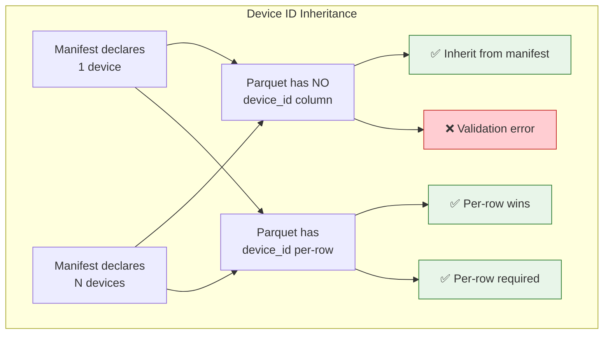
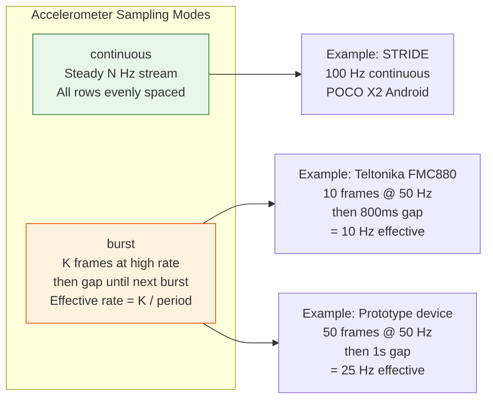
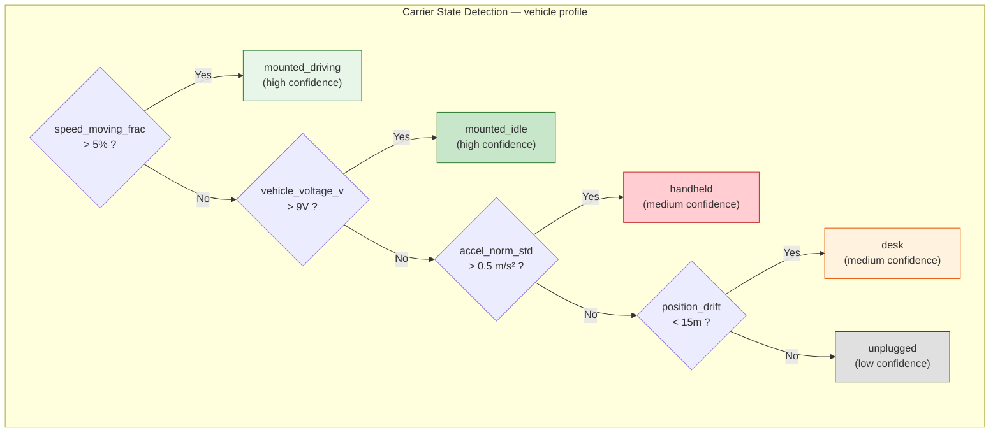

# SPEC-02: Dataset Manifest — Canonical File-Level Metadata

## 1. Introduction

Every Telemachus dataset is accompanied by a **manifest** that describes
its provenance, hardware configuration, sensor characteristics, and
accelerometer frame history. The manifest is a YAML sidecar file named
`manifest.yaml` placed alongside the Telemachus parquet files.

This specification consolidates and supersedes RFC-0003 (Dataset
Specification v0.2) and RFC-0014 (Dataset Manifest v0.8).

### 1.1 Design Principles

- **One manifest per dataset.** The manifest is authoritative for file-level metadata.
- **YAML preferred.** JSON with identical schema is also accepted.
- **No duplication with record columns.** Metadata that doesn't change per-row (device, frame, carrier state) lives in the manifest, not in columns.
- **Inheritance.** Row-level columns MAY omit fields declared at manifest level; consumers resolve by falling back to the manifest.

### 1.2 Manifest Structure Overview


```mermaid
graph TD
    subgraph MANIFEST["manifest.yaml"]
        ID["Identification\ndataset_id, schema_version\ntitle, slug, country, license"]
        SRC["Source (provenance)\ntype, url, doi, citation"]
        HW["Hardware\nvendor, model, class\ndevices list"]
        SENS["Sensors\ngps, accelerometer\ngyroscope, magnetometer, obd2"]
        ACC["AccPeriods\nframe: raw/compensated/partial\nresidual_g, detection_method"]
        CS["Carrier States\ntrip_carrier_states\ncarrier_state_summary"]
        LOC["Location & Period\ncity, region, lat/lon center\nstart, end"]
        VOL["Volume\nn_devices, n_trips\nn_messages, distance_km"]
        DATA["Data Files\npath, format, size_mb"]
    end

    ID --> SRC --> HW --> SENS --> ACC --> CS --> LOC --> VOL --> DATA

    style MANIFEST fill:#e3f2fd,stroke:#1565c0
    style ID fill:#fff9c4,stroke:#f9a825
    style SRC fill:#e8f5e9,stroke:#2e7d32
    style HW fill:#fce4ec,stroke:#c62828
    style SENS fill:#bbdefb,stroke:#1565c0
    style ACC fill:#fff3e0,stroke:#e65100
    style CS fill:#f3e5f5,stroke:#6a1b9a
    style LOC fill:#c8e6c9,stroke:#2e7d32
    style VOL fill:#e0e0e0,stroke:#424242
    style DATA fill:#ffecb3,stroke:#ff8f00
```

---

## 2. Directory Structure

```
<dataset_slug>/
├── manifest.yaml          # This specification
├── device1.parquet        # Telemachus data file(s)
├── device2.parquet     # (one per device or one combined)
└── README.md              # Optional human-readable description
```

For datasets with restricted licenses (e.g. CC-BY-NC-ND), raw data
MUST NOT be committed to git. Instead, the manifest points to the
download source:

```
<dataset_slug>/
├── manifest.yaml          # Points to external source
├── README.md              # Download instructions
├── download.sh            # Script to fetch from official source
└── adapter.py             # Conversion code (MIT licensed)
```

---

## 3. Manifest Schema

### 3.1 Required Fields

| Field | Type | Description |
|-------|------|-------------|
| `dataset_id` | string | Globally unique identifier. Pattern: `<country>_<slug>_<year>` |
| `schema_version` | string | Telemachus spec version, e.g. `"telemachus-0.8"` |
| `profile` | string | Device capability profile: `"core"`, `"imu"`, or `"full"` (see SPEC-01 §2.2). Default: `"imu"` |
| `source` | object | Provenance block (see §3.5) |

### 3.2 Identification Block (recommended)

```yaml
title: "AEGIS Automotive Sensor Data (Graz)"
slug: aegis_graz
country: AT                          # ISO 3166-1 alpha-2
license: CC-BY-4.0                   # SPDX identifier
license_warning: ""                  # Free-text caveat if restrictive
```

### 3.3 Location & Period

```yaml
location:
  city: "Graz"
  region: "Styria"
  lat_center: 47.0707
  lon_center: 15.4395

period:
  start: 2017-01-01T00:00:00Z
  end: 2017-12-31T23:59:59Z
  notes: "Academic data collection campaign"
```

### 3.4 Hardware Block

Describes the telematics device(s) that produced the data.

```yaml
hardware:
  vendor: "Teltonika"
  model: "FMC880"
  class: commercial            # commercial | research | smartphone
  protocol: "codec_8e"         # optional
  devices:
    - name: device_1
      imei: "IMEI_EXAMPLE_1"   # or other unique ID
      fleet_id: 1001            # optional
```

**Device inheritance rule** (§4.1): if the manifest declares exactly one
device, its `name` (or `imei`) is the canonical `device_id` for all
rows that omit it.


```mermaid
graph TD
    subgraph INHERIT["Device ID Inheritance"]
        MANIFEST_1["Manifest declares\n1 device"]
        MANIFEST_N["Manifest declares\nN devices"]
        PARQUET_NO["Parquet has NO\ndevice_id column"]
        PARQUET_YES["Parquet has\ndevice_id per-row"]

        MANIFEST_1 --> PARQUET_NO --> OK1["✅ Inherit from manifest"]
        MANIFEST_1 --> PARQUET_YES --> OK2["✅ Per-row wins"]
        MANIFEST_N --> PARQUET_NO --> ERR["❌ Validation error"]
        MANIFEST_N --> PARQUET_YES --> OK3["✅ Per-row required"]
    end

    style OK1 fill:#e8f5e9,stroke:#2e7d32
    style OK2 fill:#e8f5e9,stroke:#2e7d32
    style OK3 fill:#e8f5e9,stroke:#2e7d32
    style ERR fill:#ffcdd2,stroke:#c62828
```

### 3.5 Source (Provenance) — REQUIRED

```yaml
source:
  type: open_external               # open_external | live | commercial | synthetic
  url: "https://zenodo.org/records/820576"
  citation: "Brunner et al. (2017)"
  doi: "10.5281/zenodo.820576"      # optional
  download_status: complete          # not_downloaded | partial | complete
  adapter_status: production         # not_implemented | draft | production
```

For live/commercial datasets:
```yaml
source:
  type: live
  ingestion: "MQTT bridge → DuckDB → trip processor"
  contact: "operator_name"
  campaign: "commercial pilot Q2 2026"
```

### 3.5.1 Row Accounting — REQUIRED of any adapter that drops a row

A validator only ever sees the output file. It can establish that every row
present is well-formed; it can establish nothing at all about the rows that are
absent, nor whether they deserved to be. The `metrics` block is the only
channel through which that fact reaches a consumer, which is why it is a count
**per reason** and not a total.

```yaml
source:
  type: live
  metrics:
    raw_rows_in: 2693414            # frames read from the source
    rows_out: 2681050               # rows written to the Telemachus file
    raw_rows_dropped: 12364         # MUST be explained by drop_reasons
    drop_reasons:
      duplicate_ts: 12000
      no_position_and_no_imu: 364
```

Rules, all checked by `tele validate`:

1. An adapter that discards any row MUST report `metrics`. An adapter that
   discards none SHOULD report it anyway, since "nothing was dropped" is itself
   the useful statement.
2. The block MUST balance: `rows_out + raw_rows_dropped == raw_rows_in`. An
   adapter that cannot balance its own books has lost track of rows somewhere,
   and a block that does not add up is worse than no block — it reads as an
   audit that was performed.
3. `drop_reasons` MUST sum to `raw_rows_dropped`, and a non-zero
   `raw_rows_dropped` MUST NOT leave `drop_reasons` empty.
4. Dropping rows solely because the advisory `gnss_valid` flag is false is
   **NOT permitted** (SPEC-01 §2.5): it discards valid positioned fixes, and
   the receivers that set the flag are the ones whose flag is least
   trustworthy. The reason names `gnss_valid_false` and `gnss_invalid` are
   refused outright rather than left for a reviewer to notice.
5. Reason names are free text. `duplicate_ts`, `unparseable_ts`,
   `no_timestamp`, `no_position`, `bad_checksum` and `no_position_and_no_imu`
   are the ones the reference adapters emit.

The unit being counted is the adapter's own row-equivalent, declared by the
adapter: a frame for a gateway feed, a track point for GPX, a **fix epoch** for
NMEA — where three sentences describe one instant and produce one row between
them. What matters is that the same unit is counted on both sides of the
identity.

### 3.6 Sensors

Declares per-sensor native rates and characteristics. Consumers use
these to size buffers and pick interpolation strategies.

```yaml
sensors:
  gps:
    rate_hz: 1                      # observed effective rate
    rate_hz_declared: 1             # manufacturer spec (if different)
    quality: low_cost               # low_cost | survey_grade | smartphone

  accelerometer:
    rate_hz: 10                     # effective rate (post-burst averaging)
    rate_native_hz: 50              # native hardware rate (if burst mode)
    range_g: 16
    has_gyroscope: false
    unit: "m/s^2"                   # canonical Telemachus unit (for documentation)
    sampling_mode: continuous       # continuous | burst
    burst_size: 10                  # frames per burst (if burst mode)
    burst_rate_hz: 50               # intra-burst rate (if burst mode)
    threshold_filter_mg: null       # firmware threshold (e.g. 50 mG on some prototypes)
    notes: "FMC880 10 Hz continuous mode requires specific firmware"

  gyroscope:
    rate_hz: 100
    unit: "rad/s"                   # or "deg/s" — adapter converts at load
    bias:                           # optional calibration data
      x: -0.0645
      y: 0.9192
      z: 0.6401

  magnetometer:
    rate_hz: 100
    unit: "uT"

  obd2:
    available: true
    pids: ["0x0D", "0x0C"]          # optional: which PIDs are collected
    notes: "Speed + RPM via OBD-II"
```


```mermaid
graph LR
    subgraph SAMPLING["Accelerometer Sampling Modes"]
        CONT["continuous\nSteady N Hz stream\nAll rows evenly spaced"]
        BURST["burst\nK frames at high rate\nthen gap until next burst\nEffective rate = K / period"]
    end

    CONT --> EX1["Example: STRIDE\n100 Hz continuous\nPOCO X2 Android"]
    BURST --> EX2["Example: Teltonika FMC880\n10 frames @ 50 Hz\nthen 800ms gap\n= 10 Hz effective"]
    BURST --> EX3["Example: Prototype device\n50 frames @ 50 Hz\nthen 1s gap\n= 25 Hz effective"]

    style CONT fill:#e8f5e9,stroke:#2e7d32
    style BURST fill:#fff3e0,stroke:#e65100
```

### 3.7 AccPeriods (Accelerometer Frame)

Declares one or more time ranges with a coherent accelerometer frame
(see SPEC-01 §2.12 for definitions).

```yaml
acc_periods:
  - start: 2025-09-04T06:48:31Z
    end: 2025-09-04T12:04:27Z
    frame: partial                   # raw | compensated | partial
    detection_method: empirical      # device-reported | auto | user | empirical
    residual_g: 0.101                # OPTIONAL descriptive hint (off-board |a| statistic), not required
    calibration_state: null           # device-specific, optional
    notes: "Firmware compensation imperfect — 5.77° residual"
```

**Default**: if `acc_periods` is omitted, consumers MUST assume a single
implicit period `{frame: "raw"}` covering the entire dataset.

**Multi-period example** (config change mid-collection):
```yaml
acc_periods:
  - start: 2025-03-01T00:00:00Z
    end: 2025-03-15T12:00:00Z
    frame: compensated
    detection_method: profile_change
    notes: "Initial config — gravity_filter ON"
  - start: 2025-03-15T12:00:01Z
    end: present
    frame: raw
    detection_method: profile_change
    notes: "After config change — gravity_filter OFF"
```

> The device orientation/mounting and any rectification of the raw signal are
> **off-board processing** (D1+), not manifest metadata — they are not declared
> here (per SPEC-01 §2.2 / §2.12).

```mermaid
timeline
    title AccPeriod Timeline (Multi-Period Example)
    section Initial config
        2025-03-01 : frame=compensated : gravity_filter ON
    section Config change
        2025-03-15 12:00 : New profile applied
    section Post-config
        2025-03-15 onwards : frame=raw : gravity_filter OFF
```

### 3.8 Carrier Profile & States

Carrier state classifies each **trip** (not each sample) to determine whether
the data comes from a context the analysis is about. This metadata lives
exclusively in the manifest — not as record columns.

```yaml
carrier_profile: vehicle          # default; may be omitted

carrier_state_summary:
  mounted_driving: 23
  mounted_idle: 0
  desk: 0
  handheld: 0
  unknown: 0

trip_carrier_states:
  - trip_id: "T20260410_1053_001"
    carrier_state: "mounted_driving"
    confidence: "high"
    detection_method: "powered_motion"
    signals:
      speed_moving_frac: 0.72
      speed_max_ms: 28.4
      vehicle_voltage_v: 13.8
```

**Default**: `carrier_profile` absent means `vehicle`. If neither
`carrier_state_summary` nor `trip_carrier_states` is present, consumers MUST
assume `carrier_state: "unknown"` globally.

#### 3.8.1 Why a profile

The record format is neutral about what carries the device. Position,
timestamp, accelerometer, gyroscope, magnetometer, speed, GNSS quality,
AccPeriods and the multi-rate convention of §2.11 all pass unchanged onto an
animal collar, a bicycle or a rucksack — the multi-rate convention is *more*
relevant in biologging than in fleet, where a fix every quarter of an hour
meets accelerometer bursts at 20-50 Hz.

This block was the exception. Its five states are vehicle states, and the
detection tree below tests a vehicle battery voltage. None of them means
anything on a collar, and a format that is neutral everywhere except in its
manifest is not neutral.

**The invariant is the declaration, not the vocabulary.** What a consumer needs
from this block is one bit per state: may an analysis use the data recorded
while the carrier was in it? A vehicle parked with the engine running is usable
— it is where ZUPT segments come from. A device on a desk is not. Which words a
domain uses for those situations is that domain's business; that it *says*
which ones are usable is this format's requirement.

| Usability | Meaning |
|-----------|---------|
| `analysable` | Use it |
| `optional` | The carrier's situation is unknown; the consumer decides |
| `excluded` | The data does not describe the phenomenon being studied |

#### 3.8.2 Registered profiles

A profile named here needs no further declaration: a manifest writes the name,
or nothing at all.

**`vehicle`** — the default, and exactly the taxonomy this specification
carried before profiles existed. Nothing about it changes.

| State | Vehicle context | Usability |
|-------|-----------------|-----------|
| `mounted_driving` | YES — in motion | `analysable` |
| `mounted_idle` | YES — parked/idling | `analysable` (ZUPT segments) |
| `unplugged` | UNKNOWN | `optional` |
| `desk` | NO — stable surface | `excluded` |
| `handheld` | NO — hand manipulation | `excluded` |
| `unknown` | UNKNOWN | `excluded` |

`vehicle` is the only registered profile. **No animal, pedestrian or bicycle
profile is registered**, and none will be until a dataset carries one: the
mechanism is what 1.0 owes, and a profile invented ahead of the data it
describes is a promise the specification cannot keep. An unkept promise in a
specification costs more than an absence.

#### 3.8.3 Declaring a profile inline

A carrier this specification does not cover declares its own states and what
each is worth:

```yaml
carrier_profile:
  name: collar
  description: "Neck-mounted logger, large mammal"
  states:
    foraging:   analysable
    resting:    analysable
    handled:    excluded          # animal being handled by a human
    detached:   excluded
    unknown:    optional
```

Rules:

1. An inline profile MUST declare `name` and `states`, and every state MUST map
   to one of `analysable`, `optional`, `excluded`.
2. At least one state MUST be `analysable`. A profile in which nothing is usable
   would make every trip in the dataset unusable, which is a mistake rather
   than a statement.
3. A registered name MUST NOT be redefined inline. Two datasets naming the same
   profile have to mean the same thing, or the name is worthless. Name the
   variant something else.
4. Every `carrier_state` appearing in `trip_carrier_states` or
   `carrier_state_summary` MUST be a state of the resolved profile.
5. A consumer reading an unrecognised state treats it as `excluded` rather than
   failing: a dataset produced against a later profile revision should degrade,
   not break. The validator, which has the profile in front of it, rejects.

#### 3.8.4 `is_vehicle_data`

SPEC-01 §2.13 lists `is_vehicle_data` as derived from `carrier_state`. Under
the `vehicle` profile it derives exactly as it always did — true for
`mounted_driving` and `mounted_idle` — because those are its `analysable`
states. Under any other profile the question is the wrong one, and the general
form replaces it: **is this state `analysable` under the declared profile?**

The detection tree below is the `vehicle` profile's, and only its: the
`vehicle_voltage_v` test is what makes it one. Another profile detects its own
states its own way, and how it does so is not this specification's business
(SPEC-04 §5.2) — only the resulting declaration is.


```mermaid
graph TD
    subgraph DETECT["Carrier State Detection — vehicle profile"]
        SPEED{"speed_moving_frac\n> 5% ?"}
        POWERED{"vehicle_voltage_v\n> 9V ?"}
        ACCEL_VAR{"accel_norm_std\n> 0.5 m/s² ?"}
        DRIFT{"position_drift\n< 15m ?"}

        SPEED -->|Yes| DRIVING["mounted_driving\n(high confidence)"]
        SPEED -->|No| POWERED
        POWERED -->|Yes| IDLE["mounted_idle\n(high confidence)"]
        POWERED -->|No| ACCEL_VAR
        ACCEL_VAR -->|Yes| HAND["handheld\n(medium confidence)"]
        ACCEL_VAR -->|No| DRIFT
        DRIFT -->|Yes| DESK["desk\n(medium confidence)"]
        DRIFT -->|No| UNPLUG["unplugged\n(low confidence)"]
    end

    style DRIVING fill:#e8f5e9,stroke:#2e7d32
    style IDLE fill:#c8e6c9,stroke:#2e7d32
    style HAND fill:#ffcdd2,stroke:#c62828
    style DESK fill:#fff3e0,stroke:#e65100
    style UNPLUG fill:#e0e0e0,stroke:#424242
```

### 3.9 Acquisition Breaks (D0.5 — the state the device was in)

`acc_periods` (§3.7) says which frame the accelerometer was in. `carrier_profile`
(§3.8) says what the device was riding on. This block says the third thing, and
it is the one most often missing when an analysis turns out to have been wrong:
**was the acquisition itself intact?**

#### 3.9.1 A hole in the data is not a hole in the movement

A Telemachus file with no rows between two instants is ambiguous, and the
ambiguity is not academic — each reading leads to a different, defensible, and
incompatible conclusion:

| What happened | What a consumer should conclude |
|---|---|
| The vehicle was parked in a covered car park | One trip, interrupted. The vehicle did not move |
| The device lost power or restarted | Unknown. The vehicle may have moved |
| The network dropped and the frames arrived three days later | Nothing yet — the data exists and is not here *yet* |
| The GNSS receiver lost fix while the IMU kept running | The vehicle moved, and its path over that interval is not observed |
| A sensor froze while still emitting | **Worse than a hole**: the rows are present, well-formed, and constant |

Nothing in the record distinguishes these. Every consumer guesses, and they
guess differently — which is how the same file yields two trip counts, two
distances and two availability figures depending on who read it. The last row
of that table is the dangerous one: a frozen sensor produces data that passes
every validation rule in SPEC-01 §3.

This block is the session sheet that travels with the tape. A master with four
minutes of silence tells you nothing about whether the room was quiet, the
console was patched wrong, or the second reel was recorded after the mic fell
over. The tape cannot answer; only the note written at the time can. §3.7 and
§3.8 record two other conditions of the take — which frame the accelerometer was
in, what the device was riding on — and the three together are what make the
signal interpretable years later by someone who was not there.

Declaring the break is what removes the guess. It is a **statement of fact
about the acquisition**, not an interpretation of the movement.

#### 3.9.2 Declaration

```yaml
acquisition_breaks:
  - start: 2026-05-21T14:03:11Z
    end: 2026-05-21T14:07:52Z
    kind: gnss_outage
    scope: gnss                    # subsystem affected; `device` if all of it
    detection_method: device-reported
    notes: "Underground car park"

  - start: 2026-06-02T08:11:00Z
    end: 2026-06-05T19:40:00Z
    kind: late_delivery
    scope: device
    detection_method: auto
    notes: "Frames produced in this window arrived on 2026-06-05"
```

| Field | Required | Meaning |
|-------|:--------:|---------|
| `start` | yes | Beginning of the affected interval |
| `end` | yes | End of it. `null` or `present` for an interval still open |
| `kind` | yes | What happened, from §3.9.3 |
| `scope` | no | Affected subsystem: `gnss`, `accelerometer`, `gyroscope`, `power`, `clock`, `link`, or `device`. Default `device` |
| `detection_method` | no | `device-reported`, `auto`, `user`, `empirical` — same vocabulary as §3.7 |
| `notes` | no | Free text |

**How a break is detected is out of scope** (SPEC-04 §5.2), exactly as it is for
`acc_periods`. `detection_method` records *that* a method was used and of what
kind; the method itself belongs to whoever ran it.

#### 3.9.3 Registered kinds

An open vocabulary with a registered core. An unrecognised `kind` MUST be
carried through and treated as `unknown` rather than rejected: a consumer
reading a dataset produced against a later revision should degrade, not break.

| `kind` | The acquisition was affected because |
|--------|--------------------------------------|
| `data_gap` | No rows were produced at all |
| `gnss_outage` | The receiver had no fix. Other sensors may have kept running |
| `sensor_frozen` | A sensor emitted, but its value stopped changing |
| `device_restart` | The device rebooted; counters and state may discontinue |
| `power_loss` | Supply interrupted |
| `clock_jump` | The device clock stepped. Timestamps either side are not comparable |
| `late_delivery` | The data exists and reached the store later than the window it covers |
| `config_change` | Acquisition configuration changed mid-collection. Pairs with `config_history` (§3.13) and, for the accelerometer frame specifically, with `acc_periods` (§3.7) |
| `unknown` | Something interrupted the acquisition and it is not known what |

`late_delivery` deserves its own kind rather than being folded into `data_gap`,
because the two demand opposite reactions. A gap is final: reprocessing will not
fill it. A late delivery is transient: the same window, reprocessed after the
data lands, is complete. Treating the second as the first is how a delivery
delay gets diagnosed as data loss.

#### 3.9.4 What this is not

This block declares **absence and impairment**, never their consequences. It
does not say which trips to discard, how to interpolate across a hole, or
whether a reconstruction is trustworthy over the interval. Those are decisions,
they belong to the consumer, and the format's job is to give them the facts
they need to make them.

### 3.10 Volume (optional, informational)

```yaml
volume:
  n_devices: 2
  n_trips: 23
  n_messages: 1932
  total_samples: 351356
  distance_km: 67.0
  duration_hours: 5.3
```

### 3.11 Data Files

Enumerates the parquet files covered by the manifest.

```yaml
data_files:
  - path: "device1.parquet"       # relative to manifest directory
    format: parquet
    size_mb: 31
    description: "device_1, all trips"
  - path: "device2.parquet"
    format: parquet
    size_mb: 12
```

### 3.12 Papers Using (optional)

```yaml
papers_using:
  - paper_id: P019
    role: validation
    status: in_progress
    accept_acc_periods:
      - frame: raw
```

### 3.13 Tags & Config History (optional)

```yaml
tags:
  - commercial
  - teltonika
  - urban

config_history:
  - timestamp: 2025-03-15T12:00:01Z
    profile: profile_v0.1
    changes:
      accelerometer_gravity:
        gravity_filter: false
```


### 3.14 Corrections (optional)

Declares, once per column rather than once per row, what produced a corrected
value carried alongside its source (SPEC-01 §2.13.1).

```yaml
corrections:
  - column: lat                    # the source column, kept unmodified
    adjusted: lat_adj              # the corrected value
    uncertainty: lat_sigma         # optional, same unit as `column`
    produced_by: "acme-refine@2.3.1"
    notes: "Post-processed against a reference station"
```

| Field | Required | Meaning |
|-------|:--------:|---------|
| `column` | yes | Source column. MUST be present in the data and unmodified |
| `adjusted` | yes | Column holding the corrected value. Conventionally `<column>_adj` |
| `uncertainty` | no | Column holding its uncertainty. Conventionally `<column>_sigma` |
| `produced_by` | recommended | Identifier and version of whatever produced it |
| `notes` | no | Free text |

**Why here and not in the rows.** Attaching full provenance to every value is
attractive on paper and unaffordable in practice: at 10 Hz, in a columnar file,
repeating the same identifier string multiplies the volume many times over for
no information. What is constant across a column — the producer, its version,
the calibration identity — belongs in the manifest. What genuinely varies per
sample — the uncertainty — belongs in a column. Same contract, two orders of
magnitude less storage.

**`produced_by` is opaque to this specification.** It is a string the producer
chooses, and nothing here constrains or interprets it. A pipeline can therefore
publish corrected data in an open format without publishing how it corrects —
which is the intended arrangement, not a loophole (SPEC-04 §5.2).
---

## 4. Inheritance Rules

### 4.1 Per-Row Fields — Resolution Chain

When per-row columns are **absent** from a parquet file, consumers
MUST resolve them using this priority chain:

**`device_id` resolution:**
1. Per-row column (highest priority)
2. Manifest `hardware.devices[0].name` — only if exactly one device declared
3. ERROR — if multiple devices declared and no per-row column

**`trip_id` resolution:**
1. Per-row column (highest priority)
2. Manifest `trip_carrier_states[].trip_id` — if a single trip covers the file
3. Filename convention: `<trip_id>.parquet` (basename without extension)
4. ERROR — if none of the above resolves

### 4.2 Per-File Flags Derivable from Manifest

| Flag | Source |
|------|--------|
| Accelerometer frame at `ts` | First `acc_periods` entry where `start <= ts <= end`. If none match or list absent: `"raw"`. Validators SHOULD warn on incomplete time coverage |
| Gyro unit conversion needed | `sensors.gyroscope.unit` — if `"deg/s"`, adapter converts to `rad/s` |
| Carrier state for trip | `trip_carrier_states[].carrier_state` matched by `trip_id` |
| Carrier profile | `carrier_profile`, or `vehicle` if absent (§3.8) |
| `is_vehicle_data` | `carrier_state` is `analysable` under the resolved profile. Under `vehicle` this is `{mounted_driving, mounted_idle}`, unchanged (§3.8.4) |

### 4.3 Validation Precedence

When a field is declared **both** per-row and in the manifest:
1. Per-row value wins for that row.
2. Consumers MUST warn if the two disagree consistently.
3. Validators MAY reject in strict mode.

---

## 5. Manifest Validation Rules

A manifest is valid if:

1. `dataset_id`, `schema_version`, `source` are present.
2. `schema_version` matches pattern `telemachus-<version>`.
3. If `hardware.devices` has > 1 entry, parquet files MUST declare
   `device_id` per-row or use `<device_id>_*.parquet` filename convention.
4. If `acc_periods` is present, each entry has `start`, `end`, `frame`
   in `{raw, compensated, partial}`. `residual_g` is OPTIONAL (an off-board hint, never required); a `partial` period need only satisfy `0 < |a|_rest < g`.
5. If `trip_carrier_states` is present, each entry has `trip_id` and a
   `carrier_state` that is a state of the resolved carrier profile (§3.8.3
   rule 4). Same for the keys of `carrier_state_summary`.
6. `sensors.*.rate_hz` values are positive numbers.
7. If `sensors.accelerometer.sampling_mode` is `burst`, then `burst_size`
   and `burst_rate_hz` MUST also be present.
8. If `source.metrics` is present, it satisfies §3.5.1: it balances, its
   `drop_reasons` sum to `raw_rows_dropped`, a non-zero drop is explained, and
   no forbidden reason appears.
9. `carrier_profile`, when present, resolves: a registered name, or an inline
   declaration satisfying §3.8.3. Absent resolves to `vehicle`.
10. If `acquisition_breaks` is present, each entry has `start`, `end` and
    `kind`, with `end >= start` (or `end` null/`present` for an open interval).
    An unregistered `kind` or `scope` is a warning, never an error: the
    vocabulary of §3.9.3 is open by design.
11. At `full` level, a declared `data_gap` MUST contain no rows. That is the one
    kind whose claim the data can contradict, and a manifest asserting an
    absence the file disproves is worse than no manifest.
12. If `corrections` is present, each entry has `column` and `adjusted`; the
    source `column` exists in the data, and both `adjusted` and any
    `uncertainty` column exist too (SPEC-01 §3 rule 13).
13. Every `_adj` / `_sigma` column present in the data is declared in
    `corrections`. An undeclared one is a correction nobody can trace, which is
    the situation §3.14 exists to prevent.
14. Timestamps (`period.*`, `acc_periods[].*`, `acquisition_breaks[].*`) MAY be
    written unquoted in YAML.
   A validator MUST accept both the resulting `datetime` object and an ISO 8601
   string; a field explicitly set to `null` MUST be accepted as "declared, does
   not apply" and not treated as a type error.

---

## 6. Complete Manifest Examples

### 6.1 Open Research Dataset (AEGIS)

```yaml
dataset_id: at_aegis_zenodo_820576
schema_version: "telemachus-1.0"
profile: full
title: "AEGIS Automotive Sensor Data (Graz)"
slug: aegis_graz
country: AT
license: CC-BY-4.0

location:
  city: "Graz"
  region: "Styria"
  lat_center: 47.0707
  lon_center: 15.4395

period:
  start: 2017-01-01T00:00:00Z
  end: 2017-12-31T23:59:59Z

hardware:
  vendor: "automotive_sensor_box"
  model: "BeagleBone-based"
  class: research
  devices:
    - name: BeagleBone1

sensors:
  gps:
    rate_hz: 5
    quality: low_cost
  accelerometer:
    rate_hz: 24
    rate_hz_declared: 100
    range_g: 4
    has_gyroscope: true
    sampling_mode: continuous
  gyroscope:
    rate_hz: 24
    unit: "deg/s"
  obd2:
    available: true
    pids: ["0x0D"]

acc_periods:
  - start: 2017-01-01T00:00:00Z
    end: 2017-12-31T23:59:59Z
    frame: raw
    detection_method: user
    notes: "Raw acceleration with gravity present"

carrier_state_summary:
  mounted_driving: 35

volume:
  n_devices: 1
  n_trips: 35

source:
  type: open_external
  url: "https://zenodo.org/records/820576"
  doi: "10.5281/zenodo.820576"
  citation: "Brunner et al. (2017)"
  download_status: complete
  adapter_status: production
```

### 6.2 Commercial Fleet (generic example)

```yaml
dataset_id: xx_fleet_fmc880_2025
schema_version: "telemachus-1.0"
profile: imu
title: "Fleet Pilot — Teltonika FMC880"
country: FR
license: internal

hardware:
  vendor: "Teltonika"
  model: "FMC880"
  class: commercial
  protocol: "codec_8e"
  devices:
    - name: vehicle_01
      imei: "IMEI_EXAMPLE_1"
    - name: vehicle_02
      imei: "IMEI_EXAMPLE_2"

sensors:
  gps:
    rate_hz: 1
    quality: low_cost
  accelerometer:
    rate_hz: 1
    rate_hz_declared: 10
    range_g: 16
    has_gyroscope: false
    sampling_mode: burst
    burst_size: 10
    burst_rate_hz: 50
    notes: "10 Hz continuous requires specific firmware"

acc_periods:
  - start: 2025-03-01T00:00:00Z
    end: 2025-03-15T12:00:00Z
    frame: compensated
    detection_method: profile_change
    notes: "Initial config — gravity_filter ON"
  - start: 2025-03-15T12:00:01Z
    end: present
    frame: raw
    detection_method: profile_change
    notes: "After config update — gravity_filter OFF"

source:
  type: live
  ingestion: "MQTT bridge → DuckDB → trip processor"

config_history:
  - timestamp: 2025-03-15T12:00:01Z
    profile: profile_v0.1
    changes:
      accelerometer_gravity:
        gravity_filter: false
```

### 6.3 Smartphone Dataset (STRIDE)

```yaml
dataset_id: bd_stride_figshare_2024
schema_version: "telemachus-1.0"
profile: full
title: "STRIDE — Smartphone Sensors for Road Safety (Rajshahi)"
country: BD
license: CC-BY-4.0

hardware:
  vendor: "smartphone"
  model: "POCO X2"
  class: smartphone

sensors:
  gps:
    rate_hz: 1
    quality: smartphone
  accelerometer:
    rate_hz: 100
    has_gyroscope: true
    sampling_mode: continuous
  gyroscope:
    rate_hz: 100
    unit: "rad/s"
  magnetometer:
    rate_hz: 100
    unit: "uT"

acc_periods:
  - start: 2024-01-01T00:00:00Z
    end: 2024-12-31T23:59:59Z
    frame: raw
    detection_method: user
    notes: "Android TotalAcceleration — raw with gravity"

carrier_state_summary:
  mounted_driving: 6
  handheld: 17

source:
  type: open_external
  url: "https://figshare.com/articles/dataset/25460755"
  doi: "10.6084/m9.figshare.25460755"
  download_status: complete
  adapter_status: production
```

---

## 7. References

- **SPEC-01**: Telemachus Record Format — column definitions and validation rules
- **SPEC-03**: Adapters & Validation — how adapters produce conformant datasets
- **Superseded**: RFC-0003 (Dataset Specification v0.2), RFC-0014 (Dataset Manifest v0.8)

---

End of SPEC-02.
