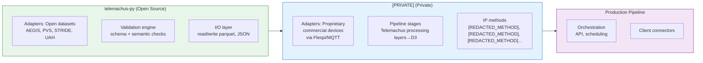
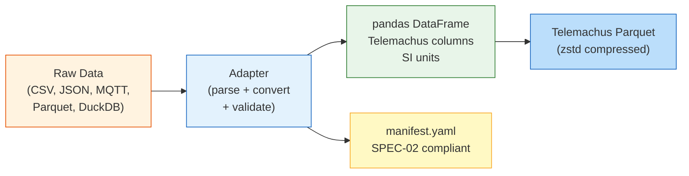
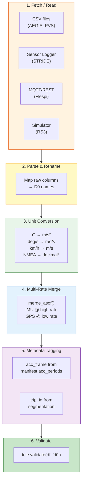
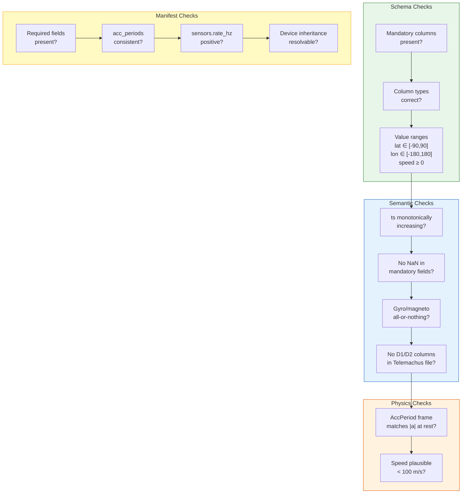
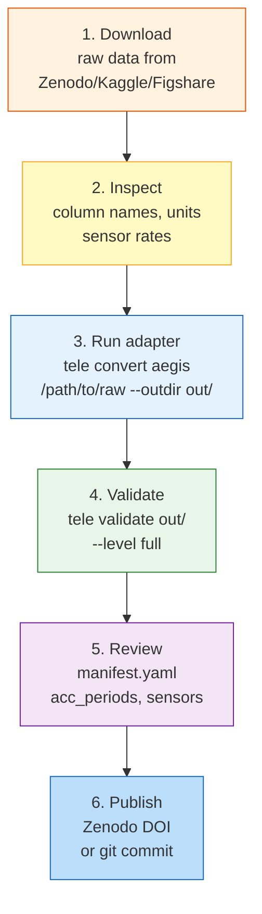

# SPEC-03: Adapters & Validation — Tooling

## 1. Introduction

Telemachus data originates from heterogeneous sources — commercial
telematics devices, research platforms, smartphones, and simulators.
**Adapters** transform raw provider data into D0-conformant parquet files.
**Validators** verify that the output conforms to SPEC-01 and SPEC-02.

This specification consolidates RFC-0005 (Adapter Architecture), RFC-0007
(Validation Framework), RFC-0009 (RS3 Integration), and incorporates
the industrial mapping from RFC-0002 as an appendix.

### 1.1 Scope Separation



---

## 2. Adapter Architecture

### 2.1 What an Adapter Does

An adapter converts raw data from a specific provider into a
D0-conformant pandas DataFrame with:
- Correct column names (SPEC-01 §2)
- Correct units (SPEC-01 §7)
- A valid `manifest.yaml` (SPEC-02)



### 2.2 Adapter Interface

Every adapter is a Python function (not a class hierarchy). The
interface is intentionally simple:

```python
def load(source_path: Path, **kwargs) -> pd.DataFrame:
    """
    Load raw data and return a D0-conformant DataFrame.

    The returned DataFrame has columns from SPEC-01 §2
    with correct SI units. Extra provider-specific columns
    use the x_<source>_<field> convention.
    """
    ...
```

Adapters MAY also provide:

```python
def manifest(source_path: Path) -> dict:
    """Return a SPEC-02 manifest dict for this dataset."""
    ...

def convert(source_path: Path, output_dir: Path) -> Path:
    """Convert raw data to Telemachus parquet + manifest.yaml."""
    ...
```

### 2.3 Module Layout

```
telemachus/
└── adapters/
    ├── __init__.py          # registry of available adapters
    ├── aegis.py             # AEGIS (Zenodo, Austria)
    ├── pvs.py               # PVS (Kaggle, Brazil)
    ├── stride.py            # STRIDE (Figshare, Bangladesh)
    └── uah.py               # UAH DriveSet (Spain)
```

Proprietary adapters live in **[PRIVATE]**, not telemachus-py:

```
[PRIVATE]/
└── adapters/
    ├── flespi.py            # Teltonika via Flespi
    ├── prototype.py         # Experimental prototypes
    └── ...
```

### 2.4 Adapter Pipeline



---

## 3. Adapter Specifications

### 3.1 AEGIS Adapter

| Property | Value |
|----------|-------|
| Source | Zenodo 820576, 6 CSV files |
| Raw units | Accel: **G-force**, Gyro: **deg/s**, GPS: **NMEA DDMM.MMMM** |
| Conversions | `× 9.80665`, `× π/180`, NMEA→decimal |
| Multi-rate merge | Accel+Gyro (24 Hz) ← GPS (5 Hz) via `merge_asof` |
| Output columns | ts, lat, lon, speed_mps, altitude_gps_m, ax/ay/az_mps2, gx/gy/gz_rad_s, speed_obd_mps (opt), device_id, trip_id |

### 3.2 PVS Adapter

| Property | Value |
|----------|-------|
| Source | Kaggle, combined GPS+MPU CSV per trip |
| Raw units | Accel: **m/s²** (native), Gyro: **deg/s**, Magneto: **µT**, GPS: decimal degrees |
| Conversions | Gyro: `× π/180` |
| Parameters | `placement`: dashboard / above_suspension / below_suspension; `side`: left / right |
| Output columns | ts, lat, lon, speed_mps, altitude_gps_m, hdop, n_satellites, ax/ay/az_mps2, gx/gy/gz_rad_s, mx/my/mz_uT, device_id, trip_id |

### 3.3 STRIDE Adapter

| Property | Value |
|----------|-------|
| Source | Figshare, 11 CSV files per session |
| Raw units | Accel: **m/s²** (TotalAcceleration), Gyro: **rad/s** (native), Magneto: **µT**, GPS: decimal degrees |
| Conversions | None (all native SI) |
| Multi-rate merge | Accel (100 Hz) ← GPS (1 Hz) ← Gyro (100 Hz) via `merge_asof` |
| Parameters | `category`: driving / anomalies / all; `with_gyro`: bool |
| Output columns | ts, lat, lon, speed_mps, altitude_gps_m, heading_deg, h_accuracy_m, ax/ay/az_mps2, gx/gy/gz_rad_s, mx/my/mz_uT, device_id, trip_id |

### 3.4 RS3 Adapter (Synthetic)

| Property | Value |
|----------|-------|
| Source | RoadSimulator3 CSV export |
| Raw units | All already in SI |
| Conversions | None |
| Ground truth | `road_type`, `event`, `target_speed` exported as `x_rs3_*` extra columns |

---

## 4. Validation Framework

### 4.1 Validation Levels

| Level | Checks | Use Case |
|-------|--------|----------|
| `d0` | Mandatory columns present, correct types, value ranges (lat/lon bounds, speed >= 0) | Quick conformance |
| `d0-strict` | All of `d0` + monotonic ts, no NaN in mandatory fields, AccPeriod gravity check | Research-grade |
| `manifest` | SPEC-02 §5 rules (required fields, acc_periods consistency, sensor config) | Manifest-only check |
| `full` | `d0-strict` + `manifest` + cross-validation (manifest vs parquet agreement) | Publication-ready |

### 4.2 Validation API

```python
import telemachus as tele

# Validate a DataFrame
report = tele.validate(df, level="d0")
print(report.ok)        # True / False
print(report.errors)    # list of error messages
print(report.warnings)  # list of warnings

# Validate a manifest file
report = tele.validate_manifest("path/to/manifest.yaml")

# Validate a complete dataset (parquet + manifest)
report = tele.validate_dataset("path/to/dataset/", level="full")
```

### 4.3 CLI

```bash
# Validate a dataset directory
tele validate path/to/dataset/ --level full

# Validate manifest only
tele validate path/to/manifest.yaml --manifest-only

# Quick D0 check on a parquet file
tele validate path/to/d0.parquet --level d0

# Output as JSON (for CI pipelines)
tele validate path/to/dataset/ --json
```

### 4.4 Validation Rules Summary



### 4.5 Exit Codes

| Code | Meaning |
|------|---------|
| `0` | Validation successful |
| `1` | Validation failed (errors detected) |
| `2` | Manifest missing or corrupted |
| `3` | Schema invalid or unavailable |

---

## 5. Dataset Generation Workflow

### 5.1 Converting Open Data

The standard workflow to generate a Telemachus dataset from an Open source:



### 5.2 CLI for Conversion

```bash
# Convert an Open dataset to Telemachus parquet + manifest
tele convert aegis /path/to/aegis/csvs --outdir datasets/aegis/
tele convert pvs /path/to/pvs/trips --outdir datasets/pvs/ --placement dashboard
tele convert stride /path/to/stride/road_data --outdir datasets/stride/ --category driving

# Validate the result
tele validate datasets/aegis/ --level full

# Inspect dataset info
tele info datasets/aegis/manifest.yaml
```

---

## 6. Open Sources Matrix

Cross-reference of available columns per Open dataset, to help users
choose the right dataset for their use case.

| Column Group | AEGIS | PVS | STRIDE | UAH |
|-------------|:-----:|:---:|:------:|:---:|
| **GPS** lat, lon | 5 Hz | 1 Hz | 1 Hz | 1 Hz |
| **GPS** speed_mps | derived | 1 Hz | 1 Hz | 1 Hz |
| **GPS** heading_deg | — | — | 1 Hz | — |
| **GPS** altitude_gps_m | 5 Hz | 1 Hz | 1 Hz | — |
| **GPS** hdop | — | 1 Hz | — | — |
| **GPS** h_accuracy_m | — | — | 1 Hz | — |
| **GPS** n_satellites | — | 1 Hz | — | — |
| **Accel** ax/ay/az_mps2 | 24 Hz | 100 Hz | 100 Hz | 10 Hz |
| **Gyro** gx/gy/gz_rad_s | 24 Hz | 100 Hz | 100 Hz | — |
| **Magneto** mx/my/mz_uT | — | 100 Hz | 100 Hz | — |
| **OBD** speed_obd_mps | PID 0x0D | — | — | — |
| **Frame** | raw | raw | raw | raw |
| **Ground truth gyro** | yes | yes | yes | — |
| **Country** | Austria | Brazil | Bangladesh | Spain |
| **License** | CC-BY-4.0 | CC-BY-NC-ND-4.0 | CC-BY-4.0 | Academic |
| **Republishable** | yes | **no** (ND) | yes | case-by-case |

---

## Appendix A — Industrial API Mapping (from RFC-0002)

Cross-reference of Telemachus columns with major industrial telematics APIs.
This table guides future adapter development.

| D0 Column | Samsara | Webfleet | Geotab | Teltonika (Flespi) |
|-----------|---------|----------|--------|-------------------|
| `ts` | `time` | `gpstime` | `dateTime` | `timestamp` |
| `lat` | `latitude` | `lat` | `latitude` | `position.latitude` |
| `lon` | `longitude` | `lon` | `longitude` | `position.longitude` |
| `speed_mps` | `speed` (km/h) | `speed` (km/h) | `speed` (km/h) | `position.speed` (km/h) |
| `heading_deg` | `bearingDeg` | `heading` | `bearing` | `position.direction` |
| `ax_mps2` | — | — | — | `x.acceleration` (g) |
| `ignition` | `engineState` | `ignition` | `ignition` | `engine.ignition.status` |
| `odometer_m` | `odometerMeters` | `mileage` (km) | `odometer` | `vehicle.mileage` (km) |
| `vehicle_voltage_v` | — | — | — | `external.powersource.voltage` |
| `rpm` | `engineRpm` | — | `engineRpm` | AVL ID 10 |

> **Note:** Samsara, Webfleet, and Geotab typically provide **D1-level**
> data (enriched, aggregated). They rarely expose raw IMU. Adapters for
> these providers would produce GPS+Vehicle I/O datasets without accel.

---

## 7. References

- **SPEC-01**: Telemachus Record Format — column definitions
- **SPEC-02**: Dataset Manifest — metadata schema
- **Superseded**: RFC-0002 (Comparative APIs), RFC-0005 (Adapter Architecture), RFC-0007 (Validation Framework), RFC-0009 (RS3 Integration)

---

End of SPEC-03.
