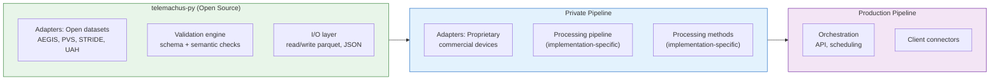
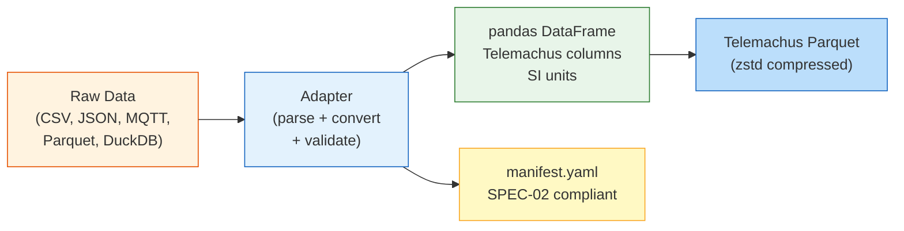
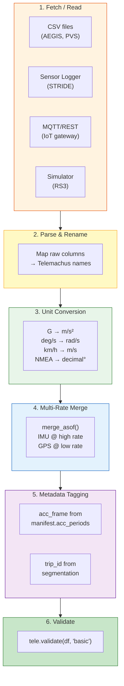
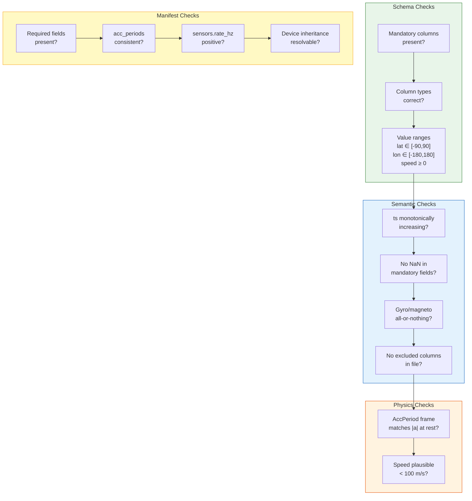
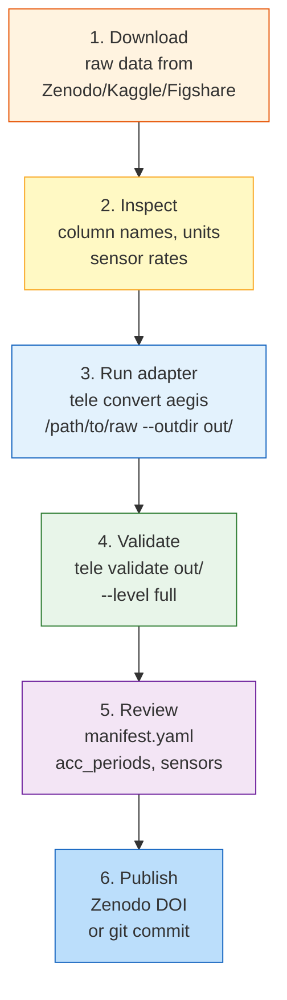

# SPEC-03: Adapters & Validation — Tooling

## 1. Introduction

Telemachus data originates from heterogeneous sources — commercial
telematics devices, research platforms, smartphones, and simulators.
**Adapters** transform raw provider data into Telemachus-conformant parquet files.
**Validators** verify that the output conforms to SPEC-01 and SPEC-02.

This specification consolidates RFC-0005 (Adapter Architecture), RFC-0007
(Validation Framework), RFC-0009 (RS3 Integration), and incorporates
the industrial mapping from RFC-0002 as an appendix.

### 1.1 Scope Separation


```mermaid
graph LR
    subgraph PUBLIC["telemachus-py (Open Source)"]
        A_OPEN["Adapters: Open datasets\nAEGIS, PVS, STRIDE, UAH"]
        VAL["Validation engine\nschema + semantic checks"]
        IO["I/O layer\nread/write parquet, JSON"]
    end

    subgraph PRIVATE["Private Pipeline"]
        A_PROP["Adapters: Proprietary\ncommercial devices"]
        PIPE["Processing pipeline\n(implementation-specific)"]
        METHODS["Processing methods\n(implementation-specific)"]
    end

    subgraph PRODUCT["Production Pipeline"]
        ORCH["Orchestration\nAPI, scheduling"]
        CONN["Client connectors"]
    end

    PUBLIC --> PRIVATE --> PRODUCT

    style PUBLIC fill:#e8f5e9,stroke:#2e7d32
    style PRIVATE fill:#e3f2fd,stroke:#1565c0
    style PRODUCT fill:#f3e5f5,stroke:#6a1b9a
```

---

## 2. Adapter Architecture

### 2.1 What an Adapter Does

An adapter converts raw data from a specific provider into a
Telemachus-conformant pandas DataFrame with:
- Correct column names (SPEC-01 §2)
- Correct units (SPEC-01 §5)
- A valid `manifest.yaml` (SPEC-02)


```mermaid
graph LR
    RAW["Raw Data\n(CSV, JSON, MQTT,\nParquet, DuckDB)"] --> ADAPTER["Adapter\n(parse + convert\n+ validate)"]
    ADAPTER --> DF["pandas DataFrame\nTelemachus columns\nSI units"]
    ADAPTER --> MAN["manifest.yaml\nSPEC-02 compliant"]
    DF --> PQ["Telemachus Parquet\n(zstd compressed)"]

    style RAW fill:#fff3e0,stroke:#e65100
    style ADAPTER fill:#e3f2fd,stroke:#1565c0
    style DF fill:#e8f5e9,stroke:#2e7d32
    style MAN fill:#fff9c4,stroke:#f9a825
    style PQ fill:#bbdefb,stroke:#1565c0
```

### 2.2 Adapter Interface

Every adapter is a Python function (not a class hierarchy). The
interface is intentionally simple:

```python
def load(source_path: Path, **kwargs) -> pd.DataFrame:
    """
    Load raw data and return a Telemachus-conformant DataFrame.

    The returned DataFrame has columns from SPEC-01 §2
    with correct SI units. Extra provider-specific columns
    use the x_<source>_<field> convention.
    """
    ...
```

Adapters MAY also provide:

```python
def manifest(source_path: Path) -> dict:
    """Return a SPEC-02 manifest dict for this dataset."""
    ...

def convert(source_path: Path, output_dir: Path) -> Path:
    """Convert raw data to Telemachus parquet + manifest.yaml."""
    ...
```

### 2.3 Module Layout

```
telemachus/
└── adapters/
    ├── __init__.py          # registry of available adapters
    │                        # -- format adapters: any source of this shape
    ├── csv_mapping.py       # CSV, driven by a declarative mapping
    ├── gpx.py               # GPX 1.0 / 1.1 track points
    ├── nmea.py              # NMEA 0183 RMC / GGA / VTG
    │                        # -- dataset adapters: one named dataset each
    ├── aegis.py             # AEGIS (Zenodo, Austria)
    ├── pvs.py               # PVS (Kaggle, Brazil)
    └── stride.py            # STRIDE (Figshare, Bangladesh)
```

The distinction matters more than the file count. A **dataset adapter** knows
one dataset's layout by heart and exists so a published result can be
reproduced. A **format adapter** works on data this project has never seen,
which is the only kind of adapter that helps someone adopt the format without
talking to its author. Nobody adopts a format by writing new data into it; they
adopt it by converting what they already have. No lossless audio format won on
the strength of its own recordings — it won because ripping a disc into it took
one command and lost nothing.

There is one thing a converter must never do, and it is the reason units are
declared rather than inferred (§3.0.1): **you cannot rip above the source.** An
adapter's job is to carry the measurement across intact, in its own units, with
what was discarded written down. Anything it invents on the way — a speed GPX
never carried, an accelerometer reading derived from GNSS — is a value that will
be read as a measurement by everyone downstream, forever.

Proprietary adapters live in a **private pipeline module**, not telemachus-py:

```
private-pipeline/
└── adapters/
    ├── commercial.py        # Commercial device adapters
    ├── prototype.py         # Experimental prototypes
    └── ...
```

### 2.4 Adapter Pipeline


```mermaid
graph TD
    subgraph FETCH["1. Fetch / Read"]
        CSV["CSV files\n(AEGIS, PVS)"]
        SENSOR["Sensor Logger\n(STRIDE)"]
        MQTT["MQTT/REST\n(IoT gateway)"]
        SIM["Simulator\n(RS3)"]
    end

    subgraph PARSE["2. Parse & Rename"]
        COL["Map raw columns\n→ Telemachus names"]
    end

    subgraph CONVERT["3. Unit Conversion"]
        UNITS["G → m/s²\ndeg/s → rad/s\nkm/h → m/s\nNMEA → decimal°"]
    end

    subgraph MERGE["4. Multi-Rate Merge"]
        ASOF["merge_asof()\nIMU @ high rate\nGPS @ low rate"]
    end

    subgraph TAG["5. Metadata Tagging"]
        FRAME["acc_frame from\nmanifest.acc_periods"]
        TRIP["trip_id from\nsegmentation"]
    end

    subgraph VALIDATE["6. Validate"]
        CHECK["tele.validate(df, 'basic')"]
    end

    FETCH --> PARSE --> CONVERT --> MERGE --> TAG --> VALIDATE

    style FETCH fill:#fff3e0,stroke:#e65100
    style PARSE fill:#fff9c4,stroke:#f9a825
    style CONVERT fill:#e8f5e9,stroke:#2e7d32
    style MERGE fill:#e3f2fd,stroke:#1565c0
    style TAG fill:#f3e5f5,stroke:#6a1b9a
    style VALIDATE fill:#c8e6c9,stroke:#2e7d32
```

> **High-rate IMU burst decoding (deterministic timestamps)**: when acceleration
> arrives as a burst (N = `burst_size` samples per frame at `burst_rate_hz`, SPEC-02
> §3.6), an adapter MUST place the sub-samples at deterministic timestamps so that
> two adapters for the same hardware produce **bit-identical** output. The convention
> is therefore **mandatory** (not adapter-chosen): anchor sub-sample 0 at the frame
> timestamp and step forward by `1 / burst_rate_hz` — `ts_i = ts_frame + i / burst_rate_hz`.
> Linear interpolation across frames is NOT permitted (it invents motion). Fixing a
> single anchor is what guarantees two adapters cannot diverge.

---

## 3. Adapter Specifications

### 3.0 Format Adapters

#### 3.0.1 CSV — declarative mapping

The CSV adapter takes its column and unit mapping as **data**, not as code:

```yaml
dataset_id: FR_myfleet_2026
device_id: truck_07
read:
  sep: ";"
  decimal: ","
columns:
  ts:        {column: "Date UTC",  unit: iso8601}
  lat:       {column: "Latitude",  unit: deg}
  lon:       {column: "Longitude", unit: deg}
  speed_mps: {column: "Vitesse",   unit: km/h}
  ax_mps2:   {column: "AccX",      unit: g}
  hdop:      {column: "HDOP"}
```

Rules:

1. **`unit` is REQUIRED on every column that carries one** (SPEC-01 §5),
   including when the source is already canonical. This is the point of the
   mechanism, not a formality: it moves the unit question to the moment the
   column is named, in front of the source's documentation, instead of leaving
   it to be inferred from magnitudes afterwards.
2. `unit` is REFUSED on a column that carries none (`hdop`, `n_satellites`) and
   on an `x_*` extra, which keeps its source unit by definition.
3. A target that is neither a SPEC-01 column nor an `x_*` extra is an error,
   and the error names the closest standard column.
4. `columns.ts` is required.
5. Unmapped source columns are dropped, or carried as `x_csv_<name>` when the
   caller asks — the coverage rule of §2.13 is then satisfied by construction.

A mapping is a file: reviewable, diffable, and returnable to whoever produced
the export for correction.

#### 3.0.2 GPX

| Property | Value |
|----------|-------|
| Source | `.gpx` 1.0 / 1.1, one file or a directory |
| Raw units | decimal degrees, metres, ISO 8601 |
| Trips | one per `<trkseg>` — a boundary the device recorded, not one a threshold inferred |
| Extensions | Garmin TrackPointExtension and Cluetrust leaves, as `x_gpx_*` |
| Not produced | `speed_mps`, present and NaN |

GPX has no speed in its base schema. Deriving one from consecutive positions
would place a computed value in a measurement column, which SPEC-04 §5.2 rules
out; the column is therefore present and empty, and a consumer who wants that
speed computes it knowing they did.

#### 3.0.3 NMEA 0183

| Property | Value |
|----------|-------|
| Sentences read | `RMC` (date, time, position, speed, course), `GGA` (quality, satellites, HDOP, altitude), `VTG` (course, ground speed) |
| Raw units | `DDMM.MMMM` + hemisphere, knots, km/h |
| Row unit | the **fix epoch** — the three sentence types describe one instant and produce one row between them |
| Checksum | verified; a corrupt `RMC`/`GGA` counts as a dropped row, a corrupt `GSV` was never a row |
| `gnss_valid` | recorded from RMC status and GGA quality, never acted upon (§2.5) |

`GGA` carries a time of day and no date. A log with `GGA` and no preceding
`RMC` is **refused** unless the caller supplies the date: a dataset off by an
arbitrary number of days is worse than a conversion that failed.

### 3.1 AEGIS Adapter

| Property | Value |
|----------|-------|
| Source | Zenodo 820576, 6 CSV files |
| Raw units | Accel: **G-force**, Gyro: **deg/s**, GPS: **NMEA DDMM.MMMM** |
| Conversions | `× 9.80665`, `× π/180`, NMEA→decimal |
| Multi-rate merge | Accel+Gyro (24 Hz) ← GPS (5 Hz) via `merge_asof` |
| Output columns | ts, lat, lon, speed_mps, altitude_gps_m, ax/ay/az_mps2, gx/gy/gz_rad_s, speed_obd_mps (opt), device_id, trip_id |

### 3.2 PVS Adapter

| Property | Value |
|----------|-------|
| Source | Kaggle, combined GPS+MPU CSV per trip |
| Raw units | Accel: **m/s²** (native), Gyro: **deg/s**, Magneto: **µT**, GPS: decimal degrees |
| Conversions | Gyro: `× π/180` |
| Parameters | `placement`: dashboard / above_suspension / below_suspension; `side`: left / right |
| Output columns | ts, lat, lon, speed_mps, altitude_gps_m, hdop, n_satellites, ax/ay/az_mps2, gx/gy/gz_rad_s, mx/my/mz_uT, device_id, trip_id |

### 3.3 STRIDE Adapter

| Property | Value |
|----------|-------|
| Source | Figshare, 11 CSV files per session |
| Raw units | Accel: **m/s²** (TotalAcceleration), Gyro: **rad/s** (native), Magneto: **µT**, GPS: decimal degrees |
| Conversions | None (all native SI) |
| Multi-rate merge | Accel (100 Hz) ← GPS (1 Hz) ← Gyro (100 Hz) via `merge_asof` |
| Parameters | `category`: driving / anomalies / all; `with_gyro`: bool |
| Output columns | ts, lat, lon, speed_mps, altitude_gps_m, heading_deg, h_accuracy_m, ax/ay/az_mps2, gx/gy/gz_rad_s, mx/my/mz_uT, device_id, trip_id |

### 3.4 RS3 Adapter (Synthetic)

| Property | Value |
|----------|-------|
| Source | RoadSimulator3 CSV export |
| Raw units | All already in SI |
| Conversions | None |
| Ground truth | `road_type`, `event`, `target_speed` exported as `x_rs3_*` extra columns |

---

## 4. Validation Framework

### 4.1 Validation Levels

| Level | Checks | Use Case |
|-------|--------|----------|
| `basic` | Mandatory columns for declared profile present, correct types, value ranges (lat/lon bounds, speed >= 0, `hdop`/`pdop` > 0, `n_satellites` >= 0, `heading_deg` in [0, 360), \|a\| finite), **unit plausibility (§4.6)**, **temporal plausibility (§4.7)** | Quick conformance |
| `strict` | All of `basic` + monotonic ts, AccPeriod gravity check (profiles `imu`/`full`). NaN is allowed in GNSS columns between ticks (multi-rate convention) but at least one non-NaN GPS fix MUST exist | Research-grade |
| `manifest` | SPEC-02 §5 rules (required fields, acc_periods consistency, sensor config) | Manifest-only check |
| `full` | `strict` + `manifest` + cross-validation (manifest vs parquet agreement) | Publication-ready |

### 4.2 Validation API

```python
import telemachus as tele

# Validate a DataFrame
report = tele.validate(df, level="basic")
print(report.ok)        # True / False
print(report.errors)    # list of error messages
print(report.warnings)  # list of warnings

# Validate a manifest file
report = tele.validate_manifest("path/to/manifest.yaml")

# Validate a complete dataset (parquet + manifest)
report = tele.validate_dataset("path/to/dataset/", level="full")
```

### 4.3 CLI

```bash
# Validate a dataset directory
tele validate path/to/dataset/ --level full

# Validate manifest only
tele validate path/to/manifest.yaml --manifest-only

# Quick check on a parquet file
tele validate path/to/data.parquet --level basic

# Output as JSON (for CI pipelines)
tele validate path/to/dataset/ --json
```

### 4.4 Validation Rules Summary


```mermaid
graph TD
    subgraph SCHEMA["Schema Checks"]
        S1["Mandatory columns\npresent?"]
        S2["Column types\ncorrect?"]
        S3["Value ranges\nlat ∈ [-90,90]\nlon ∈ [-180,180]\nspeed ≥ 0"]
    end

    subgraph SEMANTIC["Semantic Checks"]
        M1["ts monotonically\nincreasing?"]
        M2["No NaN in\nmandatory fields?"]
        M3["Gyro/magneto\nall-or-nothing?"]
        M4["No excluded columns\nin file?"]
    end

    subgraph PHYSICS["Physics Checks"]
        P1["AccPeriod frame\nmatches |a| at rest?"]
        P2["Speed plausible\n< 100 m/s?"]
    end

    subgraph MANIFEST_V["Manifest Checks"]
        V1["Required fields\npresent?"]
        V2["acc_periods\nconsistent?"]
        V3["sensors.rate_hz\npositive?"]
        V4["Device inheritance\nresolvable?"]
    end

    S1 --> S2 --> S3 --> M1 --> M2 --> M3 --> M4 --> P1 --> P2
    V1 --> V2 --> V3 --> V4

    style SCHEMA fill:#e8f5e9,stroke:#2e7d32
    style SEMANTIC fill:#e3f2fd,stroke:#1565c0
    style PHYSICS fill:#fff3e0,stroke:#e65100
    style MANIFEST_V fill:#fff9c4,stroke:#f9a825
```

### 4.5 Exit Codes

| Code | Meaning |
|------|---------|
| `0` | Validation successful |
| `1` | Validation failed (errors detected) |
| `2` | Manifest missing or corrupted |
| `3` | Schema invalid or unavailable |

### 4.6 Unit Plausibility

A wrong unit is the defect this format is least able to survive and most likely
to meet, and it is invisible to every rule above: the column is named
`speed_mps`, its type is float32, its values are positive and finite, and they
are in km/h. Only the magnitudes are wrong.

Two families of test, and the difference decides the severity.

**Cross-checks** compare a column against an independent measurement of the
same quantity, and return a ratio that names the wrong unit outright. A ratio
of 3.60 between `speed_mps` and the speed its own positions imply is not a
suspicion. These are **errors**.

| Check | Independent reference | Ratios named |
|-------|----------------------|--------------|
| `speed_mps` | great-circle distance between consecutive fixes | 3.6 km/h, 1.94 knots, 2.24 mph, 100 cm/s |

**A cross-check must know when it is looking at a mirror.** The strength of the
one above depends entirely on `speed_mps` being an independent measurement, and
nothing guarantees that: an adapter that fills it by differentiating the very
positions it will be compared against turns the test into a tautology. The
ratio comes out at exactly 1, the report is empty, and the silence reads as a
pass.

The two cases are told apart by the *scatter* of the ratio, not its median. A
Doppler reading disagrees with its own positions sample by sample — curvature,
receiver noise, timing — so the ratio spreads by several percent. A derived
column tracks them exactly and spreads by nothing. Below an interquartile
spread of 0.01 the validator reports that it **cannot** validate the column,
which is a different statement from finding it correct.

A wrong unit is still named whatever the provenance: derived and scaled by 3.6
is still km/h, and the ratio still says so.

**Magnitude checks** compare a column against what physics allows. A plausible
magnitude can still be wrong and an implausible one can be genuine, so these
**warn**, except where a named unit accounts for the discrepancy exactly.

| Column | Expected | Error when |
|--------|----------|-----------|
| \|a\| | per declared AccPeriod frame (§3 rule 3): ~9.81 `raw`, ~0 `compensated` | median ≈ 1.0 under `raw` (still in g); ≈ 9.81 under `compensated` (gravity present) |
| \|ω\| | < 8 rad/s for a mounted sensor | p99 > 17 rad/s, beyond MEMS full scale (deg/s) |
| \|m\| | 25–65 µT, the Earth's field | median matches nT, mT or gauss instead |
| `speed_mps` | < 100 m/s for a ground carrier | p99.9 above it |
| `altitude_gps_m` | below any road on Earth | p99 > 9000 m (feet) |

The accelerometer check is **frame-aware and refuses to guess**. Without a
declared AccPeriod, a median \|a\| of 1.0 m/s² is both a raw signal left in g
and a perfectly correct compensated frame; the validator reports what it sees
and asks for the declaration rather than picking one.

Every check needs at least 30 usable samples. Below that it stays silent:
silence is more useful than a coin toss.

### 4.7 Temporal Plausibility

§4.6 asks whether a number can be the quantity its column claims. This asks the
same of time, and nothing did: a trace carrying four rows stamped
`1970-01-01` satisfies every rule in §3 of SPEC-01 — the timestamps are
monotonic, typed, timezone-aware — and the descriptive layer then reports a
three-minute drive as spanning fifty-six years.

Two bounds, both **errors**, because neither is a threshold somebody chose:

| Bound | Why it is not arbitrary |
|-------|-------------------------|
| Before **1980-01-06**, the GPS epoch | GNSS *is* the clock. A receiver holding a position holds the constellation's time, so an earlier fix was stamped by something else — almost always a real-time clock that lost power and restarted at the Unix epoch |
| After **now**, with two days of tolerance | Recorded data cannot postdate its own reading. The tolerance absorbs device drift and gateway stamping; days ahead is not drift |

Between them they also catch the epoch-unit confusion, and the report names it
the way §4.6 names km/h: **seconds read as milliseconds land in January 1970,
milliseconds read as seconds land some fifty thousand years out**.

The two are less distinct than they look. A far-future instant that passes back
through a datetime conversion on a plain list wraps silently into 1970, so by
the time a frame reaches a validator "milliseconds read as seconds" and "clock
never set" can be the same four rows. The message therefore offers both
readings rather than picking one.

A span longer than ten years is a **warning**, and only when neither bound
fired — a 1970 row makes the span absurd by construction, and reporting both
would restate one fault as two.

The reference instant is injectable. A validator whose verdict depends on the
day it runs cannot be regression-tested.

---

## 5. Dataset Generation Workflow

### 5.1 Converting Open Data

The standard workflow to generate a Telemachus dataset from an Open source:


```mermaid
graph TD
    DL["1. Download\nraw data from\nZenodo/Kaggle/Figshare"] --> INSPECT["2. Inspect\ncolumn names, units\nsensor rates"]
    INSPECT --> ADAPT["3. Run adapter\ntele convert aegis\n/path/to/raw --outdir out/"]
    ADAPT --> VALID["4. Validate\ntele validate out/\n--level full"]
    VALID --> REVIEW["5. Review\nmanifest.yaml\nacc_periods, sensors"]
    REVIEW --> PUBLISH["6. Publish\nZenodo DOI\nor git commit"]

    style DL fill:#fff3e0,stroke:#e65100
    style INSPECT fill:#fff9c4,stroke:#f9a825
    style ADAPT fill:#e3f2fd,stroke:#1565c0
    style VALID fill:#e8f5e9,stroke:#2e7d32
    style REVIEW fill:#f3e5f5,stroke:#6a1b9a
    style PUBLISH fill:#bbdefb,stroke:#1565c0
```

### 5.2 CLI for Conversion

```bash
# Convert your own data (format adapters)
tele mapping-template myexport.csv > mapping.yaml      # then fill in the units
tele convert csv myexport.csv --mapping mapping.yaml --outdir out/
tele convert gpx rides/ --outdir out/
tele convert nmea track.nmea --outdir out/

# Convert an Open dataset to Telemachus parquet + manifest
tele convert aegis /path/to/aegis/csvs --outdir datasets/aegis/
tele convert pvs /path/to/pvs/trips --outdir datasets/pvs/ --placement dashboard
tele convert stride /path/to/stride/road_data --outdir datasets/stride/ --category driving

# Validate the result
tele validate datasets/aegis/ --level full

# Inspect dataset info
tele info datasets/aegis/manifest.yaml
```

---

## 6. Open Sources Matrix

Cross-reference of available columns per Open dataset, to help users
choose the right dataset for their use case.

| Column Group | AEGIS | PVS | STRIDE | UAH |
|-------------|:-----:|:---:|:------:|:---:|
| **GPS** lat, lon | 5 Hz | 1 Hz | 1 Hz | 1 Hz |
| **GPS** speed_mps | derived | 1 Hz | 1 Hz | 1 Hz |
| **GPS** heading_deg | — | — | 1 Hz | — |
| **GPS** altitude_gps_m | 5 Hz | 1 Hz | 1 Hz | — |
| **GPS** hdop | — | 1 Hz | — | — |
| **GPS** h_accuracy_m | — | — | 1 Hz | — |
| **GPS** n_satellites | — | 1 Hz | — | — |
| **Accel** ax/ay/az_mps2 | 24 Hz | 100 Hz | 100 Hz | 10 Hz |
| **Gyro** gx/gy/gz_rad_s | 24 Hz | 100 Hz | 100 Hz | — |
| **Magneto** mx/my/mz_uT | — | 100 Hz | 100 Hz | — |
| **OBD** speed_obd_mps | PID 0x0D | — | — | — |
| **Frame** | raw | raw | raw | raw |
| **Ground truth gyro** | yes | yes | yes | — |
| **Country** | Austria | Brazil | Bangladesh | Spain |
| **License** | CC-BY-4.0 | CC-BY-NC-ND-4.0 | CC-BY-4.0 | Academic |
| **Republishable** | yes | **no** (ND) | yes | case-by-case |
| **Zenodo DOI (Telemachus)** | [10.5281/zenodo.19609044](https://doi.org/10.5281/zenodo.19609044) | — | [10.5281/zenodo.19609053](https://doi.org/10.5281/zenodo.19609053) | — |

A synthetic reference dataset (RoadSimulator3, Le Havre) is also available:
DOI [10.5281/zenodo.19609057](https://doi.org/10.5281/zenodo.19609057) (CC0-1.0).

All datasets conform to Telemachus Specification v0.8
(DOI [10.5281/zenodo.19609019](https://doi.org/10.5281/zenodo.19609019)).

---

## Appendix A — Industrial API Mapping

Cross-reference of Telemachus columns with major industrial telematics APIs
(based on their public documentation). This table guides future adapter
development.

| Telemachus Column | Samsara | Webfleet (TomTom) | Geotab |
|-----------|---------|-------------------|--------|
| `ts` | `time` | `gpstime` | `dateTime` |
| `lat` | `latitude` | `lat` | `latitude` |
| `lon` | `longitude` | `lon` | `longitude` |
| `speed_mps` | `speed` (km/h) | `speed` (km/h) | `speed` (km/h) |
| `heading_deg` | `bearingDeg` | `heading` | `bearing` |
| `ignition` | `engineState` | `ignition` | `ignition` |
| `odometer_m` | `odometerMeters` | `mileage` (km) | `odometer` |
| `rpm` | `engineRpm` | — | `engineRpm` |

> **Note:** These fleet management APIs typically provide **enriched**
> data (aggregated, post-processed). They rarely expose raw IMU. Adapters for
> these providers would produce GPS + Vehicle I/O datasets without
> accelerometer data. Other commercial device adapters are documented
> in their respective private modules.

---

## 7. References

- **SPEC-01**: Telemachus Record Format — column definitions
- **SPEC-02**: Dataset Manifest — metadata schema
- **Superseded**: RFC-0002 (Comparative APIs), RFC-0005 (Adapter Architecture), RFC-0007 (Validation Framework), RFC-0009 (RS3 Integration)

---

End of SPEC-03.
