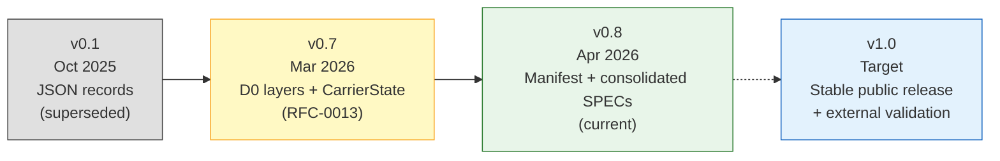

# SPEC-04: Governance & Versioning

## 1. Introduction

Telemachus is currently maintained by a **single author**. Governance
is deliberately lightweight — no committees, no formal voting, no
blocking review process. This will evolve if external contributors join.

This specification supersedes RFC-0011 (Versioning and Governance Policy).

---

## 2. Versioning

Telemachus uses pragmatic version numbering:

| Component | Versioning | Example |
|-----------|-----------|---------|
| **Specification** (SPEC-01→04) | `telemachus-<major>.<minor>` | `telemachus-0.8` |
| **Python library** (telemachus-py) | `<major>.<minor>.<patch>` | `0.8.0` |
| **Datasets** | Manifest `schema_version` field | `telemachus-0.8` |

### 2.1 Version Bumping Rules

- **Major** (0.x → 1.0): breaking schema changes, public release milestone
- **Minor** (0.7 → 0.8): new columns, new manifest fields, new adapters
- **Patch** (0.8.0 → 0.8.1): bug fixes, documentation, no schema change

### 2.2 Current Status

Pre-1.0: the specification is evolving. No backwards compatibility
guarantee between minor versions. After 1.0, deprecated fields remain
valid for at least one minor release.

---

## 3. Specification Lifecycle

| Stage | Meaning |
|-------|---------|
| **Draft** | Initial proposal, open for changes |
| **Accepted** | Conceptually approved, implementation pending |
| **Implemented** | Supported by code and tests in telemachus-py |
| **Released** | Included in an official tagged release |
| **Deprecated** | Superseded by a newer spec, kept for reference |

---

## 4. Decision Making (Solo Mode)

While the project has a single maintainer:

1. **Decisions are documented** in the relevant SPEC or in the ROADMAP journal (§5 of the deeptech ROADMAP).
2. **No formal RFC review period** — specs can move from Draft to Implemented in a single session.
3. **External feedback welcome** but not blocking. When Brice Adriano (or another external reviewer) is available, a review pass is recommended before tagging 1.0.
4. **Version bumps happen when coherent** — not on a fixed schedule, not on every commit.

### 4.1 Transition to Multi-Contributor

When external contributors join:
- Introduce PR-based review for spec changes
- Require at least one reviewer for schema-breaking changes
- Maintain a CHANGELOG linking changes to specs

---

## 5. IP and Publication Rules

### 5.1 Channel Separation

| Channel | Content | Visibility |
|---------|---------|-----------|
| `telemachus3/telemachus` (GitHub) | Format specification + telemachus-py | Public, Tier 1 |
| `research.roadsimulator3.fr` | Papers, benchmarks, scientific results | Public, Tier 1 + Tier 2 post-eSoleau |
| Private pipeline (Gitea) | Pipeline implementation, processing methods | Private, Tier 2 |

### 5.2 Golden Rule

> The spec describes **what columns exist and what they mean** — never
> **how to compute derived values**. Processing methods and calibration
> algorithms are implementation-specific and not part of this spec.

---

## 6. Release Checklist

Before tagging a release:

- [ ] All SPECs reflect current implementation
- [ ] `telemachus-py` tests pass
- [ ] At least one adapter produces a valid dataset
- [ ] `tele validate` CLI works on the produced dataset
- [ ] CHANGELOG updated
- [ ] Git tag created (`v0.8.0`)
- [ ] Zenodo DOI minted (for significant releases)

---

## 7. References

- **Superseded**: RFC-0011 (Versioning and Governance Policy)
- **Related**: SPEC-01 (Format), SPEC-02 (Manifest), SPEC-03 (Tooling)

---

End of SPEC-04.
