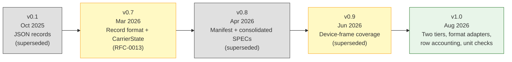

# SPEC-04: Governance & Versioning

## 1. Introduction

Telemachus is currently maintained by a **single author**. Governance
is deliberately lightweight — no committees, no formal voting, no
blocking review process. This will evolve if external contributors join.

This specification supersedes RFC-0011 (Versioning and Governance Policy).

---

## 2. Versioning

Telemachus uses pragmatic version numbering:

| Component | Versioning | Example |
|-----------|-----------|---------|
| **Specification** (SPEC-01→04) | `telemachus-<major>.<minor>` | `telemachus-1.0` |
| **Python library** (telemachus-py) | `<major>.<minor>.<patch>` | `1.0.0` |
| **Datasets** | Manifest `schema_version` field | `telemachus-1.0` |

### 2.1 Version Bumping Rules

- **Major** (0.x → 1.0): breaking schema changes, public release milestone
- **Minor** (0.7 → 0.8): new columns, new manifest fields, new adapters
- **Patch** (0.8.0 → 0.8.1): bug fixes, documentation, no schema change

### 2.2 Current Status

**1.0.0a1** — the first stable-numbered release, published as a pre-release so
that the import break of §5.3.2 is out in the open before the stability
commitment binds. `pip` does not install pre-releases by default.

The major number is not justified by a count of features. It is justified by
coherence: until 1.0, SPEC-02 §3.5 required a row accounting that the reference
implementation did not produce, and SPEC-04 asserted a perimeter that had never
been written down. A specification whose own implementation does not honour it
is the thing 1.0 ends.

From 1.0 onward, deprecated fields and symbols remain valid for at least one
minor release. Before 1.0 there was no such guarantee, and none was given.


```mermaid
graph LR
    V01["v0.1\nOct 2025\nJSON records\n(superseded)"]
    V07["v0.7\nMar 2026\nRecord format + CarrierState\n(RFC-0013)"]
    V08["v0.8\nApr 2026\nManifest + consolidated SPECs\n(superseded)"]
    V09["v0.9\nJun 2026\nDevice-frame coverage\n(superseded)"]
    V10["v1.0\nAug 2026\nTwo tiers, format adapters,\nrow accounting, unit checks"]

    V01 --> V07 --> V08 --> V09 --> V10

    style V01 fill:#e0e0e0,stroke:#424242
    style V07 fill:#fff9c4,stroke:#f9a825
    style V08 fill:#e0e0e0,stroke:#424242
    style V09 fill:#fff9c4,stroke:#f9a825
    style V10 fill:#e8f5e9,stroke:#2e7d32
```

---

## 3. Specification Lifecycle

| Stage | Meaning |
|-------|---------|
| **Draft** | Initial proposal, open for changes |
| **Accepted** | Conceptually approved, implementation pending |
| **Implemented** | Supported by code and tests in telemachus-py |
| **Released** | Included in an official tagged release |
| **Deprecated** | Superseded by a newer spec, kept for reference |

---

## 4. Decision Making (Solo Mode)

While the project has a single maintainer:

1. **Decisions are documented** in the relevant SPEC or in the ROADMAP journal (§5 of the deeptech ROADMAP).
2. **No formal RFC review period** — specs can move from Draft to Implemented in a single session.
3. **External feedback welcome** but not blocking. When Brice Adriano (or another external reviewer) is available, a review pass is recommended before tagging 1.0.
4. **Version bumps happen when coherent** — not on a fixed schedule, not on every commit.

### 4.1 Transition to Multi-Contributor

When external contributors join:
- Introduce PR-based review for spec changes
- Require at least one reviewer for schema-breaking changes
- Maintain a CHANGELOG linking changes to specs

---

## 5. IP and Publication Rules

### 5.1 Channel Separation

| Channel | Content | Visibility |
|---------|---------|-----------|
| `telemachus3/telemachus` (GitHub) | Format specification + telemachus-py | Public, Tier 1 |
| `research.roadsimulator3.fr` | Papers, benchmarks, scientific results | Public, Tier 1 + Tier 2 post-eSoleau |
| Private pipeline (Gitea) | Pipeline implementation, processing methods | Private, Tier 2 |

### 5.2 Golden Rule

> The spec describes **what columns exist and what they mean** — never
> **how to compute derived values**. Processing methods and calibration
> algorithms are implementation-specific and not part of this spec.

### 5.2.1 Where the boundary falls, layer by layer

The golden rule is easy to agree with and hard to apply, because the hard cases
are not "is this an algorithm" but "does describing this output describe the
algorithm that made it". This section fixes the answer once, in terms of the
layered architecture the format sits in, so the question is not re-litigated
per pull request.

| Layer | What it holds | In this specification? |
|---|---|---|
| **D0** — signal | What the device measured: GNSS, inertial, vehicle bus, timestamps, native quality indicators | **Yes.** SPEC-01 in full. The only layer that cannot be recomputed, therefore the only one that cannot be allowed to be lost |
| **D0.5** — acquisition context | What state the device was in while measuring: accelerometer frame (§3.7), what it was riding on (§3.8), whether the acquisition was intact (§3.9) | **Yes.** All three are declarations of fact about the acquisition. None interprets the movement |
| **D1** — kinematic reconstruction | The reconstructed trajectory, its uncertainty, its covariance | **No, except the coexistence contract.** SPEC-01 §2.13.1 says a corrected value must sit beside its source and be removable, and SPEC-02 §3.14 says its producer is declared once. Neither says what a corrected value *is*, how it is obtained, or what columns a reconstruction produces |
| **D1.5** — projection onto external references | Map matching, road segment, lane | **No.** A map is itself a versioned interpretation, and a position that depends on one cannot be replayed once the map has moved |
| **D2** — perception | Events, situations, manoeuvres | **No.** SPEC-01 §2.13 excludes them by name |
| **D3** — aggregation | Scores, indicators, fleet metrics | **No** |

**Why D0.5 is in and D1 is out**, since that is the only line that needs an
argument. D0.5 states what happened to the *instrument*: the frame it was in,
what carried it, when it was interrupted. Those facts are unrecoverable after
the fact and meaningless to compute — nobody derives "the device rebooted", the
device either did or did not. D1 states what happened to the *vehicle*, and
every value in it is the output of an estimator. Publishing a D1 column schema
would not publish an algorithm, but it would publish the shape of one, in
enough detail to be a specification of it.

**What this arrangement buys.** A producer can ship reconstructed data in a
fully open format — same columns, same manifest, same validator — while the
reconstruction itself stays theirs. `produced_by` is an opaque string this
specification never interprets. That is deliberate: an open contract lets anyone
build without permission, and rewards whoever reconstructs best. Opening the
methods as well would reward nobody and is not on offer.

**The precedent is not hypothetical.** A lossless audio format separates the
same two things and has done so for two decades: the bitstream is specified
down to the bit and belongs to everyone, while nothing in it prescribes how an
encoder should predict a sample. Encoders compete on speed and ratio, files
stay interchangeable, and the format outlives every one of them. That split is
what this section reproduces — and it is why the reference implementation is
licensed to be *linked against* rather than to be inherited from. A format's
library is the thing everyone must be able to use; a format's encoders are the
thing worth competing over.

---

---

### 5.3 Scope — Two Tiers

The golden rule above says what the *specification* covers. This section says
what the *reference implementation* covers, which is a different question and
had never been answered. Without an answer, every useful utility written
against the format drifted into `telemachus-py` and became, by the fact of
having shipped, something the project had to keep.

#### 5.3.1 The test

> **Which manifest field does this function fill, or which validation rule does
> it serve?**

| Answer | Tier | Contract |
|--------|------|----------|
| It names one | **Normative** | Bound to the specification version. Does not change without a spec revision. Lives under `telemachus` or `telemachus.metrics` |
| It names none | **Convenience** | Maintained, outside the specified perimeter, free to evolve between spec versions. Lives under `telemachus.analysis` |
| It names one from a **superseded** spec version | **Legacy** | Deprecated on sight. Kept only as long as §2.2 requires, then removed |

A convenience function is **decided, not defaulted**: the absence of an answer
is a reason to leave a utility out, not a reason to file it under `analysis`.

#### 5.3.2 The tier is in the import path

A note in the documentation stops nobody. `telemachus.metrics` against
`telemachus.analysis` is visible on every call line, in every notebook, in
every diff. This is the reason the 1.0 release breaks imports, and the reason
it does so now rather than later: the rename will never be cheaper than at the
first stable tag.

#### 5.3.3 Applied to the published surface

The test was run against everything version 0.9 shipped, before this rule was
written, so that the rule would say what the project means rather than be
contradicted by its own library. Three findings came out of it, and they are
recorded here because a rule with no worked example is a rule nobody applies
the same way twice.

**Normative.** Everything below names a field or a rule.

| Symbol | Fills or serves |
|--------|-----------------|
| `read` | SPEC-02 §3.11 `data_files`, §4.1 inheritance |
| `validate`, `validate_manifest`, `validate_dataset` | SPEC-01 §3, SPEC-02 §5, SPEC-03 §4 |
| `check_units` | SPEC-01 §5 units, §3 rule 3 frame |
| `RowAccount`, `check_row_accounting`, `drop_duplicate_ts` | SPEC-02 §3.5, SPEC-01 §3 rule 2 |
| `merge_multirate` | SPEC-01 §2.11 multi-rate convention |
| `convert_unit` | SPEC-01 §5 conversion table |
| `has_*`, `sensor_profile`, `is_gps_only`, `is_full_imu` | SPEC-02 §3.1 `profile` |
| `metrics.haversine_m`, `metrics.path_length_m` | SPEC-02 §3.10 `volume.distance_km` |
| `metrics.gaps`, `gap_profile`, `sampling_populations` | SPEC-02 §3.6 `sensors.*.rate_hz`, defined as the *observed* rate |
| `metrics.epoch_s` | timestamp resolution under the above |
| `core.schemas.schema_for_profile`, `coerce_schema_dtypes` | SPEC-01 §2.2, §3 rule 9 |
| `adapters.*` | SPEC-03 §2 adapter interface |

**Convenience.** Twelve symbols, against the five the test was expected to
catch. `stops`, `decimation_loss` and the two session functions were the
surprise, and `stream_summary` was the hard case: several of its fields would
fill a manifest block on their own, but its trip count cannot be produced
without segmenting, and a function that cannot be used without making a
decision belongs on the decision side of the line.

| Symbol | Why not normative |
|--------|-------------------|
| `by_gap`, `by_stop`, `segment_trips`, `trip_profile`, `TripSegmenter` | Cutting a stream into trips is a decision; different thresholds give different counts |
| `stops` | Depends on a minimum duration the caller picks |
| `decimation_loss` | Measures the cost of a sampling choice, not a property of the data |
| `session_profile`, `session_contiguity` | Describe a transport's shape; no manifest field records it |
| `stream_summary` | Cannot be produced without segmenting into trips |
| `compute_dt`, `speed_from_pos` | A speed derived from positions is a computed value (§5.2) |

**Legacy.** The finding the test was not looking for, and the largest. Eleven
modules implement the v0.1 three-table schema — `trajectory` / `imu` / `events`
keyed on `timestamp_ns`, with `acc_x` and `gyro_x` column names — which no
current SPEC describes. They answer the test with a field from a superseded
version, which is neither of the two tiers:

`io.load_jsonl`, `io_import`, `io_export`, `models.Manifest`, `core.models`,
`core.dataset.Dataset`, `core.semantics`, `core.validate_tables`, `pandas.*`,
`_validate_legacy`, and the `TRAJECTORY_SCHEMA` / `EVENTS_SCHEMA` aliases in
`core.schemas`.

Two consequences were visible immediately and are fixed in 1.0:

- `tele validate` ran the **v0.1** validator, not SPEC-01/02. On the four
  datasets this project publishes it reported seven schema errors, all of them
  defects in the validator rather than in the datasets. It now runs the current
  validator; the old path survives behind `--legacy`.
- `telemachus.dataset` imported a module that does not exist and raised
  `ModuleNotFoundError` on import. It shipped in 0.9 and is removed.

The rest is marked **Deprecated** in the sense of §3, kept for the one minor
release §2.2 promises, and scheduled for removal in 1.1. No new work targets it.

---

## 6. Release Checklist

### 6.1 Before tagging

- [ ] All SPECs reflect current implementation
- [ ] `telemachus-py` tests pass on every Python version `requires-python` claims
- [ ] At least one adapter produces a valid dataset
- [ ] `tele validate` works on the produced dataset **and on every dataset the
      project publishes** — 0.9 was tagged with all four failing
- [ ] No public docstring or published SPEC names an internal document, phase
      or private module (enforced by `tests/test_publication_hygiene.py`)
- [ ] **No client, partner or device name anywhere in the repository.** The same
      test scans every publishable file against a denylist held in the
      `TELEMACHUS_PRIVATE_TERMS` secret, never in the repository — a guard that
      lists what it protects has published it. The check *skips* when the secret
      is unset, so a second test fails in CI if it is: a silent skip reads as a
      pass, and this is the one leak that cannot be walked back after a push
- [ ] Git history scanned, not just the working tree. A `push` publishes every
      commit, and a name removed in the tip is still in the blob that carried it
- [ ] CHANGELOG updated, with a `## [<version>]` heading matching the tag: the
      release workflow extracts the release notes from it
- [ ] `pyproject.toml` version, `CITATION.cff` and `.zenodo.json` agree with the
      tag. The workflow fails the build on a tag/version mismatch rather than
      shipping one

### 6.2 Tagging

```bash
git tag -a v1.0.0a1 -m "Telemachus 1.0.0a1"
git push origin v1.0.0a1
```

`.github/workflows/release.yml` then runs, in this order and no other:

1. the full test suite and the dataset conformance job;
2. build sdist and wheel, `twine check --strict`, and install the wheel into a
   clean interpreter to confirm it imports and the CLI runs — a passing test
   suite does not prove the *wheel* contains what it should;
3. publish to PyPI through Trusted Publishing (OIDC, no stored token);
4. create the GitHub Release with the changelog section and the artefacts.

**The order is the point.** Zenodo mints its DOI from the GitHub Release, so the
release is created last, once the artefacts exist and are known good. A DOI
pointing at a release whose wheel failed to build cannot be retracted.

A pre-release tag (`a`, `b`, `rc`) is marked as such on GitHub and is not
installed by `pip install telemachus` without `--pre`.

### 6.3 One-time setup

| Target | What to configure | Where |
|---|---|---|
| PyPI | Trusted Publisher: owner `telemachus3`, repo `telemachus`, workflow `release.yml`, environment `pypi` | pypi.org/manage/account/publishing/ |
| GitHub | An environment named `pypi` | Settings > Environments |
| Zenodo | Enable the repository. It reads `.zenodo.json`; `CITATION.cff` is for humans and GitHub's citation box | zenodo.org/account/settings/github/ |

### 6.4 After the DOI is minted

- [ ] Add the version DOI to the release notes on GitHub
- [ ] Leave the **concept** DOI in `CITATION.cff` — it resolves to the latest
      version, where a version DOI would go stale at each release

## 7. References

- **Superseded**: RFC-0011 (Versioning and Governance Policy)
- **Related**: SPEC-01 (Format), SPEC-02 (Manifest), SPEC-03 (Tooling)

---

End of SPEC-04.
