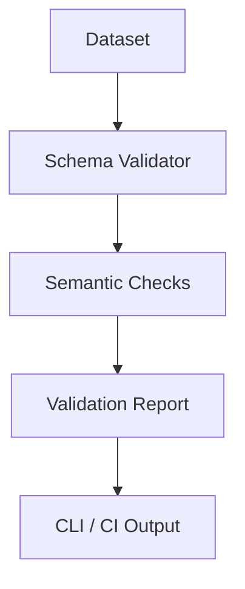

> **DEPRECATED** — This RFC has been superseded by [SPEC-03: Adapters & Validation §4](../SPEC-03-adapters-validation.md) (2026-04-16). Kept for historical reference.

## 1. Purpose

This RFC defines the **validation framework and CLI rules** for the Telemachus ecosystem.  
It formalizes how datasets, records, and schemas are validated — ensuring structural integrity, schema compliance, and temporal consistency across all Telemachus-compatible data sources.

The validation system is implemented within the `telemachus-py` library and aligns with the schema definitions established in RFC-0001 (Core), RFC-0003 (Dataset), and RFC-0004 (Extended FieldGroups).

---

## 2. Scope

This RFC covers:
- Validation workflow and architecture
- Validation levels and modes
- Command-line interface (`telemachus validate`)
- Error, warning, and exit-code conventions
- Integration with datasets, adapters, and schema registry

It does not redefine the Telemachus schema itself, but defines *how* compliance to it is verified programmatically.

---

## 3. Relationship to Other RFCs

| RFC | Title | Dependency |
|------|--------|-------------|
| RFC-0001 | Telemachus Core 0.2 | Provides base schema for validation |
| RFC-0003 | Dataset Specification 0.2 | Defines dataset manifest to validate |
| RFC-0004 | Extended FieldGroups Schema | Provides optional extended schema targets |
| RFC-0005 | Adapter Architecture | Generates data that must be validated |
| RFC-0011 | Versioning and Governance Policy | Describes lifecycle of validation rules |

---

## 4. Validation Architecture Overview

The validation framework is composed of three main layers:

1. **Schema Layer** — JSON Schemas describing structure and types (RFC-0001, RFC-0004).  
2. **Semantic Layer** — Domain-specific checks (timestamps, monotonicity, units).  
3. **CLI/Automation Layer** — User interface and integration within pipelines.



---

## 5. Validation Levels

| Level | Description | Typical Use |
|--------|--------------|--------------|
| **core** | Validate only fields from the Core schema (RFC-0001). | Minimal compliance |
| **extended** | Validate Core + Extended FieldGroups (RFC-0004). | Industrial datasets |
| **strict** | Enforce temporal, semantic, and numerical tolerances. | Research-grade datasets |

Example:
```bash
telemachus validate --dataset path/to/data --level strict
```

---

## 6. Validation Modes

| Mode | Description | Example |
|-------|--------------|----------|
| `--dataset` | Validate a dataset directory with manifest and samples. | `telemachus validate --dataset ./2025-10-01-v1.0` |
| `--record` | Validate a single JSON or CSV record. | `telemachus validate --record input.json` |
| `--schema` | Validate schema definitions themselves. | `telemachus validate --schema schema/core/record.schema.json` |
| `--adapter` | Validate output from a provider adapter (RFC-0005). | `telemachus validate --adapter samsara` |

---

## 7. Command-Line Interface

### 7.1 Basic Syntax
```bash
telemachus validate [OPTIONS]
```

### 7.2 Options
| Option | Description |
|---------|-------------|
| `--dataset PATH` | Path to dataset directory |
| `--record FILE` | Validate a single record file |
| `--schema FILE` | Validate a schema file |
| `--adapter NAME` | Validate adapter output |
| `--level {core,extended,strict}` | Validation level |
| `--all` | Validate all available tests |
| `--json` | Output validation report as JSON |
| `--fail-fast` | Stop at first error |
| `--verbose` | Detailed output of warnings and metrics |

---

## 8. Validation Report Structure

Validation results are always returned as a standardized JSON object:

```json
{
  "dataset": "2025-10-01-v1.0",
  "validated_at": "2025-10-13T10:00:00Z",
  "level": "strict",
  "records_checked": 131186,
  "errors": [
    {"field": "time", "type": "missing_value", "count": 5},
    {"field": "speed.kmh", "type": "unit_violation", "count": 3}
  ],
  "warnings": [
    {"field": "heading.deg", "type": "alignment_tolerance_exceeded", "max_delta_ns": 9000000}
  ],
  "status": "passed_with_warnings"
}
```

This format ensures compatibility with automated pipelines and CI/CD dashboards.

---

## 9. Error and Exit Codes

| Code | Meaning |
|-------|----------|
| `0` | Validation successful |
| `1` | Validation failed (errors detected) |
| `2` | Manifest missing or corrupted |
| `3` | Schema invalid or unavailable |
| `4` | CLI or adapter misconfiguration |

Warnings do not cause non-zero exit unless `--strict` is specified.

---

## 10. Semantic Validation Rules

| Check | Description | Applies To |
|--------|--------------|-------------|
| Timestamp monotonicity | Ensures timestamps are strictly increasing | All datasets |
| Missing values | Detects nulls in mandatory fields | Core & Extended |
| Unit validation | Checks values within expected unit range | Numeric fields |
| Alignment tolerance | Warns when misalignment exceeds defined threshold | Multisensor data |
| Sampling rate deviation | Detects irregular intervals | High-frequency datasets |

---

## 11. Implementation Guidelines

- Implemented under `telemachus/core/validate.py`
- Expose a main entry point `validate_dataset(path, level="core")`
- Integrate schema validation via `jsonschema` or `fastjsonschema`
- Use warnings module for soft alerts (`AlignmentWarning`, etc.)
- All validation rules must be unit-tested under `tests/test_validation.py`

---

## 12. Integration with CI/CD

A GitHub Actions workflow validates all datasets on push or pull requests:

```yaml
name: Validate Telemachus Dataset
on: [push, pull_request]
jobs:
  validate:
    runs-on: ubuntu-latest
    steps:
      - uses: actions/checkout@v3
      - name: Validate datasets
        run: |
          pip install telemachus-py
          telemachus validate --all --level strict
```

---

## 13. Future Extensions

- Web dashboard for dataset validation reports  
- Integration with RS3 simulation output checks  
- Automatic schema discovery from datasets  
- Integration with OpenTelemetry logging and metrics (RFC-0014)  

---

## 14. References

- RFC-0001 — *Telemachus Core 0.2*  
- RFC-0003 — *Dataset Specification 0.2*  
- RFC-0004 — *Extended FieldGroups Schema*  
- RFC-0005 — *Adapter Architecture & Provider Modules*  
- RFC-0011 — *Versioning & Governance Policy*  
- JSON Schema — https://json-schema.org/  
- Python `jsonschema` library — https://pypi.org/project/jsonschema/  

---

## 15. Conclusion

This RFC formalizes the validation backbone of the Telemachus ecosystem.  
It provides clear operational rules for ensuring consistency, reliability, and traceability of datasets, enabling automated quality assurance for both simulated and real-world telematics data.