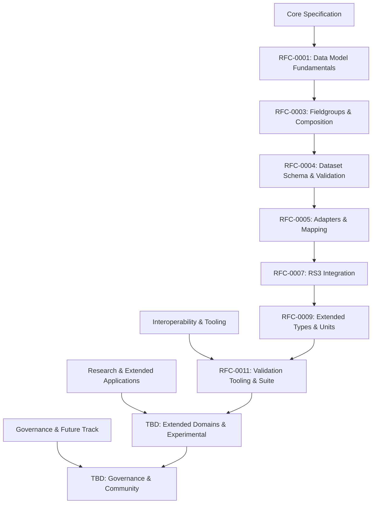

> **Sub-roadmap Telemachus spec (RFCs).** For the cross-project commercial deployment
> view, see [`../../ROADMAP.md`](../../ROADMAP.md). For IP/publication
> logic, see [`../../WORKFLOW.md`](../../WORKFLOW.md).

# Telemachus RFC Roadmap (2024)

This roadmap presents the structured development of Telemachus as a data modeling and interoperability specification. It is organized into four major tracks: Core Specification, Interoperability & Tooling, Research & Extended Applications, and Governance & Future Track. The RFCs listed here reflect the current, consolidated scope—datasets, fieldgroups, adapters, validation, RS3, and governance. Protocol-level RFCs are out of scope for Telemachus.

---

## I. CORE SPECIFICATION

| RFC   | Title                                 | Description                                                      | Target Release |
|-------|---------------------------------------|------------------------------------------------------------------|---------------|
| 0001  | Telemachus Data Model Fundamentals    | Core concepts: datasets, fields, fieldgroups, units, metadata    | v0.2          |
| 0003  | Fieldgroups & Composition             | Fieldgroup definitions, composition, reuse, inheritance          | v0.3          |
| 0004  | Dataset Schema & Validation           | Dataset schema format, constraints, validation rules             | v0.3          |
| 0005  | Adapters & Mapping                    | Adapter system for mapping to/from external representations      | v0.4          |
| 0007  | Reference Set 3 (RS3) Integration     | RS3 dataset and fieldgroup mapping, compatibility                | v0.5          |
| 0009  | Extended Types & Units                | Support for custom types, units, and extensibility mechanisms    | v0.6          |

---

## II. INTEROPERABILITY & TOOLING

| RFC   | Title                                 | Description                                                      | Target Release |
|-------|---------------------------------------|------------------------------------------------------------------|---------------|
| 0011  | Validation Tooling & Reference Suite  | Canonical validation tools, conformance suite, CLI/SDKs          | v0.7          |

---

## III. RESEARCH & EXTENDED APPLICATIONS

| RFC   | Title                                 | Description                                                      | Target Release |
|-------|---------------------------------------|------------------------------------------------------------------|---------------|
| (TBD) | Extended Domains & Experimental Apps  | Applying Telemachus to novel or domain-specific use cases        | v1.0+         |

---

## IV. GOVERNANCE & FUTURE TRACK

| RFC   | Title                                 | Description                                                      | Target Release |
|-------|---------------------------------------|------------------------------------------------------------------|---------------|
| (TBD) | Governance Process & Community        | RFC process, change management, working groups                   | v1.0          |

---

## Roadmap Summary Table

| Track                               | RFCs                | Status      |
|--------------------------------------|---------------------|-------------|
| **Core Specification**               | 0001, 0003, 0004, 0005, 0007, 0009 | [ ] Planned |
| **Interoperability & Tooling**       | 0011                | [ ] Planned |
| **Research & Extended Applications** | (TBD)               | [ ] Planned |
| **Governance & Future Track**        | (TBD)               | [ ] Planned |

---

## Roadmap Diagram (Mermaid)

